Winapi GUI in C++17 Chapter 1 – Building a GUI message box “Hello, world!” in Visual Studio.  
*<sup>Copyright © 2025 Alf P. Steinbach</sup>*

> ❞ *However you say hello, may you do it with a smile!*

<!-- START doctoc generated TOC please keep comment here to allow auto update -->
<!-- DON'T EDIT THIS SECTION, INSTEAD RE-RUN doctoc TO UPDATE -->
**Table of Contents**  *generated with [DocToc](https://github.com/thlorenz/doctoc)*

- [Chapter 1. Building a GUI message box “Hello, world!” in Visual Studio.](#chapter-1-building-a-gui-message-box-hello-world-in-visual-studio)
  - [1.1. The C++ example.](#11-the-c-example)
    - [1.1.1. C++ code for a GUI “Hello, world!”, and the resulting message box.](#111-c-code-for-a-gui-hello-world-and-the-resulting-message-box)
    - [1.1.2. Wide versus “ANSI” functions and strings.](#112-wide-versus-ansi-functions-and-strings)
    - [1.1.3. The short of how to build it for those familiar with command line work.](#113-the-short-of-how-to-build-it-for-those-familiar-with-command-line-work)
  - [1.2. New stuff involved in building a GUI program.](#12-new-stuff-involved-in-building-a-gui-program)
    - [1.2.1. DLLs and import libraries.](#121-dlls-and-import-libraries)
    - [1.2.2. How to set the executable’s Windows subsystem: console versus GUI.](#122-how-to-set-the-executables-windows-subsystem-console-versus-gui)
    - [1.2.3. How to use standard `main` also with Microsoft’s tools.](#123-how-to-use-standard-main-also-with-microsofts-tools)
    - [1.2.4. Debunked: common misconceptions about `WinMain`.](#124-debunked-common-misconceptions-about-winmain)
    - [1.2.5. How to avoid that Microsoft’s `assert` swallows assertion messages.](#125-how-to-avoid-that-microsofts-assert-swallows-assertion-messages)
  - [1.3. Building in Visual Studio.](#13-building-in-visual-studio)
    - [1.3.1. The “don’t use standard `main`!” problem with Microsoft, in Visual Studio.](#131-the-dont-use-standard-main-problem-with-microsoft-in-visual-studio)
    - [1.3.2. How to tell Visual Studio to let Visual C++ accept a standard `main`.](#132-how-to-tell-visual-studio-to-let-visual-c-accept-a-standard-main)
    - [1.3.3. Building a GUI subsystem executable.](#133-building-a-gui-subsystem-executable)
    - [1.3.4. How to trim down the list of DLL import libraries that VS adds by default.](#134-how-to-trim-down-the-list-of-dll-import-libraries-that-vs-adds-by-default)
    - [1.3.5. Building and running a console subsystem executable in the same VS project.](#135-building-and-running-a-console-subsystem-executable-in-the-same-vs-project)

<!-- END doctoc generated TOC please keep comment here to allow auto update -->


## Chapter 1. Building a GUI message box “Hello, world!” in Visual Studio.

By making a “Hello, world!” program you learn the basic ***tool usage*** and one almost guaranteed way to present information. This enables you to make other simple programs and thus, to explore things. And that’s super important.

<sub>“Almost guaranteed”: Windows 11 introduced a design level bug where an application’s first window such as a message box is no longer guaranteed to be presented above other windows.</sup>

In this chapter we’ll only make “Hello, world!” in Visual Studio, because (except possibly for installing Visual Studio) that requires almost no preparation. Also the full-featured [Community Edition of Visual Studio](https://visualstudio.microsoft.com/vs/community/) is free for personal use. Thus Visual Studio is the almost universally recommended go to choice for a novice who just wants to get simple C++ programs up and running in Windows.

Still, in order to present various information I use some command line examples. If you are not familiar with working in the command line you will have to wait till the next chapter for a full understanding. However the main thing is the information presented, not the commands used to get that information.


### 1.1. The C++ example.

<sup>in *chapter 1. “Building a GUI message box “Hello, world!” in Visual Studio”*</sup>

We will now first make a basic Windows GUI “Hello, world!”. It uses a **message box** to present the text. A message box is a special kind of window dedicated to presenting short text messages.


#### 1.1.1. C++ code for a GUI “Hello, world!”, and the resulting message box.

<sup>in *section 1.1. “The example”*</sup>  
<sup>in *chapter 1. “Building a GUI message box “Hello, world!” in Visual Studio”*</sup>

This “Hello, world!” does its work via a single function call and is therefore a single C++ source code file. To be realistic and to not lead you astray it presents international text, which means that it’s not simplest   possible — but almost. Apart from calling a Windows API function it’s ordinary standard C++.

[*01/code/hello.cpp*](01/code/hello.cpp):

```cpp
// A near minimal, basic Windows GUI “Hello, world!” program.
#include <windows.h>

using Wide_c_str = const wchar_t*;

auto main() -> int
{
    const Wide_c_str    title   = L"Hello, world!";
    const Wide_c_str    text    = L"Every 日本国 кошка likes Norwegian blåbærsyltetøy!";
    const UINT          options = MB_OK | MB_ICONINFORMATION | MB_SETFOREGROUND;

    MessageBoxW( 0, text, title, options );
}
```

The call of Windows’ `MessageBoxW` function displays a message box that looks like this:

$\quad$ 

Except for the rounded corners it looks like a message box from Windows 2000, because this example doesn’t do anything to change the theme to Windows 11 look ’n feel, which would look like this:

$\quad$ 

I don’t show the code for the Windows 11 style version in this chapter because, due to the mentioned baffling Microsoft complexity, doing that properly involves some intricate support including non-C++ code, with an additional build step.


#### 1.1.2. Wide versus “ANSI” functions and strings.

<sup>in *section 1.1. “The example”*</sup>  
<sup>in *chapter 1. “Building a GUI message box “Hello, world!” in Visual Studio”*</sup>

The `L` string literals are **wide** strings, which in Windows are Unicode text encoded as UTF-16 and stored as a sequence of 16-bit `wchar_t` values. Hence the definition of `Wide_c_str` as `const wchar_t*`, corresponding to handling ordinary `char` based C strings via `const char*`. The basic Windows API is wide text oriented and all Unicode.

And that’s what the suffix `W` in the name `MessageBoxW` is about: it indicates a wide string based function. There is also a `char`-based message box function called `MessageBoxA`. It’s just a thin wrapper that translates its `char` based argument strings to wide strings, by default under an archaic text encoding assumption that produces [gibberish results](01/images/hello-text-garbled.png) such as “Every 日本国 кошка likes Norwegian blÃ¥bærsyltetøy!”, and calls `MessageBoxW` which is the basic API function.

The `A` suffix is short for the misnomer “ANSI”. There is a very thin historical connection back to an ANSI encoding standard in the mid 1980’s, namely the Latin 1 encoding, but now Windows “**ANSI**” is just the `char` based text encoding assumed by the `A` functions, namely the mentioned archaic encoding. Exactly which encoding that is is configurable, and it’s generally different in different countries.

The gibberish-by-default result is why I didn’t use `char` based `MessageBoxA` here, as most tutorials do — they hide the problems and how limited that approach is by presenting only text with the letters restricted to A trough Z… Unfortunately configuring the ANSI functions’ encoding assumption to UTF-8, to handle e.g. the above text correctly, involves both extra non-C++ source code and extra tool usage. So for a while we’ll continue to use the basic wide functions.

However, with an encoding configuration in place using the ANSI functions can give more clean-looking code and can be much more convenient, and so we’ll switch to that more sophisticated approach later.


#### 1.1.3. The short of how to build it for those familiar with command line work.

<sup>in *section 1.1. “The example”*</sup>  
<sup>in *chapter 1. “Building a GUI message box “Hello, world!” in Visual Studio”*</sup>

For the reader already familiar with C++ development work in the Windows command line, here's how to build the program with MinGW `g++`, producing an executable file called “a.exe”:

```text
g++ hello.cpp -mwindows
```

And here's how to do the same with the Visual C++ compiler `cl`, producing a “b.exe” executable:

```text
cl /nologo /Feb hello.cpp /link user32.lib /subsystem:windows /entry:mainCRTStartup
```

Instead of the g++ compiler you can use the corresponding clang compiler `clang++`, and instead of the Visual C++ compiler you can use the corresponding clang compiler `clang-cl`. With the latter you may get a sillywarning due to some option specified via the `CL` environment variable being ignored. If that happens you can suppress the noise via option `-Qunused-arguments`.

This is all explained in much more detail in the following sections and in the next chapter.


### 1.2. New stuff involved in building a GUI program.

<sup>in *chapter 1. “Building a GUI message box “Hello, world!” in Visual Studio”*</sup>

Building a Windows GUI program involves some aspects that simply are not there for a purely standard C++ text oriented console program:

* Linking with the relevant Windows API libraries e.g. to get a definition of `MessageBoxW`.  
  The Windows API libraries are in the form of **DLL** files where e.g. `MessageBoxW` is provided by “user32.dll”. A DLL file is a **dynamically linked library** which means that its functions are not copied to the executable. Instead they’re just referred to, so the Windows loader has to find and load the DLL along with the executable.

* Setting a value in the executable saying that it shouldn’t get a console window.  
  The integer value in the executable is called its **subsystem** and is usually either 2, *GUI*, saying “I don’t need a console window”, or 3, *console*, saying “I require a console window; please outfit me with one unless I already have one”.

* Working around the Microsoft linker’s default requirement of a function named **`WinMain`**.  
  Happily this non-standard linker behavior can be dealt with via command line options, just as with the standard-conformance issues of the compiler (and compilers in general). But additionally Microsoft’s runtime library bases its `assert` message reporting mechanism on the choice of `main` versus `WinMain`, and for programs with assertions used and enabled in release versions this necessitates extra Visual C++-specific workaround code. And Microsoft’s documentation of `WinMain` has been incorrect and incomplete all the way back since the mid 1990’s.

In the subsections below I provide short overviews of these problems and how to fix them.

With that basis established, in following sections we’ll then build the “Hello, world!” message box program as a GUI subsystem executable by using Visual C++ in Visual Studio, and then we’ll modify the Visual Studio project to build the program as a console system executable, which is more practical for development work. With a console subsystem executable you get an automatic console window, which is useful e.g. for seeing trace and debug information, and for terminating a wayward excecution by pressing `Ctrl`+`C`. A GUI subsystem build is, on the other hand, what end users need.


#### 1.2.1. DLLs and import libraries.

<sup>in *section 1.2. “New stuff involved in building a GUI program”*</sup>  
<sup>in *chapter 1. “Building a GUI message box “Hello, world!” in Visual Studio”*</sup>

“DLL” is short for [*dynamic-link library*](https://en.wikipedia.org/wiki/Dynamic-link_library), so called because the functions you use from a DLL are not fully resolved until you run the program and the executable is loaded into memory.

At this point the Windows program loader sees that the executable depends on the DLL and it therefore also looks for the DLL in known places, and if that succeeds it loads the DLL into the new process’ memory space. It then updates a table of function pointers to point to the functions in the loaded DLL, and the executable’s API calls use these function pointers. So with a DLL the final linking happens at run time, *dynamically*; the ordinary C++ linker only outfits the executable with the info that the program loader needs.

The common Windows API DLLs reside in the Windows **system directory** which in both 32-bit and 64-bit Windows is called “system32” and is a sub-directory of the **Windows directory**. Usually that means that the system directory is “c:\windows\system32”. However it’s possible that Windows is installed somewhere else, and wherever that is is reflected in the environment variable **`windir`**.

The following command line example presents the Windows system DLLs. You can ignore the rest, but for completeness: the `windir` variable is here used in Cmd, where one requests the value by placing it in percent signs. The `dir` command lists the files whose names match a pattern, and that output is “piped” as input to `findstr` which filters out everything but lines that start with a letter, namely the filename lines:

```text
[G:\01\code]
> echo %windir%
C:\WINDOWS

[G:\01\code]
> dir /w c:\windows\system32\*32.dll | findstr /b /i "[a-z]"
advapi32.dll   avicap32.dll   avifil32.dll   cfgmgr32.dll   clfsw32.dll
cmcfg32.dll    cmdial32.dll   cmpbk32.dll    comctl32.dll   comdlg32.dll
crypt32.dll    dciman32.dll   gdi32.dll      glmf32.dll     glu32.dll
icm32.dll      iedkcs32.dll   imm32.dll      iyuv_32.dll    kernel32.dll
ktmw32.dll     lz32.dll       mapi32.dll     mciavi32.dll   mciqtz32.dll
msacm32.dll    mscat32.dll    msimg32.dll    msrle32.dll    mssign32.dll
mssip32.dll    msvfw32.dll    msvidc32.dll   netapi32.dll   odbc32.dll
odbccp32.dll   odbccr32.dll   odbccu32.dll   ole32.dll      oleaut32.dll
opengl32.dll   rasapi32.dll   riched32.dll   rshx32.dll     secur32.dll
shell32.dll    sqlsrv32.dll   tapi32.dll     txfw32.dll     user32.dll
vfwwdm32.dll   Wldap32.dll    ws2_32.dll     wsnmp32.dll    wsock32.dll
wtsapi32.dll   xwtpw32.dll
```

“**kernel**32.dll” is used in every program because it provides a crucial function to terminate a process, namely `ExitProcess`, that every program needs. “**user**32.dll” provides user interface functionality like the `MessageBoxW` function, and also, as we’ll use in chapter xxx, `CreateWindowW`. A good way to find out which DLL provides some given API function, when that isn’t clear, is to check it in Microsoft’s documentation. However you can use tools such as MinGW `objdump` or Microsoft `dumpbin` to inspect the list of functions that a DLL exports. Generally, and in this case, that list might include some undocumented functions:

```text
[G:\01\code]
> objdump -p c:\windows\system32\user32.dll | find /i "messagebox"
        [ 649] +base[2151]  0291 MessageBoxA
        [ 650] +base[2152]  0292 MessageBoxExA
        [ 651] +base[2153]  0293 MessageBoxExW
        [ 652] +base[2154]  0294 MessageBoxIndirectA
        [ 653] +base[2155]  0295 MessageBoxIndirectW
        [ 654] +base[2156]  0296 MessageBoxTimeoutA
        [ 655] +base[2157]  0297 MessageBoxTimeoutW
        [ 656] +base[2158]  0298 MessageBoxW
        [ 921] +base[2423]  03b7 SoftModalMessageBox
```

The number in front of each function name is its “ordinal number”, a kind of function id number, in the DLL. And that provides an alternative way to specify a DLL function: not by name/signature but by number. Which is a second way that linking for a DLL is different from an ordinary C++ library.

An ordinary C++ library is called a **static library** when one needs to distinguish it from DLLs. Static library = all static linking done by the C++ linker, versus DLL = dynamic linking done by the Windows program loader. Static library = copying of functions to the executable, versus DLL = just function pointers and a reference to the DLL.

The common modern way to deal with the dynamic linking and the possible binding-by-number, in C++, is to use a so called **DLL import library**. To the programmer a DLL import library appears to be and is used like a normal static library, just that it has the magic property that it causes dynamic linking of the DLL that it represents. It effects that magic by outfitting the executable with the information that the Windows program loader needs.

Different compilers can have different naming conventions for their DLL import libraries. For example, the Visual C++ import library for “user32.dll” is called “user32.lib”, while the ditto MinGW g++ import library is called “libuser32.a”. With the Microsoft tools the import library is specified via its full name `user32.lib`, while with the MinGW tools the import library is specified as `-luser32`, which is a link option `-l` plus the library base name `user32` (the `-l` is a hyphen plus a lowercase L that is short for *link*):

| | Visual C++: | MinGW: |
|-|-------------|--------|
| Import library file name: | user32.lib | libuser32.a |
| Specification to the linker: | `user32.lib` | `-luser32` |


#### 1.2.2. How to set the executable’s Windows subsystem: console versus GUI.

<sup>in *section 1.2. “New stuff involved in building a GUI program” in Visual Studio”*</sup>  
<sup>in *chapter 1. “Building a GUI message box “Hello, world!””*</sup>

With the compiler’s default console subsystem your program requires a console window, so if you run it by double clicking the executable in Windows Explorer a console window is created for it.

$\qquad$ *Console subsystem:*  
&nbsp; 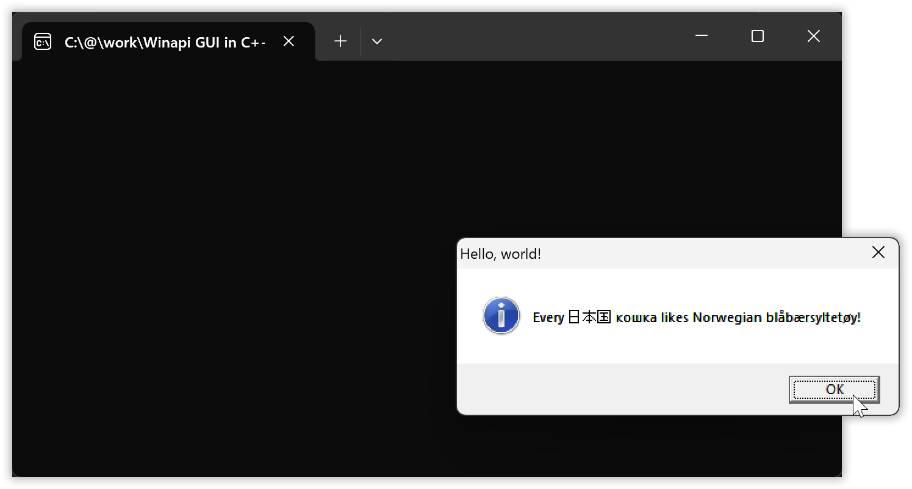

Using the GUI subsystem (i.e. you build the executable with GUI subsystem indication) the automatic console window is avoided,

$\qquad$ *GUI subsystem:*  
$\quad$ 

… at the cost of reduced functionality:

* textual output such as for debugging, tracing and in some cases assertions, is not presented anywhere, and
* you can’t terminate the program via `Ctrl`+`C` in a console window.

There are ways to work around these limitations but it’s not convenient to do, few even know about how it’s possible, and such workarounds may stop working in the future.

And so it can be a Good Idea™ to ***build your program with console subsystem during development***, so that you can see debug and trace output and can rely on seeing assertion messages and can terminate a wayward execution via `Ctrl`+`C`, but build the end users’ version with GUI subsystem, no console window.

Terminology: when I write *console subsystem* or *GUI subsystem* those are just descriptive terms, not official names, but I have the impression that this is how most everybody refer to the subsystems. However in the Windows headers and as reported by inspection tools they are called “CUI” and “GUI”, where the former is short for *character* user interface. And with both the Microsoft and MinGW linkers the subsystems are specified as `console` and `windows`, respectively.

A dear child has many names:

| | Subsystem value 3: | Subsystem value 2: |
|-|--------------------|--------------------|
| Informally: | Console subsystem | GUI subsystem |
| Inspection tools output: | CUI | GUI |
| Specification in linker options: | `console` | `windows` |
| Visual Studio project wizard: | Console Application | Desktop Application |


In addition to these two most common subsystems there are a number of others, some of them no longer supported, with C++ identifiers provided as macro symbols by the \<winnt.h\> header.

In Microsoft’s *\<winnt.h\>*, where the comments are the original ones:

```cpp
// Subsystem Values

#define IMAGE_SUBSYSTEM_UNKNOWN              0   // Unknown subsystem.
#define IMAGE_SUBSYSTEM_NATIVE               1   // Image doesn't require a subsystem.
#define IMAGE_SUBSYSTEM_WINDOWS_GUI          2   // Image runs in the Windows GUI subsystem.
#define IMAGE_SUBSYSTEM_WINDOWS_CUI          3   // Image runs in the Windows character subsystem.
#define IMAGE_SUBSYSTEM_OS2_CUI              5   // image runs in the OS/2 character subsystem.
#define IMAGE_SUBSYSTEM_POSIX_CUI            7   // image runs in the Posix character subsystem.
#define IMAGE_SUBSYSTEM_NATIVE_WINDOWS       8   // image is a native Win9x driver.
#define IMAGE_SUBSYSTEM_WINDOWS_CE_GUI       9   // Image runs in the Windows CE subsystem.
#define IMAGE_SUBSYSTEM_EFI_APPLICATION      10  //
#define IMAGE_SUBSYSTEM_EFI_BOOT_SERVICE_DRIVER  11   //
#define IMAGE_SUBSYSTEM_EFI_RUNTIME_DRIVER   12  //
#define IMAGE_SUBSYSTEM_EFI_ROM              13
#define IMAGE_SUBSYSTEM_XBOX                 14
#define IMAGE_SUBSYSTEM_WINDOWS_BOOT_APPLICATION 16
#define IMAGE_SUBSYSTEM_XBOX_CODE_CATALOG    17
```

With all C++ toolchains the console subsystem is the default and GUI subsystem — that no console window is required — needs to be explicitly specified.

| | Visual C++ linker: | MinGW linker: | MinGW g++ front end: |
|-|--------------------|---------------|----------------------|
| Console subsystem: | `/subsystem:console` | `--subsystem console` | `-mconsole` |
| GUI subsystem: | `/subsystem:windows` | `--subsystem windows` | `-mwindows` |

With Visual C++ you can specify linker options to the `cl` front end after a `/link` option, if you don’t run the linker separately. E.g. `cl hello.cpp /link /subsystem:windows`. Except for the problem discussed in the next subsection, which necessitates an extra option like in the build command shown at the start,

```text
cl /nologo /Feb hello.cpp /link user32.lib /subsystem:windows /entry:mainCRTStartup
```

With MinGW used for C++ programming one usually invokes the MinGW linker via the g++ front end: running that linker separately needs a lot of C++ specific stuff to be specified, like a cryptic magic incantation. Thus mostly one uses the front end `-mwindows` option. You can however provide the bare linker option, like `-Wl,--subsystem,windows` (with no spaces!).

```text
g++ hello.cpp -mwindows
```

The g++ compiler illustrates how simple it *can* be with reasonable defaults.

For the Visual C++ tools you can provide such more reasonable defaults via the `CL` and `LINK` environment variables.


#### 1.2.3. How to use standard `main` also with Microsoft’s tools.

<sup>in *section 1.2. “New stuff involved in building a GUI program” in Visual Studio”*</sup>  
<sup>in *chapter 1. “Building a GUI message box “Hello, world!””*</sup>

All Windows C++ toolchains support using a function named **`WinMain`** instead of a standard C++ `main`:

[*01/code/main-functions/WinMain.cpp*](01/code/main-functions/WinMain.cpp):

```cpp
#include <windows.h>

auto WINAPI WinMain(
    HINSTANCE           h_instance,               // Value from `GetModuleHandle( 0 )`
    HINSTANCE           _dummy,                   // 0
    char*               cmd_arguments_part,       // Value from `GetCommandLineA` + skip cmd verb.
    int                 initial_show_state        // Value from `GetStartupInfoW` + `.wShowWindow`
    ) -> int
{
    return 0;   // No special support for default return value, unlike standard `main`.
}
```

<sup>Note: as of this writing Microsoft’s documentation manages to provide an incorrect declaration of `WinMain` with `__clrcall` instead of `WINAPI`.</sup>

`WinMain` as a **main function** is non-standard and it lacks the useful parameters of `main` that some libraries require, i.e. it has severe costs and apparently no advantage, so why is it used?

Well, unlike other toolchains, with the Microsoft tools the subsystem is inferred from the choice of main function, and if you ask for a given subsystem then a main function is assumed from the choice of subsystem:

* `main` ⇔ console subsystem $\quad$ and $\quad$ `WinMain` ⇔ GUI subsystem.

Common misconceptions about this include that the execution of the program’s own code starts in `WinMain` (it does not), i.e. that `WinMain` is required by Windows (it is not), and that the `WinMain` parameters are useful or required (they’re not, they’re entirely useless). But those who haven’t realized how useful it is to build a GUI program with console subsystem during development, and how limiting it is to use GUI subsystem during development, and who only use Microsoft’s tools, often use a `WinMain` in order to specify the GUI subsystem or to fit the choice of GUI subsystem. And  in order to be able to accept such common non-standard code other Windows toolchains support using `WinMain` instead of `main`, but generally *without Microsoft’s automatic choice of subsystem*.

When one builds the “Hello, world!” program with the Visual C++ compiler `cl` and simply specifies GUI subsystem the Microsoft linker protests about an unresolved function `WinMain`:

```text
[G:\01\code]
> cl /nologo hello.cpp user32.lib /link /subsystem:windows
hello.cpp
LIBCMT.lib(exe_winmain.obj) : error LNK2019: unresolved external symbol WinMain referenced in function "int __cdecl __scrt_common_main_seh(void)" (?__scrt_common_main_seh@@YAHXZ)
hello.exe : fatal error LNK1120: 1 unresolved externals
```

<sup>In this and the following examples I’ve made sure to first delete the `CL` and `LINK` environment variables that I ordinarily use to provide default options.</sup>

To work around that non-standard default behavior specify option `/entry:mainCRTStartup` to the linker. This makes the linker assume that machine code execution will start in the machine code level **entry point** function `mainCRTStartup`, which calls the standard C++ `main` main function. Since this works to get rid of the problem, apparently the internal mechanism of the Microsoft linker is that the main function it finds directs its assumption of entry point function, and the entry point choice then directs it to link with a corresponding implementation of the part of the runtime library that is responsible for calling the main function (note: that call is made after the code initializes the runtime library itself and your namespace scope variables, and maybe more).

In the command line the option can be specified directly as a linker option after `/link`, or you can put it in the environment variable **`LINK`**:

```text
[G:\01\code]
> set link=/entry:mainCRTStartup

[G:\01\code]
> cl /nologo hello.cpp user32.lib /link /subsystem:windows
hello.cpp

[G:\01\code]
> dumpbin /headers hello.exe | find /i "subsystem"
            6.00 subsystem version
               2 subsystem (Windows GUI)
```

Hurray!

For completeness: there are also two other Microsoft main functions. These two correspond to standard `main` and Microsoft `WinMain`, but with `wchar_t` based strings instead of `char`-based. The four possible Microsoft main functions are called by different machine code level entry points.

The entry point code first initializes things, in particular the runtime library state and your namespace scope variables, and then calls its corresponding main function:

| Microsoft entry point: | Calls main function: | Which is defined by: |
|-----------------|-------------------------|------------------:|
| `mainCRTStartup` | `main` | The C++ standard |
| `WinMainCRTStartup` | `WinMain` | Microsoft |
| `wmainCRTStartup` | `wmain` | Microsoft |
| `wWinMainCRTStartup` | `wWinMain` | Microsoft |

With MinGW g++ you may have to use option `-municode` to have the linker recognize `wmain` or `wWinMain`, in which case at least my current g++ linker does not recognize `main` or `WinMain`.

Terminology: in recent years the term “entry point” has begun to be [used about the `main` function](https://en.cppreference.com/w/cpp/language/main_function.html#Explanation). To be clear one may distinguish between “machine code entry point” (where the execution starts) and “application level entry point” (the main function, called after initialization of stuff). Earlier it was sufficient to just say “entry point” and everybody then understood that it was about the execution’s actual entry into the executable, and that this is what you specify via a linker’s **entry point option** such as, with Microsoft’s tools, `/entry:`, as used above.

#### 1.2.4. Debunked: common misconceptions about `WinMain`.

<sup>in *section 1.2. “New stuff involved in building a GUI program” in Visual Studio”*</sup>  
<sup>in *chapter 1. “Building a GUI message box “Hello, world!””*</sup>

Microsoft’s own documentation misleads many students, and indeed apparently also Microsoft’s own documentation writers, into believing that for a GUI subsystem Windows program the execution of its own code starts in a `WinMain` function: that `WinMain` is itself the program’s “entry point” and as such is known and required by Windows.

You can inspect the actual startup call chain in the Visual Studio debugger, here with the “Hello, world!” program built with GUI subsystem:

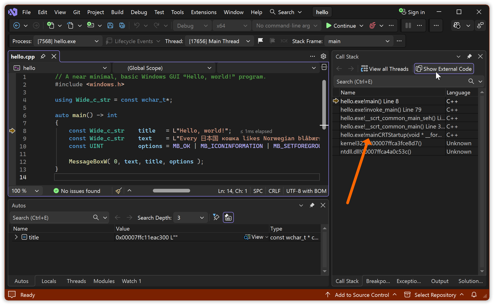

There is no `WinMain` involved here at all.

The details will be different for a program built with different options, and in particular for a program built with a different coolchain, but since there is no `WinMain` in this call chain, clearly execution does not need to start in `WinMain`. And it never does, and forcing it to do so would have dire consequences such as garbage parameter values and missing initialization of globals. With Microsoft’s toolchain  execution of the *program’s own code* starts in one of the four mentioned entry point functions: `mainCRTStartup`, `WinMainCRTStartup`, `wmainCRTStartup` or `wWinMainCRTStartup`.

In this concrete example the  execution of *the process’ machine code* (which includes loaded DLLs in addition to the program’s own code) started somewhere in “ntdll.dll”. Two call levels down — physically up in the list in the screenshot — it entered into the “Hello, world!” executable at the `mainCRTStartup` entry point function provided by the Visual C++ runtime library, marked by an arrow on the screenshot. The internal details are largely irrelevant for application programming except the facts that (1) there is such a call chain and that (2) dynamic initialization of e.g. namespace scope variables happens somewhere in that call chain, but it shows the calls

* [coming from somewhere internally in Windows]  
  → `mainCRTStartup`  
  → `__scrt_common_main` → `__scrt_common_main_seh` → `invoke_main`  
  → `main`.

Ditto for a program with e.g. a `WinMain`: when the executable is built with Microsoft’s tools the machine code execution then enters the executable at entry point `WinMainCRTStartup` and ends up in main function `WinMain`.

But note: other toolchains, and in particular toolchains for other languages, have other entry points; the above example is Microsoft specific.

---

Since the execution doesn’t start there, since it’s not called by Windows, and since therefore Windows has no need to know about it, `WinMain` is not a Windows requirement. It’s merely an easy to circumvent default non-standard behavior of Microsoft’s tools for C and C++ development, just as their C++ tools default to non-standard behavior for e.g. exception handling and RTTI support, and even for the `__cplusplus` C++ standard version indicator, and need **configuration** to be standard-conforming. And `WinMain` is not a requirement of other vendors.

---

The parameters of `WinMain`,

In [*01/code/main-functions/WinMain.cpp*](01/code/main-functions/WinMain.cpp):

```cpp
auto WINAPI WinMain(
    HINSTANCE           h_instance,               // Value from `GetModuleHandle( 0 )`
    HINSTANCE           _dummy,                   // 0
    char*               cmd_arguments_part,       // Value from `GetCommandLineA` + skip cmd verb.
    int                 initial_show_state        // Value from `GetStartupInfoW` + `.wShowWindow`
    ) -> int
```

&hellip; are used in Microsoft code examples in their documentation, and, sort of rubbed right in your face, in starter code generated by Visual Studio.

But they don’t serve any purpose and they aren’t necessary, so they’re not a reason to use `WinMain`.

These parameters are entirely useless techno-babble verbosity; just noise.

* `h_instance`  
  is the value that one gets from calling `GetModuleHandle(0)`. It refers to the executable’s loaded image, and (I believe undocumented) is the start address of that image. Since it can be used to access data embedded in the executable, so called “resources”, it’s usually declared as a global constant, and then the `WinMain` parameter is redundant and useless, and otherwise declaring and using the parameter is more to write than just `GetModuleHandle(0)`, so also then it’s useless.
* `cmd_arguments_part`  
  is the usually encoding-garbled trailing part of the program invocation command line, after the command verb. It’s not compatible with libraries requiring the `main` parameters `argc` + `argv`. It’s useless.
* `initial_show_state`  
  is a value specifying in what state the program invoker wants a main window presented, e.g. minimized, normal or maximized. But [the documentation](https://learn.microsoft.com/en-us/windows/win32/api/winuser/nf-winuser-showwindow) states, correctly, that ❝[that `ShowWindow` call argument] is ignored the first time an application calls `ShowWindow`❞, and being used in such a first call was and is the sole reason for existence of this parameter. Hence also this `WinMain` parameter is useless.

The `WinMain` return value is the same as for `main`: it’s just passed to `exit`.

So there is no technical reason to use `WinMain`: it’s not required by Windows, the MS tool defaults have to be configured for standards conformance anyway, and its parameters are useless, archaic stuff from Windows 1.x in the mid 1980’s.

Indeed there are instead good technical reasons to use a standard C++ `main`, including that one may need its parameters — which as opposed to the `WinMain` ones *are* practically useful, and may be required by some 3rd party library. Also one should have a good reason to go non-standard. Hopefully this explains why this tutorial uses the standard C++ `main`.


#### 1.2.5. How to avoid that Microsoft’s `assert` swallows assertion messages.

<sup>in *section 1.2. “New stuff involved in building a GUI program” in Visual Studio”*</sup>  
<sup>in *chapter 1. “Building a GUI message box “Hello, world!””*</sup>

The problem described in this sub-section, concerning Microsoft’s `assert` implementation,  does not matter for the simple “Hello, world!” program.

And it can be argued that it doesn’t matter for a correct program, because then no assertions fire. But when an assertion does fire then you want that to be a *dependable* mechanism; you want a guarantee that you, or an end user, can see that message.

And since this is generally important and since it’s connected to Microsoft’s `WinMain` (!) I discuss it here.

---

If you use `main` or `wmain` then with the Microsoft runtime an assertion message will be output to the standard error stream, but if you use a `WinMain` or `wWinMain` function then an assertion message will be presented in a GUI error box.

| Main function: | By default the MS runtime presents `assert` message via: |
|-----------------|-------------------------|
| `main` or `wmain` | Output to the standard error stream. |
| `WinMain` or `wWinMain` | A GUI error box. |

As a consequence, if you use a standard `main` with GUI subsystem then with Microsoft’s runtime an assertion message will by default be output to the standard error stream, which due to the GUI subsystem is by default not connected to anything, and so in that case the `assert` message *is discarded*, swallowed, not shown, which is not just non-standard behavior but very unreasonable behavior.

It’s possible to pipe a GUI subsystem process’ output to e.g. `more`, and so when an assertion fires the assertion text *can* be presented. But by default it’s just Missing In Action™. The program execution that produced it is no more, and, a catch-22, without the message there may not be a practical way to recreate the conditions that resulted in the `assert` firing.

---

To work around the impractical default behavior you can use a **reusable** separately compiled code snippet like this:

[*01/code/assert-text-presentation/msvc-assertion-fix.cpp*](01/code/assert-text-presentation/msvc-assertion-fix.cpp):

```cpp
#ifndef _MSC_VER
#   error "This file is for Visual C++ only."
#endif

#include <windows.h>        // GetStdHandle, GetFileType
#include <process.h>        // _set_app_type, _crt_...

const HANDLE    error_stream_handle = GetStdHandle( STD_ERROR_HANDLE );
const bool      has_error_stream    = (GetFileType( error_stream_handle ) != FILE_TYPE_UNKNOWN);

static auto fix_it() -> bool
{
    const auto  use_text_assertions = _crt_console_app;
    const auto  use_gui_assertions  = _crt_gui_app;
    _set_app_type( has_error_stream? use_text_assertions : use_gui_assertions );
    return true;
}

const bool dummy = fix_it();
```

This checks dynamically via `GetFileType` whether there is an available standard error stream, and if so it directs the runtime to output `assert` messages there, as opposed to Microsoft’s default of using the source code main function choice to decide the reporting.

Example usage in the command line (in Visual Studio just include both files in the project):

[*01/code/assert-text-presentation/assert-text.cpp*](01/code/assert-text-presentation/assert-text.cpp):

```cpp
#include <cassert>          // The `assert` macro.

auto main() -> int
{
    assert( !"This is an `assert` message." );
}
```

```text
[G:\01\code\assert-text-presentation]
> cl assert-text.cpp msvc-assertion-fix.cpp /Feb /link /subsystem:windows
assert-text.cpp
msvc-assertion-fix.cpp
Generating Code...

[G:\01\code\assert-text-presentation]
> b
    [A GUI ASSERTION MESSAGE BOX IS PRESENTED]
```

The GUI assertion error box:

$\quad$ 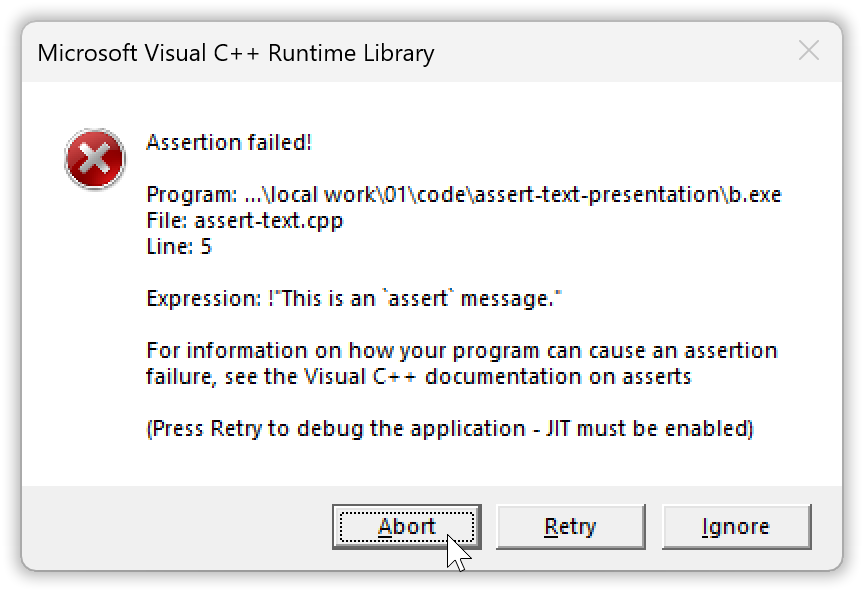

There is apparently no possible technical or non-technical purpose of the impractial and unreasonable choice of reporting mode for Microsoft’s `assert`. And so it may be just a consequence of their scheme for automated subsystem selection + somewhat sloppy coding and/or testing. Happily as shown their runtime library API is sufficiently complete — though with strongly misleading names for the relevant functionality, perhaps originally intended for more general use — that the behavior can be fixed.

One way to use the fix above without having it as a separately compiled library part, i.e. as a pure header, is shown in chapter xx.


### 1.3. Building in Visual Studio.

<sup>in *chapter 1. “Building a GUI message box “Hello, world!” in Visual Studio”*</sup>

To prepare for building the “Hello, world!” program in Visual Studio start by creating a C++ “Windows Desktop Application” project:

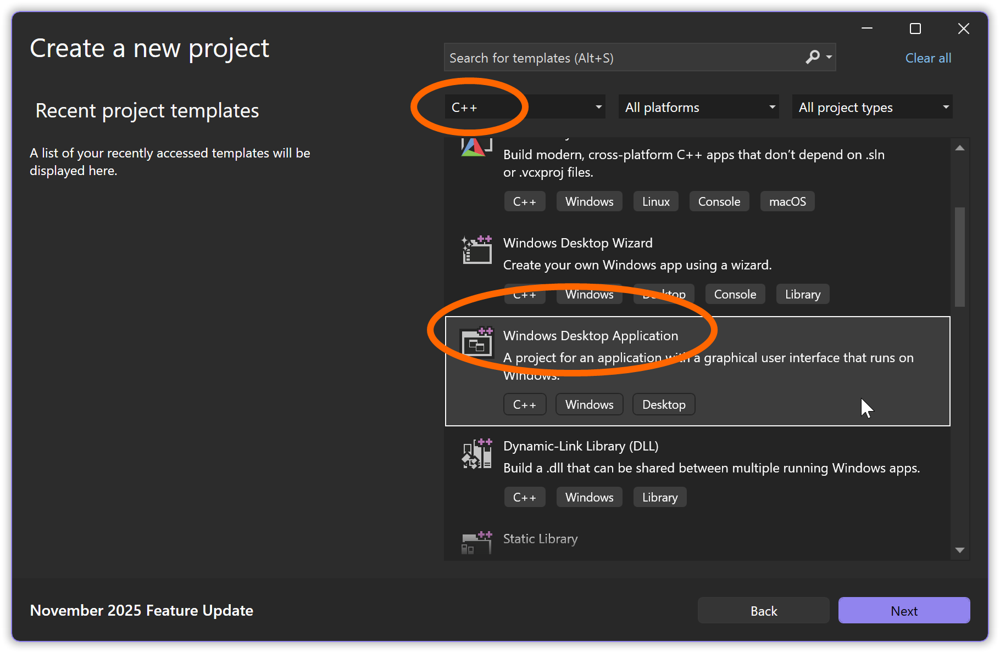

After finishing the wizard you have a project with generated Microsoft style C code, like this:

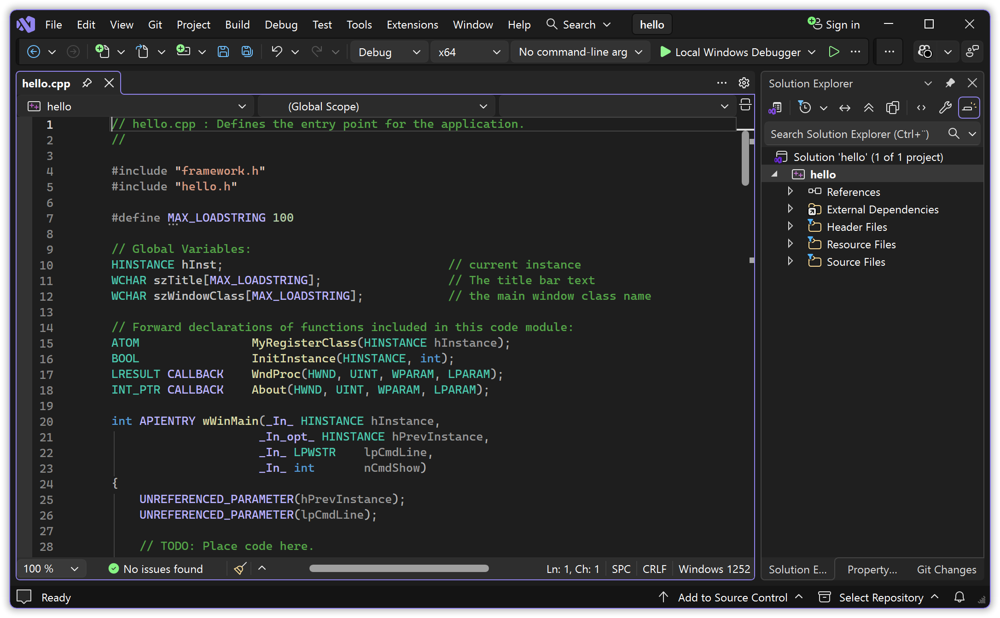

This is the code I mentioned earlier that counter-productively uses a variant of non-standard `WinMain` as main function.

Remove the generated low level source code (e.g. `Ctrl`+`A` and then `Del`), paste or type in the “Hello, world!” source code, and **save**. If you get a question about whether to save as Unicode, just say yes (on my machine this saves as UTF-8 encoded with BOM). It can now look like this:

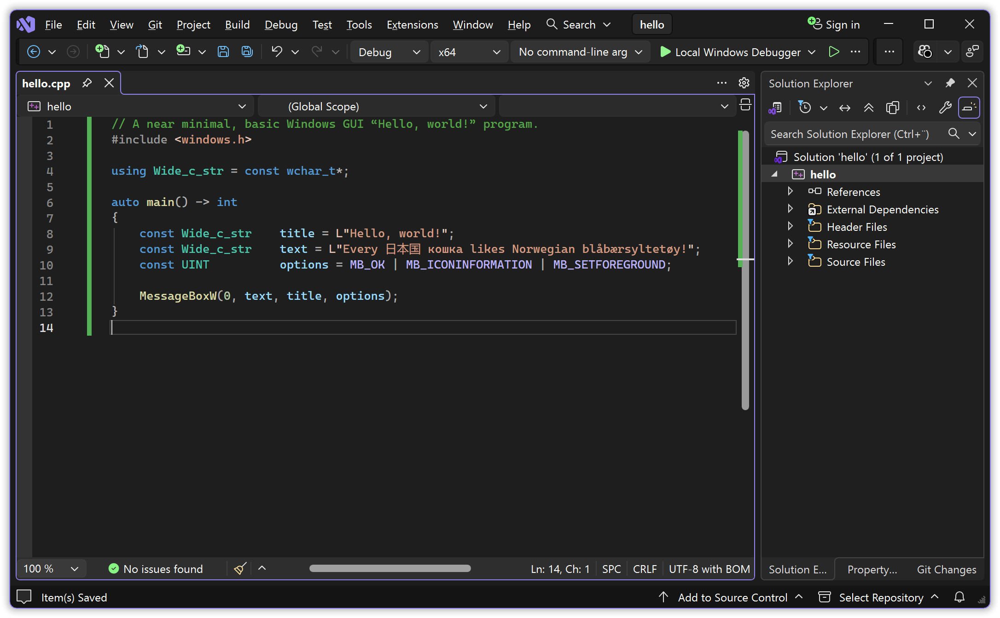

An alternative way to get to this point is to instead start by creating a “Windows Desktop Project” and in that wizard change the application type from default “Console Application” to “Desktop Application”, which means GUI subsystem.

A third way is to start by creating an “Empty Project”, and then configure its properties and add a source file.

#### 1.3.1. The “don’t use standard `main`!” problem with Microsoft, in Visual Studio.

<sup>in *section 1.3 “Building in Visual Studio”*</sup>  
<sup>in *chapter 1. “Building a GUI message box “Hello, world!” in Visual Studio”*</sup>

Hit `Ctrl`+`F5` to attempt to build and run. Since Microsoft’s linker by default doesn’t accept a standard `main` for a GUI program, this will fail. The Microsoft linker complains about an allegedly missing “`WinMain`”.

Unfortunately to see that name you may have to click away an error box and scroll the diagnostic output, but in the screenshot below the name is visible:

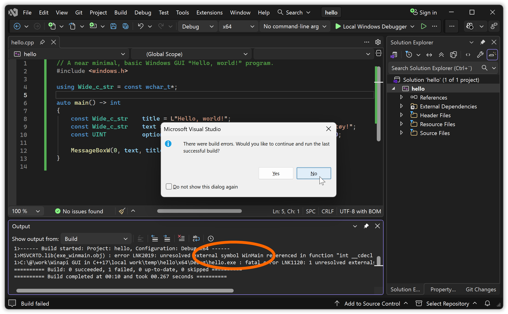

The g++ linker (as an example) doesn’t have this problem about not accepting standard code, it’s purely a Microsoft tools problem. 


#### 1.3.2. How to tell Visual Studio to let Visual C++ accept a standard `main`.

<sup>in *section 1.3 “Building in Visual Studio”*</sup>  
<sup>in *chapter 1. “Building a GUI message box “Hello, world!” in Visual Studio”*</sup>

You can specify the executable’s entry point in the project setting and thus get a standard `main` called:

1. Right click the project in the Solution Explorer pane (placed to the right in the Visual Studio screenshots above), or with the project selected use the *Project* menu. Choose *Properties*.
2. In the project settings dialog that pops up change the *Configuration* from “Active (Debug)” to “All Configurations”.
3. Go into *Configuration Properties* ▸ *Linker* ▸ *Advanced*.
4. In the *Entry Point* edit field type `mainCRTStartup`, which calls standard `main`.
5. And *OK* it.

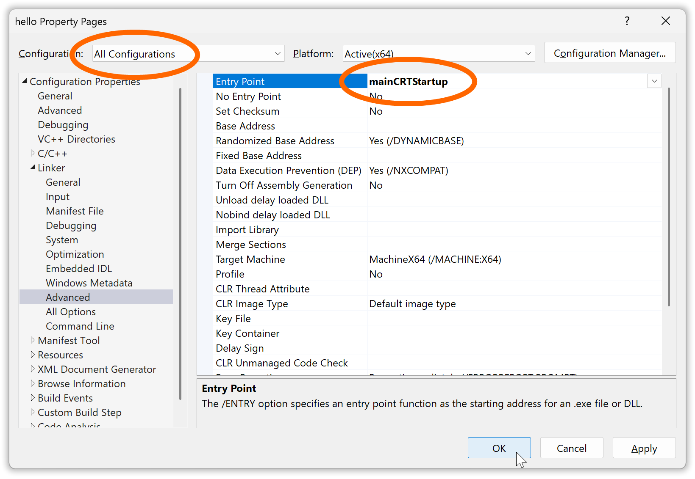

This causes Visual Studio to invoke the linker with option `/entry:mainCRTStartup`.

And that sets `mainCRTStartup` as the executable’s (machine code level) entry point, which calls the standard C++ `main` function, which is more practical both for its parameters and for switching between console and GUI subsystem builds.

<sup>It would be nice to have this setting as default in Visual Studio. Alas, specifying defaults is not as easy or obviously available functionality as one could wish for: it involves [defining “property sheets” in “.props” files](https://stackoverflow.com/a/20658404/464581). An easier solution is to circumvent the Visual Studio machinery and supply this option via the `LINK` environment variable.</sup>

Other relevant settings to change  —  but not necessary for this program! — include those that generate compiler options

```text
/std:c++17 /Zc:__cplusplus /Zc:preprocessor /W4 /wd4459 /D _CRT_SECURE_NO_WARNINGS=1 /D _STL_SECURE_NO_WARNINGS=1
```

Additionally, for programs using `char` based strings it’s a good idea in general to have the option **`/utf-8`**. It must be typed in manually in *Configuration Properties* ▸ *C/C++* ▸ *Command Line* field *Additional Options*. The `/utf-8` option tells the compiler to (1) assume that source code files that don’t have encoding indication are UTF-8 encoded, and to (2) store `char` based string literals UTF-8 encoded.


#### 1.3.3. Building a GUI subsystem executable.

<sup>in *section 1.3 “Building in Visual Studio”*</sup>  
<sup>in *chapter 1. “Building a GUI message box “Hello, world!” in Visual Studio”*</sup>

Since the project was created with the “Windows Desktop Application” wizard it builds an executable with GUI subsystem by default.

So when you now hit `Ctrl`+`F5` to build and run it should work nicely:

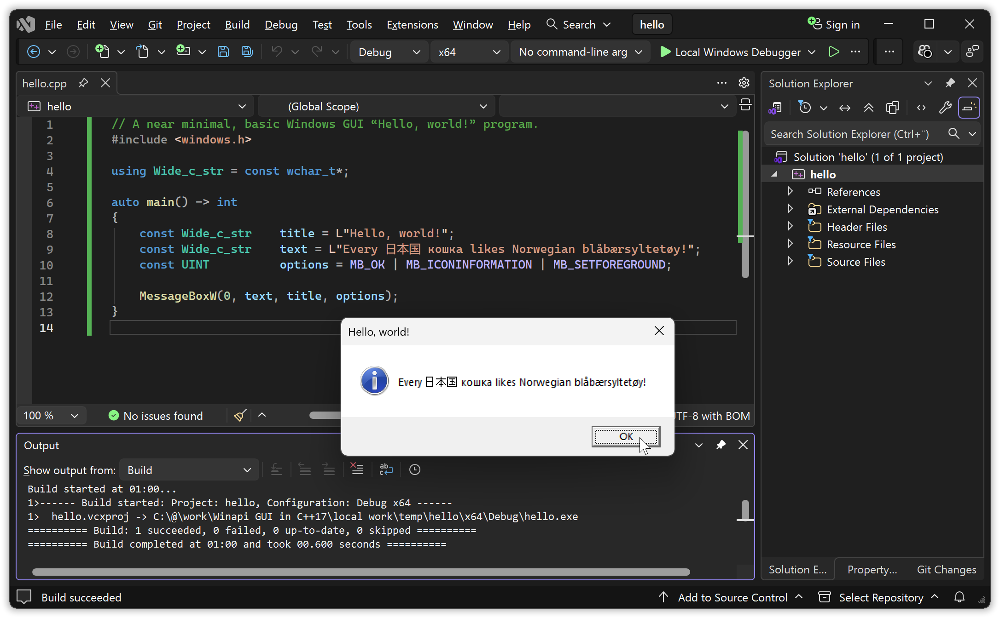

Again, without Visual Studio in the background the message box looks like this:

$\quad$ 

---

*Exercise suggestion*:

* Change the program to present the text you get from `GetCommandLineW`.

#### 1.3.4. How to trim down the list of DLL import libraries that VS adds by default.

<sup>in *section 1.3 “Building in Visual Studio”*</sup>  
<sup>in *chapter 1. “Building a GUI message box “Hello, world!” in Visual Studio”*</sup>

In the Visual C++ command line build example at the start the “user32.lib” DLL import library had to be specified,

```text
cl /nologo /Feb hello.cpp /link user32.lib /subsystem:windows /entry:mainCRTStartup
```

… in order to get dynamic linking of “user32.dll” which provides the `MessageBoxW` function.

However in Visual Studio it was not necessary to specify this library, because Visual C++ studio adds a number of Windows API libraries by default.

One way to see the list of added libraries is by checking, in the project properties, the complete linker command that Visual Studio issues when you build the program, which in my current Visual Studio installation is

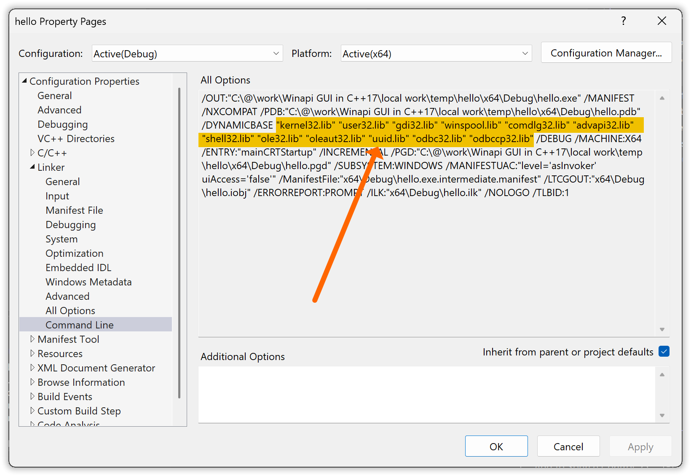

I.e. my Visual Studio provides “kernel32.lib”, “user32.lib”, “gdi32.lib”, “winspool.lib”, “comdlg32.lib”, “advapi32.lib”, “shell32.lib”, “ole32.lib”, “oleaut32.lib”, “uuid.lib”, “odbc32.lib” and “odbccp32.lib” by default.

An object file in a static library isn’t added if nothing in it is used, and reportedly (and in my testing) a DLL is not loaded if it isn’t actually used. And so these libraries probably do not impose much technical overhead. But the list hides which libraries are actually used, and misleadingly communicates that some unused libraries are used, so it constitutes noise for maintainers including for your later self.

So ideally the list should be trimmed down to just “user32.lib”, the one library that the program explicitly actually uses. The program, as all Windows programs, also uses “kernel32” via the runtime library, but all compilers add “kernel32” by default because all programs need it. To trim down the list you can change the linker’s library list, specified in *Configuration Properties* ▸ *Linker* ▸ *Input* field *Additional Dependencies*, from

```text
$(CoreLibraryDependencies);%(AdditionalDependencies)
```

… to

```
user32.lib
```

If you do, then be sure to do this for “All configurations”:

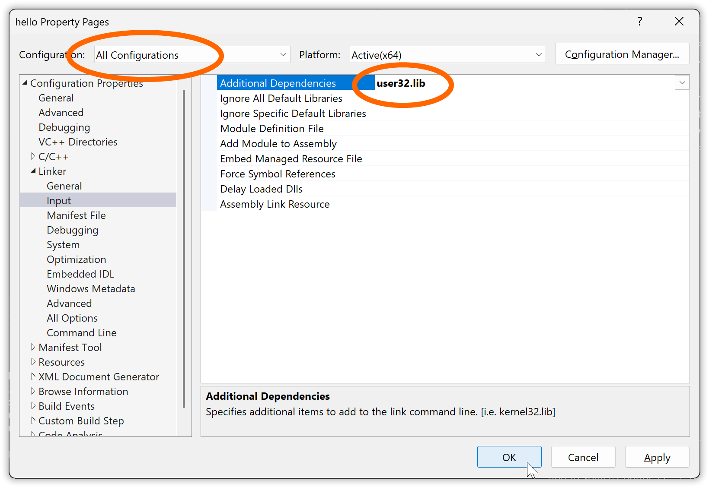

After such a change of the project settings it can be a good idea to check that the project still builds without problems.


#### 1.3.5. Building and running a console subsystem executable in the same VS project.

<sup>in *section 1.3 “Building in Visual Studio”*</sup>  
<sup>in *chapter 1. “Building a GUI message box “Hello, world!” in Visual Studio”*</sup>

Building the program as a console subsystem executable is now a simple matter of choosing the console subsystem in the linker settings in the project properties, *Configuration Properties* ▸ *Linker* ▸ *System* field *SubSystem*:

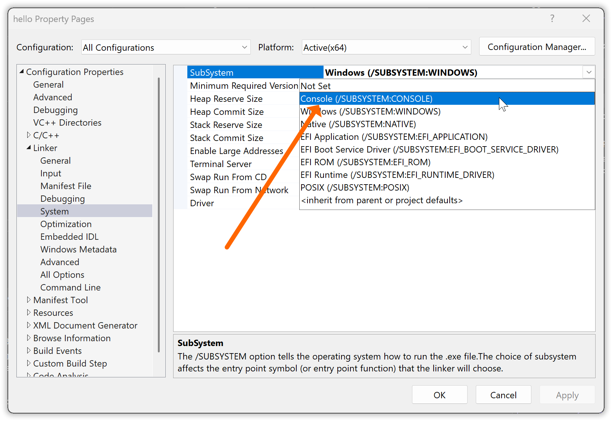

Again, when/if you do this, unless you want to have different subsystems for “Debug” and “Release” make sure that you make this change for “All configurations”.

Likewise it’s simple to switch back to GUI subsystem for a release to end users.

---

When or if you run the console subsystem executable via `Ctrl`+`F5` within Visual Studio, a new console window is created for the process, and with Windows 11 and later the message box may then be placed behind the console window, effectively hidden. It’s essentially a bug in Windows. But you can then switch to the hidden window e.g. via `Alt`+`Tab`, or e.g. via the Windows task bar.

---

The main reason for doing this is however to be able to run the program from the command line, terminate it in the command line via `Ctrl`+`C`, see trace and debug output in the command line, and not the least see assertion text from Microsoft’s `assert` in the command line, the latter without having to add a fix as shown earlier.

In the directory where you have the Visual Studio solution the executable generated via the *Debug* configuration is down in the “x64\Debug” sub-directory. Unfortunately there is also one such in the project directory, but without an executable there. The executable resides in the “x64\Debug” sub-directory in the VS solution directory:

```text
[T:\hello]
> tree
Folder PATH listing for volume OS
Volume serial number is 6269-9F01
T:.
├───hello
│   └───x64
│       └───Debug
│           ├───hello.tlog
│           ├───hello_MD.tlog
│           └───microsoft
│               └───STL
└───x64
    └───Debug

[T:\hello]
> cd x64\Debug

[T:\hello\x64\Debug]
> dir /b *.exe
hello.exe
```

Here you can run it with just command `hello`.

Or something more elaborate.

---

*Exercise suggestions*:

* Check out the effect of `std::clog` output statements (just add them to this source code) with a console subsystem build versus a GUI subsystem build.

* Check out the effect of keypress `Ctrl`+`C` when you run the program as console subsystem executable, with and without the console window as your active window.
