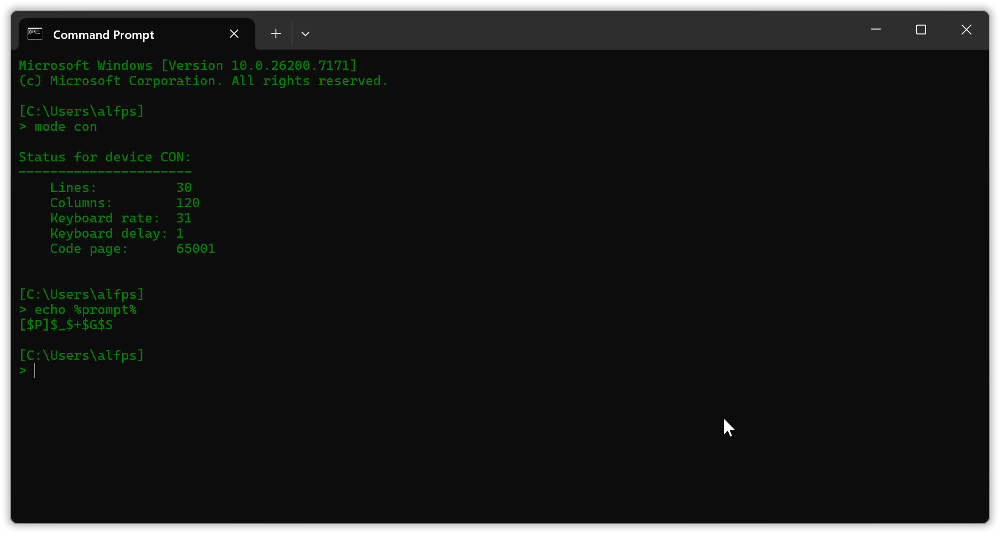
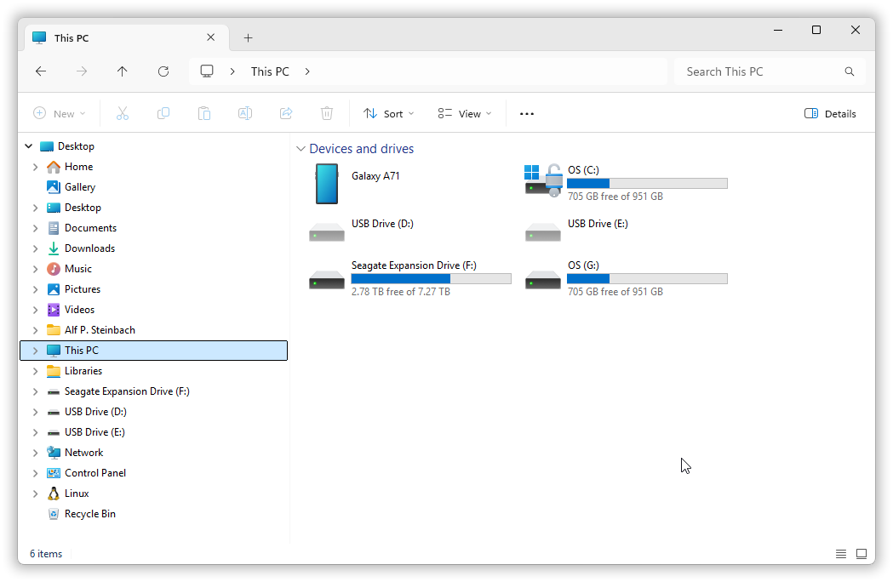
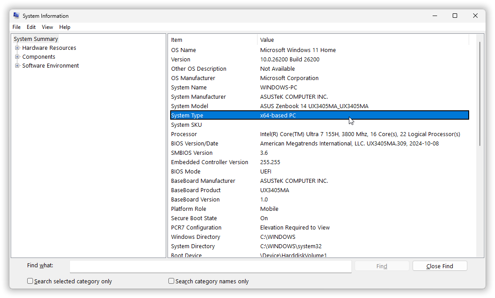
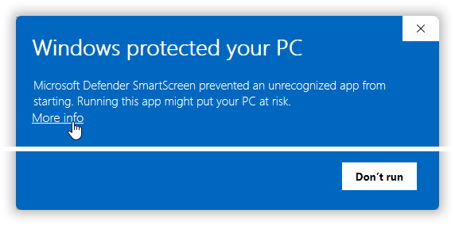
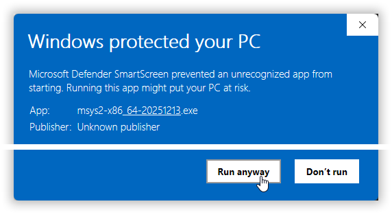
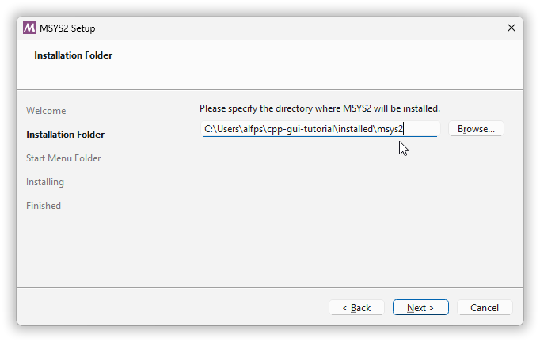
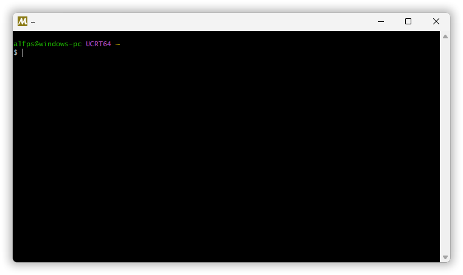

Winapi GUI in C++17 Chapter 2 – An introduction to command line work.

> ❞ *I can no longer obey; I have tasted command, and I cannot give it up.*

<!-- START doctoc generated TOC please keep comment here to allow auto update -->
<!-- DON'T EDIT THIS SECTION, INSTEAD RE-RUN doctoc TO UPDATE -->
**Table of Contents**  *generated with [DocToc](https://github.com/thlorenz/doctoc)*

- [Chapter 2. An introduction to command line work.](#chapter-2-an-introduction-to-command-line-work)
  - [2.1. Help and documentation for Windows’ commands.](#21-help-and-documentation-for-windows-commands)
    - [2.1.1. Core commands.](#211-core-commands)
    - [2.1.2. Quirks & idioms.](#212-quirks--idioms)
    - [2.1.3. Quick help for a program.](#213-quick-help-for-a-program)
  - [2.2. Command line concepts & basic usage / MinGW g++.](#22-command-line-concepts--basic-usage--mingw-g)
    - [2.2.1. About the file system.](#221-about-the-file-system)
    - [2.2.2. Let’s create a directory for the tutorial.](#222-lets-create-a-directory-for-the-tutorial)
    - [2.2.3. Let’s create sub-directories for installations and custom commands.](#223-lets-create-sub-directories-for-installations-and-custom-commands)
    - [2.2.4. The `.` and `..` directory links.](#224-the--and--directory-links)
    - [2.2.5. Let’s install the MSYS2 g++ compiler.](#225-lets-install-the-msys2-g-compiler)
    - [2.2.6. Let’s map a drive letter to the tutorial directory.](#226-lets-map-a-drive-letter-to-the-tutorial-directory)
    - [2.2.7. Let’s make MSYS2’s g++ available in Cmd.](#227-lets-make-msys2s-g-available-in-cmd)
    - [2.2.8. Let’s build the GUI “Hello, world!” program with g++.](#228-lets-build-the-gui-hello-world-program-with-g)
    - [2.2.9. Let’s create a batch file to set up the `PATH` etc. for g++.](#229-lets-create-a-batch-file-to-set-up-the-path-etc-for-g)
    - [2.2.10. Oh, you now also have a nice collection of Unix commands.](#2210-oh-you-now-also-have-a-nice-collection-of-unix-commands)
    - [2.2.11. And let’s build a C++ program that uses an extra Windows library, with g++.](#2211-and-lets-build-a-c-program-that-uses-an-extra-windows-library-with-g)
  - [2.3. Visual C++.](#23-visual-c)
    - [2.3.1. The “vcvars” batch files.](#231-the-vcvars-batch-files)
    - [2.3.2. Compiler options.](#232-compiler-options)
    - [2.3.3. Linker options.](#233-linker-options)
    - [2.3.4. The `CL` and `LINK` environment variables.](#234-the-cl-and-link-environment-variables)
    - [2.3.5. UTF-8 and other “reasonable behavior” options.](#235-utf-8-and-other-reasonable-behavior-options)
    - [2.3.6. Cleanup after a Visual C++ compilation.](#236-cleanup-after-a-visual-c-compilation)
    - [2.3.7. Checking the Visual C++ compiler version.](#237-checking-the-visual-c-compiler-version)

<!-- END doctoc generated TOC please keep comment here to allow auto update -->

Along the way you’ll encounter and *learn-by-using* a number of command line concepts including (in order)

- [Home directory.](#home-directory)
- [Environment variables.](#environment-variables)
- [Using environment variable values (a.k.a. environment variable “expansion”).](#using-environment-variable-values-aka-environment-variable-expansion)
- [Path requirements for tools ported from Unix.](#path-requirements-for-tools-ported-from-unix)
- [Pipes and filters.](#pipes-and-filters)
- [Auto-completion of file and directory names.](#auto-completion-of-file-and-directory-names)
- [Keys for command recall and editing.](#keys-for-command-recall-and-editing)
- [Determine x64 or AMD-64 system? Accessing system information.](#determine-x64-or-amd-64-system-accessing-system-information)
- [Wintty console windows are (still) a thing.](#wintty-console-windows-are-still-a-thing)
- [Check if a command such as running g++, succeeds or fails, via logical `&&` and `||`.](#check-if-a-command-such-as-running-g-succeeds-or-fails-via-logical--and-)
- [Add the compiler’s directory path to the `PATH` variable’s value.](#add-the-compilers-directory-path-to-the-path-variables-value)
- [Quiet (that is, non-interactive) cleanup.](#quiet-that-is-non-interactive-cleanup)
- [Check the subsystem with the MinGW tools.](#check-the-subsystem-with-the-mingw-tools)
- [You can reduce the executable’s size with `strip`, if you want.](#you-can-reduce-the-executables-size-with-strip-if-you-want)
- [Batch files.](#batch-files)
- [Command echoing.](#command-echoing)
- [UTF-8 as active codepage.](#utf-8-as-active-codepage)
- [Batch files affect the caller’s environment.](#batch-files-affect-the-callers-environment)
- [Remember that you have auto-complete: use it.](#remember-that-you-have-auto-complete-use-it)
- [Cmd uses `^` as an escape character.](#cmd-uses-%5E-as-an-escape-character)
- [The `call` command.](#the-call-command)
- [Output redirection and the null device.](#output-redirection-and-the-null-device)
- [The `%errorlevel%` pseudo environment variable.](#the-%25errorlevel%25-pseudo-environment-variable)
- [Splicing the error stream into the output stream.](#splicing-the-error-stream-into-the-output-stream)


## Chapter 2. An introduction to command line work.

To [work in the **command line**](https://blog.mavigadget.com/command-prompt-for-beginners-a-step-by-step-guide/) means to use a command interpreter such as Cmd , Powershell  or bash , and invoke the compiler and linker, or alternatively some build system that invokes them, by typing commands.

Working in the command line has many advantages for developing a GUI program. In chapter 1 I mentioned the ability to ***see trace and debug output***, the ability to ***terminate a wayward execution via `Ctrl`+`C`***, and ***seeing Microsoft `assert` messages*** by default. And, for example, it’s much easier to provide various ***command line arguments*** such as options and file names for exploration and testing. More indirectly it brings to bear the whole infrastructure of ***powerful command line tools***.

For example, for this tutorial I use a logical drive “r:” mapped to a **directory** — a file system folder — for the code and work examples. Drive “r:” is defined via the `subst` command. Windows provides no GUI for defining `subst` drives: the creation is functionality that by default, in a clean Windows installation, is only available in the command line. To be fair, Windows Explorer does offer network drive creation, in Windows 11 via the right click menu in *This PC* (one has to know about that or google it up), and that more heavy machinery *can* do the job. But `subst` drives are an example of work saving functionality that is available in the command line and that’s not available in the GUI.

A standard C++ `main` makes it easy to work in the command line, including not just ease of changing the subsystem choice but also for using e.g. common command line argument parsing libraries that require the arguments of `main`.

Main goals for this chapter include

* to enable you to build C++ GUI programs with Visual C++ and g++ in Cmd,
* to enable you to work in the command line in general, and
* to enable you to follow or just understand various examples in the first chapter and in later chapters.

For the first point it would suffice with a Microsoft-ish cookbook recipe which one can follow mechanically with no understanding: do this, do that, and then type this, and voilà! But for the second and third points a lot more background and insight is needed. That constitutes the bulk of this chapter — enabling future general work.

---

The Windows **system command interpreter**, the one used by C++’s `system` function and by ditto functionality in other languages, is Cmd, with executable file “cmd.exe”, developed by Therese Stowell for Windows NT.

One way to run Cmd is

1. Bring up the Start menu.
2. Type “cmd”, sans the quotes.
3. Press the return key (Enter), or click e.g. “open”

I have configured the PC I’m writing this on so that launching a new instance of Cmd — Microsoft now calls it the “Command Prompt” — produces a [Windows Terminal](https://github.com/Microsoft/Terminal?tab=readme-ov-file#installing-and-running-windows-terminal) window with Cmd ***running in*** a tab in that window:



<sup><sub>If instead you launch Cmd via the Windows Run dialog, e.g. with that dialog invoked with Windows-key `⊞` + `R`, then you likely get a different window/tab title like “C:\WINDOWS\system32\cmd.exe”. You can change the title via the `title` command; the title “Command Prompt” comes from the name of the shortcut that the Start menu invokes. In Windows Terminal you can also change the title via *Rename Tab* in the right click menu of the tab.</sub></sup>

A presentation of program textual output like above is called a **console**.

A console uses a `monospaced font` and consists of a grid of character cells. In the above the grid has 30 lines and 120 columns. Usually each character is placed in one cell but some characters such as emojis require two consecutive cells.

Reportedly Windows Terminal [is the default kind of console in Windows 11](https://devblogs.microsoft.com/commandline/windows-terminal-is-now-the-default-in-windows-11/) from and including the second half of 2022 (Windows 11 22H2). With an earlier Windows you may get a **classic console window** instead. It looks more primitive, doesn’t have tabs, doesn’t properly support emojis, as I recall only supports copying rectangular areas of text (i.e. not sequential multiline text), and doesn’t support UTF-8 input, so in that case I recommend installing Windows Terminal and choosing it as your default.

In the window above I’ve typed a `mode` command and an `echo` command to display some relevant configuration. Each command follows a `>` **prompt** from Cmd. The `>` is generally recognizable and indicates that what follows is a command, so generally the lack of a visual distinction via color or font variation such as *`italics`* is not a problem, though it would have been nice to have.

---

Usually and by default the prompt is configured to also show you your location in the file system, where you are, here `C:\Users\alfps`. As shown above I prefer a two line prompt with the location presented on a separate line before the `>`, and with a space after the `>`, because that puts the commands at a fixed starting position to the left with enough room for a long command. The default prompt is on a single line with the location before the `>`, and with no space after the `>`, like `C:\Users\alfps>|`, which can put the following command arbitrarily far to the right.

<sup><sub>*For future reference:* the definition of my two line prompt is `[$P]$_$+$G$S`. The definition of the default prompt is `$P$G`. These are values of the `PROMPT` variable.</sub></sup>

As you work in Cmd you have a **current drive** and  on each drive a **current directory**.

Your location shown in the prompt is the current drive + the current directory on that drive, in the screenshot respectively `C:` and `\Users\alfps`.


### 2.1. Help and documentation for Windows’ commands.

<sup>in *chapter 2. “An introduction to command line work”*</sup>

[Wikipedia](https://en.wikipedia.org/wiki/Cmd.exe) can be a good a good starting place for general information about Cmd.

More specific references are unfortunately scarce, and as a rule fail to differentiate between the handful of core commands for working in Cmd, and the zillions of arbitrary programs that are available via commands.

But check out e.g.

* https://learn.microsoft.com/en-us/windows-server/administration/windows-commands/windows-commands
* https://www.geeksforgeeks.org/techtips/most-useful-cmd-commands-in-windows/


#### 2.1.1. Core commands.

<sup>in *section 2.1. “Help and documentation for Windows’ commands”*</sup>  
<sup>in *chapter 2. “An introduction to command line work”*</sup>

For the **core commands**, the ones that you need all the time, you can get a listing with most of them via **`help`**. However in Windows 11 that listing now also includes some “network admin” / “IT support personnel” / “technician” commands that probably are of little to no use to you, just distracting noise. So in the example below I’ve removed the lines for 17 commands I seldom or never use: `bcdedit`, `cacls`, `chkdsk`, `chkntfs`, `compact`, `convert`, `diskpart`, `driverquery`, `fsutil`, `gpresult`, `icacls`, `openfiles`, `robocopy`, `systeminfo`, `sc`, `schtasks` and (deprecated) `wmic`.

```text
[C:\Users\alfps]
> help
For more information on a specific command, type HELP command-name
ASSOC          Displays or modifies file extension associations.
ATTRIB         Displays or changes file attributes.
BREAK          Sets or clears extended CTRL+C checking.
CALL           Calls one batch program from another.
CD             Displays the name of or changes the current directory.
CHCP           Displays or sets the active code page number.
CHDIR          Displays the name of or changes the current directory.
CLS            Clears the screen.
CMD            Starts a new instance of the Windows command interpreter.
COLOR          Sets the default console foreground and background colors.
COMP           Compares the contents of two files or sets of files.
COPY           Copies one or more files to another location.
DATE           Displays or sets the date.
DEL            Deletes one or more files.
DIR            Displays a list of files and subdirectories in a directory.
DOSKEY         Edits command lines, recalls Windows commands, and
               creates macros.
ECHO           Displays messages, or turns command echoing on or off.
ENDLOCAL       Ends localization of environment changes in a batch file.
ERASE          Deletes one or more files.
EXIT           Quits the CMD.EXE program (command interpreter).
FC             Compares two files or sets of files, and displays the
               differences between them.
FIND           Searches for a text string in a file or files.
FINDSTR        Searches for strings in files.
FOR            Runs a specified command for each file in a set of files.
FORMAT         Formats a disk for use with Windows.
FTYPE          Displays or modifies file types used in file extension
               associations.
GOTO           Directs the Windows command interpreter to a labeled line in
               a batch program.
HELP           Provides Help information for Windows commands.
IF             Performs conditional processing in batch programs.
LABEL          Creates, changes, or deletes the volume label of a disk.
MD             Creates a directory.
MKDIR          Creates a directory.
MKLINK         Creates Symbolic Links and Hard Links
MODE           Configures a system device.
MORE           Displays output one screen at a time.
MOVE           Moves one or more files from one directory to another
               directory.
PATH           Displays or sets a search path for executable files.
PAUSE          Suspends processing of a batch file and displays a message.
POPD           Restores the previous value of the current directory saved by
               PUSHD.
PRINT          Prints a text file.
PROMPT         Changes the Windows command prompt.
PUSHD          Saves the current directory then changes it.
RD             Removes a directory.
RECOVER        Recovers readable information from a bad or defective disk.
REM            Records comments (remarks) in batch files or CONFIG.SYS.
REN            Renames a file or files.
RENAME         Renames a file or files.
REPLACE        Replaces files.
RMDIR          Removes a directory.
SET            Displays, sets, or removes Windows environment variables.
SETLOCAL       Begins localization of environment changes in a batch file.
SHIFT          Shifts the position of replaceable parameters in batch files.
SHUTDOWN       Allows proper local or remote shutdown of machine.
SORT           Sorts input.
START          Starts a separate window to run a specified program or command.
SUBST          Associates a path with a drive letter.
TASKLIST       Displays all currently running tasks including services.
TASKKILL       Kill or stop a running process or application.
TIME           Displays or sets the system time.
TITLE          Sets the window title for a CMD.EXE session.
TREE           Graphically displays the directory structure of a drive or
               path.
TYPE           Displays the contents of a text file.
VER            Displays the Windows version.
VERIFY         Tells Windows whether to verify that your files are written
               correctly to a disk.
VOL            Displays a disk volume label and serial number.
XCOPY          Copies files and directory trees.

For more information on tools see the command-line reference in the online help.
```

The Microsoft “command-line reference” mentioned at the end is presumably the one I linked to, which is fine when you know about a command and want its documentation, but much like the C++ standard it’s not a resource for basic learning.

For example, one very useful core command that is not present above and that in the reference is hidden in a morass of irrelevant other commands: the `clip` command puts its input stream text on the clipboard; it’s sort of like `Ctrl`+`C` via a command. For example, **`cd | clip`** puts the path to the current directory on the clipboard, so that you can paste it into a text file or e.g. into Windows Explorer’s  location bar. But if you just want a Windows Explorer view of the current directory that you have in Cmd, then the command **`explorer .`** is a simpler way. Going in the opposite direction you can drag a folder or file onto a Cmd instance to copy its path to Cmd, and provided you have Cmd as your default in Windows Terminal you can right click a folder and “Open in Terminal” for a new Cmd instance with that folder as current directory.

| Direction: | Command/action: |
|------------|-----------------|
| Cmd → Windows Explorer | `cd \| clip` then paste that path |
| Cmd → Windows Explorer | `explorer .` |
| Windows Explorer → Cmd | Drag a file or folder onto Cmd |
| Windows Explorer → Cmd | Right click a folder then “Open in Terminal” |

In addition to `clip` and `explorer` you will probably find the `edit` command useful (none of these are mentioned in the `help` text). `edit` fires up a console based reliable little editor where you can create and edit small text files like a Cmd script or some textual data. You can use the mouse and it supports ordinary `Ctrl`+`C` and `Ctrl`+`V` for copy and paste.


#### 2.1.2. Quirks & idioms.

<sup>in *section 2.1. “Help and documentation for Windows’ commands”*</sup>  
<sup>in *chapter 2. “An introduction to command line work”*</sup>

While the commands reference does include some common quirk based **idioms** in its command examples, it doesn’t offer a list of idioms, so via the reference one can only learn about idiomatic use by stumbling upon such examples.

Here are three idioms that you may find useful.

One of the idoms that *is* exemplified in the reference is to add a period to the `echo` command to *output a blank line*, i.e. `echo.`. This can also be used to output the single words “off” and “on”, as well as the quick help option “/?”. These four cases are not possible without the period or e.g. colon, possibly some other characters, because then the command does something else than simple output. The unguessable quirk: apparently, undocumented, it’s possible to append a period to the command verb for all internal commands, which for `echo` works in a useful way.

Another idiom that is documented, but one that you could not realistically find by skimming the reference’s list of 737 commands and sub-commands, is that you can use `set /a` to evaluate a simple integer *arithmetic expression* with C operators. Quirk: for example, the command `set /a 2147483647 + 1` produces `-2147483648`, a 32-bit two’s complement wrap-around. Despite that serious limitation I find `set /a` useful at times; as of Windows 11 25H2 more powerful general C style arithmetic is still available via Windows JScript (bundled with Windows) and also via Powershell, but when I need that I instead use needs-to-be-installed even more powerful Python, which has arbitrary precision integer arithmetic and a reasonable exponentiation operator `**`; and sometimes I just use the Windows GUI calculator available via command `calc`.

One of the idioms that’s *not* exemplified is to *count the number of lines* in a file or in text produced by a program by using `find /c /v ""`. Option `/c` says to count lines and option `/v` says to consider only lines that don’t contain the specified text. The unguessable quirk: as `find` sees it even empty lines don’t contain an empty string, so it counts them all.


#### 2.1.3. Quick help for a program.

<sup>in *section 2.1. “Help and documentation for Windows’ commands”*</sup>  
<sup>in *chapter 2. “An introduction to command line work”*</sup>

Instead of consulting the reference it’s usually enough to check out a command’s **quick help**, a summary of its options and how to invoke it. Most originally Microsoft commands accept option **`/?`** as a request for its quick help. This is the Windows convention. But some originally Unix commands instead want Unix convention `--help` and/or that it’s invoked without arguments. E.g. the Unix convention is used by the MinGW `g++` compiler and by `code`, the VS Code editor.

Example quick help for the `ren` command — no lines removed:

```text
[C:\Users\alfps]
> ren /?
Renames a file or files.

RENAME [drive:][path]filename1 filename2.
REN [drive:][path]filename1 filename2.

Note that you cannot specify a new drive or path for your destination file.
```

Typical for quick help texts:

* `[` and `]` square brackets say that the enclosed part is optional.
* To be understood without mention: that wildcards can be used, e.g. one can do `ren *.txt *.md` for a mass renaming of “.txt” files to “.md” (markdown) filename extension.
* Incompleteness: it’s not mentioned that you also can use `ren` to rename directories.

If you come from a Unix background and are baffled by the mass renaming command: in Windows wildcards like `*` are not expanded by the shell but are passed raw to each program, which is responsible for applying suitable handling.

Heads up warning: command specific wildcard interpretation can be *unreliable* and in particular  is unreliable with the `ren` command. The special case I used as example works and is documented in the command reference, but natural variations of that with the wildcard matching some part of a name component, may/will not work. For more reliable mass renaming consider a third party tool such as the free [Bulk Rename Utility](https://www.bulkrenameutility.co.uk/), or create a tool.

Tip: for a long quick help text like the one from `for /?` you can pipe the text to `edit`, e.g. `for /? | edit`. Unix has a special command for the purpose of just looking at and perhaps scrolling back & forth in some text, called `less`. Unfortunately Windows doesn’t provide a `less` command, but using `edit` as a viewer works well.


### 2.2. Command line concepts & basic usage / MinGW g++.

<sup>in *chapter 2. “An introduction to command line work”*</sup>

One learns best from doing.

Also, IME things become more clear in the context of achieving a practical goal.

Our first TODO goal, the goal for this section, is to install and try the MinGW g++ compiler. You already have Visual C++ via your Visual Studio installation. The additional compiler is both because one should as a rule try out C++ code and ideally make it compile cleanly with at least two compilers (Scott Meyers in his *Effective C++*: “I encourage you to develop your code under at least two compilers”), and because you *need to know far less* to use g++ in the command line, compared to Visual C++.

Here we will only use g++ from the command line but a great many IDE’s work with g++: they include probably all IDEs except Visual Studio, and in particular they include [CLion](https://www.jetbrains.com/clion/), which like Visual Studio is free for non-commercial use.

The plan is (1) learn just enough about the Windows file system; (2) create a directory for the tutorial and a sub-directory for installed programs; (3) install MinGW g++ from a currently well regarded source, namely MSYS2; (4) configure things to make g++ directly usable in Cmd; (5) try it out with, among others, the GUI “Hello, world!” program from chapter 1.


#### 2.2.1. About the file system.

<sup>in *section 2.2. “Command line concepts & basic usage / MinGW g++”*</sup>  
<sup>in *chapter 2. “An introduction to command line work”*</sup>

When I refer to **the file system** I refer to the files that are accessible via the standard libraries of C++, Python, Java etc., for example via C++ `std::fopen`. This is the file system that is available in Cmd. It is essentially the structure of letter named **drives** (top level storage devices) and **directory** hierarchies and files that one had in DOS, before Windows.

For example, the **path** “c:\windows\system32\sysdm.cpl” says start in drive “c:”, in its **root directory** “**\\**”, from there go into directory “windows”, from there go into sub-directory “system32”, and there you have the file “sysdm.cpl”:

| Drive: | Directory path:    | Filename:  |
|--------|--------------------|------------|
| c:     | \windows\system32\ |  sysdm.cpl |

As an example of something outside the file system, if I connect my Android phone to the PC then it shows up in Windows Explorer but without a **drive letter**. Thus there is no way to start an ordinary path there so it cannot be accessed via `std::fopen`. And so while the phone has files and while those files can be copied to the PC, and vice versa, it’s not part of the PC’s file system, though one might argue that it’s part of the PC’s “storage device space”:



In Windows 11 the “storage device space” part is called **This PC**, as in this screenshot; earlier it’s been called *Computer* and *My Computer*. As you can see Windows Explorer presents an even higher level “[**shell namespace**](https://learn.microsoft.com/en-us/windows/win32/shell/namespace-intro)” that includes the “storage device space” *This PC* as a part. The Windows shell namespace is a bewildering haphazard structure, not just for browsing but also down at the level of programmatic access, but you can select *This PC* to get a top level view of the file system, namely the devices with drive letters, where you can click your way further into the folders a.k.a. directories on a drive.

Anything that shows up in *This PC* is necessarily part of the shell namespace and can be accessed that way e.g. via Windows Explorer, and I sometimes use that to copy photos from my phone to the PC.


#### 2.2.2. Let’s create a directory for the tutorial.

<sup>in *section 2.2. “Command line concepts & basic usage / MinGW g++”*</sup>  
<sup>in *chapter 2. “An introduction to command line work”*</sup>

To create a directory for the tutorial activites you can just use Windows Explorer, but let’s use Cmd commands.

##### Home directory.

The initial current directory in Cmd depends on how you start Cmd. When you start Cmd via the Start menu or the Windows Run dialog you’re likely to end up in your **home directory** which for me is “C:\Users\alfps”. For the path to *your* home directory just replace “alfps” with your short Windows username:

```text
[C:\Users\alfps]
> set user
USERDOMAIN=WINDOWS-PC
USERDOMAIN_ROAMINGPROFILE=WINDOWS-PC
USERNAME=alfps
USERPROFILE=C:\Users\alfps
```

##### Environment variables.

The above are process **environment variables** whose names start with “user”.

`USERNAME` holds your short user name, and as this result shows the `USERPROFILE` variable holds the path to the home directory. Or more precisely to *your* home directory. And that’s directly what’s needed if you don’t already have the home directory as current directory.

In passing: in Unix the home directory has a more central & important rôle so instead of the Unix `HOME` variable (already shorter than Windows’ `USERPROFILE`) you can use a single character alias `~`, and the Unix `cd` command defaults to go to the home directory. It’s just more practical. Alas, in Windows `cd` defaults to report your current directory path.


##### Using environment variable values (a.k.a. environment variable “expansion”).

You can access the value of an environment variable — using that value in a command — by placing the name in percentage signs, like  **`%`**`userprofile`**`%`**. This is a Windows ***standard notation*** for getting the value: it’s not just generally usable in Cmd but also in the Windows Explorer address bar, in the Windows registry database, in “.ini” files (configuration files for programs), and possibly more places, though not in the more Unix-oriented Powershell. So if or when your current directory is not your home directory you can use that notation with the **`cd`** command, *change directory*, to go there:

```text
[C:\Windows\System32]
> cd %userprofile%

[C:\Users\alfps]
> |
```

You can now use the **`md`** command, short for *make directory*, to create a directory here for the tutorial, but first:


##### Path requirements for tools ported from Unix.

With a view towards installing various tools in some sub-directory of the tutorial directory the path to the tutorial directory, including its name,

* should have **no spaces** (typical requirement for tools ported from Unix) and
* should have **no `@` at-signs** (requirement of e.g. the Qt library installer).

Also the directory name should not start with a `-` **hyphen**, because a Unix-oriented program might consider that as an option instead of as a filesystem item name or path.

Arguably the no spaces and no at-signs requirements are clear manifestations of incompetence. As of this writing in 2025, for dinos like me this is the far technological future of science fiction where everything is automated and works and the air’s full of self driving flying cars, and originally Windows programs do not, as a rule, have problems with spaces or at-signs. But the ported Unix programs and/or Unix-flavored installers are like a precious gift with a few weird nonsense conditions that one *must* abide by: the value of the gift far exceeds the annoyance of complying with the requirements.

```text
[C:\Users\alfps]
> md cpp-gui-tutorial
```


##### Pipes and filters.

There was no “directory created!” message because if successful commands generally reported success then the command history would be littered with valueless success reports. Instead most basic commands like `md` ***succeed silently***, but they do produce error messages when they fail. The absence of an error message means that `md` succeeded, that the directory was created.

Still you may want to check that. The home directory is filled to the brim with arbitrary application and Windows stuff, so checking whether the directory creation succeeded needs to be more specific than e.g. just using **`dir`** to request a list of all items (it would/could be quite noisy). One way is

```text
[C:\Users\alfps]
> dir | find "cpp"
2025-12-17  06:27    <DIR>          cpp-gui-tutorial
```

The `dir` command provides a listing with one item per line. The **`|`** denotes a **pipe** where the output stream of the lhs command is connected to the input stream of the rhs command (the commands run in parallel). And the rhs command **`find`** is a **filter** that passes through the lines that contain a specified text.


#### 2.2.3. Let’s create sub-directories for installations and custom commands.

<sup>in *section 2.2. “Command line concepts & basic usage / MinGW g++”*</sup>  
<sup>in *chapter 2. “An introduction to command line work”*</sup>

##### Auto-completion of file and directory names.

To now create a sub-directory for tool installations, say one called “installed”, you *can* use a relative path as in the command `md cpp-gui-tutorial\installed`. But if you’re going to do more work in the tutorial directory, e.g. also create a sub-directory for your custom and 3rd party commands, then it’s natural to instead first `cd` into the directory. For this an experienced command line user will only type the first few letters of the directory name, like

```text
[C:\Users\alfps]
> cd cpp|
```
… and then press the `⭾` **`Tab`** key to **auto-complete** that name:

```text
[C:\Users\alfps]
> cd cpp-gui-tutorial|
```

You still need to press the `↵` return key to issue the command, whence it can look like

```text
[C:\Users\alfps]
> cd cpp-gui-tutorial

[C:\Users\alfps\cpp-gui-tutorial]
> |
```

Creating a tools’ installation directory and a commands directory is straightforward:

```text
[C:\Users\alfps\cpp-gui-tutorial]
> md installed

[C:\Users\alfps\cpp-gui-tutorial]
> md commands

[C:\Users\alfps\cpp-gui-tutorial]
> |
```

##### Keys for command recall and editing.

Tip: keystrokes for command recall and editing are documented in the `doskey /?` quick help:

> ```text
> UP and DOWN ARROWS recall commands; ESC clears command line; F7 displays
> command history; ALT+F7 clears command history; F8 searches command
> history; F9 selects a command by number; ALT+F10 clears macro definitions.
> ```

#### 2.2.4. The `.` and `..` directory links.

<sup>in *section 2.2. “Command line concepts & basic usage / MinGW g++”*</sup>  
<sup>in *chapter 2. “An introduction to command line work”*</sup>

Since there’s nothing else here, no noise like in the home directory, you can check the result via a simple `dir`:

```text
[C:\Users\alfps\cpp-gui-tutorial]
> dir
 Volume in drive C is OS
 Volume Serial Number is 6269-9F01

 Directory of C:\Users\alfps\cpp-gui-tutorial

2025-12-17  11:09    <DIR>          .
2025-12-17  06:27    <DIR>          ..
2025-12-17  10:57    <DIR>          commands
2025-12-17  10:43    <DIR>          installed
               0 File(s)              0 bytes
               4 Dir(s)  752,866,525,184 bytes free
```

The **`.`** and **`..`** items are standard directory links that are present in every directory. Or, since they don’t occupy storage, it’s *as if* they’re present in every directory. They’re just not shown by Windows Explorer.

The `.` link is an alias for the directory it’s in, or in a command it’s the current directory. I.e. in general it's a **self link**, denoting “here”. The `..` link is an alias for the parent directory of `.`, or in a drive’s root directory it’s just a self link, i.e. in general it’s a **parent link**.

These links are reported by Cmd’s `dir` command, and they’re reported by the Windows API functions for iterating over directory items, such as `FindFirstFileW`. But they’re not reported — they’re suppressed, hidden, passed over — by the C++ `std::filesystem` directory item iterators. And they’re not shown by Windows Explorer.

Anyway this means that you, for example, can use the command `cd ..` to go up one level:

```tree
[C:\Users\alfps\cpp-gui-tutorial]
> cd ..

[C:\Users\alfps]
> |
```

And while we’re at it, you can of course use `cd \` to go directly all the way up to the root:

```text
[C:\Users\alfps]
> cd \

[C:\]
> |
```


#### 2.2.5. Let’s install the MSYS2 g++ compiler.

<sup>in *section 2.2. “Command line concepts & basic usage / MinGW g++”*</sup>  
<sup>in *chapter 2. “An introduction to command line work”*</sup>

The MinGW g++ native Windows compiler is available via a number of “distributions”, known as **distros**. Over time some distros become stale, not being updated after some version; some disappear; and some new ones pop up. For example, the Nuwen distro maintained by Microsoft’s Stephan T. Lavavej, at one time the go to distro choice for beginners, appears to now be definitely stale, offering g++ 11.0.1 from 2021.

As of late 2025 the usually recommended distro is one called **MSYS2**, which provides not just the g++ compiler but also a bash command interpreter and a ditto host of tools ported from Unix.

Installing the MSYS2 g++ compiler involves first installing MSYS2 itself, and then using the MSYS2 package manager `pacman` to install the g++ compiler.


---

##### Determine x64 or AMD-64 system? Accessing system information.

The [MSYS2 web site’s front page](https://www.msys2.org/#installation) offers two installers: one for PC’s with x86-64 processors and one for PC’s with ARM64 processors. These terms are short for respectively *64-bits Intel x86* and, formerly, for *Advanced RISC Machines*. x86-64 is also known as just **x64**, and **ARM** is now directly a name, no longer an acronym.

If you don’t know whether your PC is x64 or ARM64 based you can check that via Windows’ *System Information* which you can launch via command **`msinfo32`**:



Alternatively you can get that information as text via a command like the following,

```text
[C:\Users\alfps]
> powershell -c "(Get-CimInstance Win32_ComputerSystem).SystemType"
x64-based PC
```

The documentation of this is like an exercise in obfuscation, but happily Google can find concrete examples for particular tasks, as it did for this one. As mentioned in the introduction, at times one must just deal with baffling Microsoft complexity, obfuscation etc. And one trick then is to focus exclusively on the current goal.

---

##### Deal with Windows’ FUD security warnings.

Software that isn’t vetted and approved by Microsoft triggers a Windows security response that can look quite scary. Oh my this non-Microsoft software can wreak all kinds of havoc! If you believe that then you can trust your anti-virus to deal with it, but there’s really no reason to believe that warning: it’s just the [usual Microsoft **FUD** (*fear, uncertainty and doubt*)](https://en.wikipedia.org/wiki/Fear,_uncertainty,_and_doubt#Microsoft).

When you download the appropriate x64 or ARM MSYS2 installer and run it, in Windows 11 you get the warning dialog shown with its middle part cut below,



Here, for this download the claim that “Windows protected your PC” is untrue, a Trump-like misleading boast. And for a programmer or other power user this claim will usually be untrue. It’s a dishonest general practice that it’s worth being aware of, so as to be able to use practical 3rd party tools in Windows.

And the *existence* of a choice for running the software anyway is hidden behind “More info”, i.e. it’s obfuscated, made very non-obvious.

You need to click “More info” to see the run-it-anyway choice,



The hiding, obfuscation and extra clicking requirement means that the warning does not primarily serve your interests but Microsoft’s.

---

##### Guess right about whether a specified installation directory will be used directly or just as a parent directory.

The installer, which should now run, is a sequence of dialog pages where you can just accept the defaults except for the directory to install in. You *can* accept also that. But to follow this tutorial it’s better to invent a directory name in the “%userprofile%\cpp-gui-tutorial\installed” directory we created earlier:



Here I browsed to “c:\users\alfps\cpp-gui-tutorial\installed” and ***typed in*** “\msys2” at the end, as the name of the MSYS2 installation directory.

Some installers will create a new directory in the specified directory. Some, and this installer is of that kind, install directly in the specified directory. I wish there was an established practice for making that clear to the user, but alas, as a rule one has to employ one’s ESP powers or else be ready to move and rename things if the installer does the unexpected.

---

##### Wintty console windows are (still) a thing.

When the installer is finished it lets you launch the MSYS2 bash command interpreter.

By default it runs not in Windows Terminal but in another kind of wrapper over classic console windows, called a [**mintty**](https://mintty.github.io/) window. This dates back to the time from before Windows Terminal. MSYS2 bash can run in Windows Terminal as the default Windows console experience, but as launched from the installer it runs in mintty:



When or if you install GitHub command line tools you will see that the GitHub bash [also runs in a mintty window](https://gitforwindows.org/faq.html#some-native-console-programs-dont-work-when-run-from-git-bash-how-to-fix-it) (well at least it still does as of this writing), just with some differences in the details.

To clear the screen in bash you can use command **`clear`**. And to terminate the session (probably closing the window) you can use **`logout`** or **`exit`**. Or you can simply type `Ctrl`+`D` right after the prompt; used in this way, on an empty line, it’s effectively an “end of text” indicator.

How do you relaunch that bash window when you’ve closed it, or how do you launch it in the first place if you didn’t click the “run it” button in the last installer dialog page?

In your tutorial work directory,

```text
[C:\Users\alfps\cpp-gui-tutorial]
> installed\msys2\ucrt64

[C:\Users\alfps\cpp-gui-tutorial]
> |
```

And a new instance pops up. Provided, of course, that you installed MSYS2 there, in “%userprofile%\cpp-gui-tutorial\installed\msys2”. Otherwise adjust as necessary for your actual installation directory, and/or use the relevant Start menu item, the one that mentions **UCRT64**, in the Start menu’s app listing.


---

##### Use MSYS2’s package manager `pacman` to install g++.

The MSYS2 web page’s installation recipe says to now use the MSYS2 bash command

```text
pacman -S mingw-w64-ucrt-x86_64-gcc
```

… to install the g++ compiler. Note that unlike Cmd, bash commands are **case sensitive**, so that `-S` must be `-S` and not `-s`. With a working internet connection it Just Works™, though it produces an avalanche of progress messages.

When that avalanche comes to a halt, which doesn’t take long, a simple way to check that the installation worked is to invoke g++ asking it for its version, via command verb **`g++`** option `--version`:

```text
alfps@windows-pc UCRT64 ~
$ g++ --version
g++.exe (Rev8, Built by MSYS2 project) 15.2.0
Copyright (C) 2025 Free Software Foundation, Inc.
This is free software; see the source for copying conditions.  There is NO
warranty; not even for MERCHANTABILITY or FITNESS FOR A PARTICULAR PURPOSE.
```

Hurray that worked.

But our goal is to run g++ from Cmd, not just from MSYS2 bash…


#### 2.2.6. Let’s map a drive letter to the tutorial directory.

<sup>in *section 2.2. “Command line concepts & basic usage / MinGW g++”*</sup>  
<sup>in *chapter 2. “An introduction to command line work”*</sup>

The MSYS2 installer requires that the installation directory path is a ❝short ASCII-only path on a NTFS volume, no accents, no spaces, no symlinks, no subst or network drives, no FAT❞. The no FAT requirement makes no sense given the earlier NTFS requirement, because NTFS and FAT are mutually exclusive. Still it’s a good idea to take such requirements seriously, and we did.

But now we’re finished with that installation and can map e.g. drive “r:” to the tutorial work directory, e.g. via the **`subst`** command:

```text
[C:\Users\alfps\cpp-gui-tutorial]
> subst r: .
```

You can use the drive designator, here “r:”, as a command to go to that drive, i.e. to make it your current drive:

```text
[C:\Users\alfps\cpp-gui-tutorial]
> r:

[R:\]
> |
```

You can’t use `..` to refer to something above the root of “r:” but otherwise you’re effectively in the tutorial work directory, just with a shorter and mostly location-independent path:

```text
[R:\]
> dir
 Volume in drive R is OS
 Volume Serial Number is 6269-9F01

 Directory of R:\

2025-12-17  11:09    <DIR>          .
2025-12-18  05:01    <DIR>          ..
2025-12-17  10:57    <DIR>          commands
2025-12-18  03:01    <DIR>          installed
               0 File(s)              0 bytes
               4 Dir(s)  752,125,153,280 bytes free
```

The `subst` mapping is global in your Windows login session so you can use drive “r:” e.g. in Windows Explorer. And that means that it persists until you log out. The `net use` command can establish a drive mapping that persists across login sessions but it’s more heavy machinery and it only accepts absolute paths.


#### 2.2.7. Let’s make MSYS2’s g++ available in Cmd.

<sup>in *section 2.2. “Command line concepts & basic usage / MinGW g++”*</sup>  
<sup>in *chapter 2. “An introduction to command line work”*</sup>


##### Check if a command such as running g++, succeeds or fails, via logical `&&` and `||`.

You can apparently now run the g++ compiler directly by specifying the path down to the executable:

```text
[R:\]
> installed\msys2\ucrt64\bin\g++ --version
g++ (Rev8, Built by MSYS2 project) 15.2.0
Copyright (C) 2025 Free Software Foundation, Inc.
This is free software; see the source for copying conditions.  There is NO
warranty; not even for MERCHANTABILITY or FITNESS FOR A PARTICULAR PURPOSE.
```

However when you ask it to do anything more than report its version, it fails when it’s run this way.

Worse, it fails silently.

For the following example you can use the `edit` command to create the minimal C++ source code file. Or just use your favorite editor. For the compilation command you can use the up arrow `↑` key to recall and edit (add success/failure checking to) the first one:

```text
[R:\]
> type test.cpp
#include <stdio.h>
auto main() -> int { puts( "Kvakk." ); }

[R:\]
> installed\msys2\ucrt64\bin\g++ test.cpp && echo Success! || echo Gah, it failed...
Gah, it failed...
```


##### Unexpected: DLL not found and three g++ bugs. As if one wasn’t enough.

The problem isn’t the “r:” drive, as one could easily assume. Some minute’s detective work revealed that it’s about the Windows loader not finding some required DLLs for a `g++` helper program, terminating that helper with process exit code [`STATUS_DLL_NOT_FOUND`](https://learn.microsoft.com/en-us/openspecs/windows_protocols/ms-erref/596a1078-e883-4972-9bbc-49e60bebca55) = C0000135₁₆. This happens because the DLLs are in the same directory as the g++ executable while the helper program is located elsewhere, and the latter location is all that the Windows loader knows.

The g++ front end fails to tell Windows to search for DLLs in its own directory, so this is a **bug** in g++.

Then after the helper fails it sabotage-like replaces the informative process exit code `STATUS_DLL_NOT_FOUND` with its own generic failure code `1`. Which is a second bug. Finally it fails to produce an error message, which is a third bug.


##### Successful compilation.

One way to make Windows’ DLL search find the DLLs is to make the DLL directory the current directory, i.e. `cd` down into that directory:

```text
[R:\]
> cd installed\msys2\ucrt64\bin

[R:\installed\msys2\ucrt64\bin]
> g++ \test.cpp && echo Success! || echo Gah, it failed...
Success!
```

This produced an executable file “**a.exe**” by default. The unqualified `g++` command found the “g++.exe” executable because the current directory also affects Cmd, namely, when you ask Cmd to run a program it looks first in the current directory, and “g++.exe” is here. And this means that “a.exe” can now be run with just command `a`:

```text
[R:\installed\msys2\ucrt64\bin]
> a
Kvakk.
```

And then, since the “a.exe” file constitutes unwanted litter in this directory it should be removed e.g. with command `del a.exe`:

```text
[R:\installed\msys2\ucrt64\bin]
> del a.exe
```

---

##### Add the compiler’s directory path to the `PATH` variable’s value.

One way to make g++ usable from elsewhere is to add its directory path to the list of paths in the **`PATH`** environment variable, for then the Windows loader will search (also) there for required DLLs.

As a nice bonus side effect this also causes Cmd to search there for executables so that `g++` can be used as an unqualified simple command, just as in the above example.

The paths in `PATH` are separated with **`;`** **semicolons**, it’s one rather large single string with semicolon-separated paths, like

```text
C:\Python313\Scripts\;C:\Python313\;C:\Program Files\Python\Python312\Scripts\;C:\Program Files\Python\Python312\;C:\WINDOWS\system32;C:\WINDOWS;C:\WINDOWS\System32\Wbem;C:\WINDOWS\System32\WindowsPowerShell\v1.0\;C:\WINDOWS\System32\OpenSSH\;C:\Program Files\CMake\bin;C:\@\installed\texlive\2025\bin\windows;C:\Program Files (x86)\Windows Kits\10\Windows Performance Toolkit\;C:\Program Files\nodejs\;C:\ProgramData\chocolatey\bin;C:\Program Files\dotnet\;C:\Program Files\Git\cmd;C:\Users\alfps\AppData\Local\Programs\Python\Launcher\;c:\@\commands;C:\Users\alfps\AppData\Local\Microsoft\WindowsApps;C:\Users\alfps\AppData\Local\Programs\Microsoft VS Code\bin;C:\Users\alfps\AppData\Roaming\npm;C:\Users\alfps\AppData\Local\GitHubDesktop\bin;C:\Users\alfps\.dotnet\tools;C:\Users\alfps\AppData\Local\Microsoft\WinGet\Links;
```

… so adding an extra path can go like this:

```text
[R:\installed\msys2\ucrt64\bin]
> cd \

[R:\]
> set originalpath=%path%

[R:\]
> set path=%path%;r:\installed\msys2\ucrt64\bin

[R:\]
> g++ test.cpp && echo Success! || echo Gah, it failed...
Success!

[R:\]
> a
Kvakk.
```

Compiling from elsewhere, here the root of “r:”, worked, hurray.

The expression that provides the new `PATH` value has three components:

| Original `PATH` value: | A semicolon: | The extra new path: |
|------------------------|--------------|---------------------|
| `%path%`               | `;`          | `r:\installed\msys2\ucrt64\bin` |


The new search path is a **fully qualified path** with drive and root specified, so that it will work also with some other drive as current drive.

For now — better ways are forthcoming but for now, as an interim measure — you can save this command in a text file. One way to save it in a text file is to use `edit`. Then when you want it done you can just copy and paste it into Cmd.


##### Quiet (that is, non-interactive) cleanup.

For the cleanup you do not even have to type two filenames (source code and executable). Since `del` deletes only *files*, not directories, you can use the `*` wildcard and type just `del *` to delete both files. It asks whether you’re sure. To avoid the question you can use option `/q`, i.e. command `del /q *`. It’s short for “be *quiet*” and is also supported by `rd`.


#### 2.2.8. Let’s build the GUI “Hello, world!” program with g++.

<sup>in *section 2.2. “Command line concepts & basic usage / MinGW g++”*</sup>  
<sup>in *chapter 2. “An introduction to command line work”*</sup>

Our [goal](#22-command-line-concepts--basic-usage) is to build chapter 1’s GUI “Hello, world!”, which went like this:


[*02\code\hello.cpp*](02/code/hello.cpp) (a copy of the chapter 1 program):

```cpp
// A near minimal, basic Windows GUI “Hello, world!” program.
#include <windows.h>

using Wide_c_str = const wchar_t*;

auto main() -> int
{
    const Wide_c_str    title   = L"Hello, world!";
    const Wide_c_str    text    = L"Every 日本国 кошка likes Norwegian blåbærsyltetøy!";
    const UINT          options = MB_OK | MB_ICONINFORMATION | MB_SETFOREGROUND;

    MessageBoxW( 0, text, title, options );
}
```

To create this file you can (1) use `md` and `cd` to create directory “r:\02” and sub-directory “r:\02\code”, then (2) use your favorite editor or e.g. `edit` to create “hello.cpp” there. And yes, `edit` tackles the international text just fine. An alternative to (1) is to use Windows Explorer for the directory creation; use whatever tools that feel most convenient.

```text
[R:\02\code]
> dir /b
hello.cpp
```


##### Building with console subsystem is maximally simple.

As with all Windows C++ compilers g++ defaults to building the program with console subsystem, useful for development and testing. If that’s OK then the build command is particularly simple because g++ by default links with Windows’ “user32.dll” which supplies the `MessageBoxW` function. So it’s just `g++` and the filename!

It can go like this:

```text
[R:\02\code]
> g++ hello.cpp

[R:\02\code]
> dir /b
a.exe
hello.cpp
```

In passing, remember that for the filename you can just type `h` and press the `Tab` key `⭾` for name completion.


##### With a console subsystem executable Cmd waits for program completion.

With a console subsystem executable Cmd *waits* for program completion, i.e. its command execution is *blocking*, so that all interaction via the console can complete before the next prompt:

```text
[R:\02\code]
> a
[The “Hello, world!” message box pops up. Nothing more happens until it’s closed. Then:]

[R:\02\code]
> |
```

The message box:

$\quad$ 


##### Check the subsystem with the MinGW tools.

Even Windows Explorer’s details pane or Windows’ property dialog doesn’t tell you the subsystem of an executable.

Windows 9x’s *Quick View* used to, but that tool is dead and buried long long ago.

You can however inspect the subsystem with e.g. MinGW **`objdump`** (the compiler and its bundled tools that we have with MSYS2 are the MinGW tools). Or with appropriate configuration you can use Microsoft’s **`dumpbin`**. With `objdump` you can use option `-p` to ask it to dump “*private*” header info, essentially stuff that isn’t specified by the Unix COFF standard, such as purely Windows stuff, and filter that to display only lines with the string “subs” in them:

```
[R:\02\code]
> objdump -p a.exe | find /i "subs"
MajorSubsystemVersion   5
MinorSubsystemVersion   2
Subsystem               00000003        (Windows CUI)
```

**CUI** is short for *character user interface*, i.e. console subsystem. This arbitrary abbreviation is also used in the symbolic subsystem value names in the Windows API headers. The other major application subsystem, GUI, is shown as **GUI**.

For more info about the `objdump` options try e.g. `objdump --help | edit`.


##### Building with GUI subsystem is also easy.

To build with GUI subsystem you can use option **`-mwindows`**:

```text
[R:\02\code]
> g++ hello.cpp -mwindows

[R:\02\code]
> objdump -p a.exe | findstr /b "Subs"
Subsystem               00000002        (Windows GUI)
```

Now Cmd issues a new prompt immediately when you run the program, while the message box is still there.

I used `findstr` instead of basic `find` because the earlier result showed that one could improve the filtering by specifying that a string should occur at the *beginning* of the line, and `findstr`’s option `/b` does that.


##### You can reduce the executable’s size with `strip`, if you want.

One problem or in-the-time-of-more-limited-disk-capacity-used-to-be-a-problem with Visual Studio is that even for a minimal program like “Hello, world!” it generates megabytes upon megabytes of support files. Currently about 92 MB after a debug build, which is the default. You avoid that insane excess by working in the command line:

```text
[R:\02\code]
> g++ hello.cpp

[R:\02\code]
> dir | findstr "\..."
2025-12-21  06:31           133,684 a.exe
2025-12-20  21:29               441 hello.cpp
```

About 134 KB in total, that’s very reasonable.

However, a *minimum* size for this executable would, as I recall, be about ½ KB, about 0.37% of the default size. The Windows memory page size is 4 KB so it would be natural to assume that that would be the minimum executable size, but at least at one time in the past one could get below that, because the tools and Windows’ loader fixed things. So given the discrepancy between the possible and the actual you may feel it prudent to at least use `strip` to reduce the size.

**`strip`** removes strings from the executable, e.g. strings used by the debugger. The **`strings`** command lists those strings with one per line. Using the [idiom](#212-quirks--idioms) `find /c /v ""` to count those lines:

```text
[R:\02\code]
> strings a.exe | find /c /v ""
3117

[R:\02\code]
> strip a.exe

[R:\02\code]
> strings a.exe | find /c /v ""
203

[R:\02\code]
> dir | findstr "\..."
2025-12-21  06:40            18,432 a.exe
2025-12-20  21:29               441 hello.cpp
```

Reduced from 3117 strings to just 203 (these include e.g. function names and DLL names), and reduced from about 133 KB to about 18 KB. It’s still a lot compared to the absolute minimum. But as Albert Einstein reportedly remarked, all is relative: it’s *only* in a very relative sense that 18 KB can be considered excessive; it’s really very small.

Tip: instead of applying `strip` after a build you can just use the **`-s`** option with `g++`.

Oh, the `findstr "\..."`. It passes on just the lines that contain a period followed by at least two (possibly space) characters, such as in a filename extension, and discards the rest, the noise from `dir`. Unlike `find` the `findstr` pattern is not a literal string but a pattern with wildcards, where unescaped `.` stands for a single character.


#### 2.2.9. Let’s create a batch file to set up the `PATH` etc. for g++.

<sup>in *section 2.2. “Command line concepts & basic usage / MinGW g++”*</sup>  
<sup>in *chapter 2. “An introduction to command line work”*</sup>

##### Batch files.

Cmd lets you use “**.bat**” files as commands. They are simple text files that contain Cmd commands, and executing a “.bat” file just executes the commands in it — in the current instance of Cmd. As the filename extension “.bat” indicates these are the **batch file**s that you probably have heard of. You can alternatively use the “**.cmd**” filename extension. But there’s no practically important difference: both “.bat” and “.cmd” are ordinary batch files.

Batch file command execution has three major differences from interactive command execution:

* Each executed command is by default **echo**ed to the console.
* All commands except `start` are blocking regardless of subsystem. `start` is by default non-blocking.
* You have to use *two* percent signs for a `for` loop variable, like `%%f`.
* To make some other batch file return after execution you must use the **`call`** command.
* The `setlocal` command, in particular `setlocal enabledelayedexpansion`, works (has effect).

Okay that was five major differences, I lied. But.


##### Command echoing.

Command echoing is seldom desirable, except for debugging. Happily it can be turned off per command by prefixing the command with an at-sign **`@`**. Thus a batch file “Hello, world!” can go like this:

[*02\code\batch-hello.bat*](02/code/batch-hello.bat):

```text
@echo Hello from a batch file!
```

Result:

```text
[R:\02\code]
> batch-hello
Hello from a batch file!
```

This technique is also useful in interactive commands, because execution of the nested command of a `for`, the loop body, will by default be echoed — once per loop iteration  —  but an `@` fixes that.

For a batch file with multiple commands it’s more practical to turn command echoing off ~entirely. That’s done via the **`echo off`** command. But by default the `echo off` command is itself echoed so it needs to be prefixed with an `@`:

[*02\code\batch-greeting.bat*](02/code/batch-greeting.bat):

```text
@echo off
set /p _username=Hi, what’s your name? 
echo Greetings, %_username%! Welcome to batch file land!
```

Here the underscore prefix is a way to avoid name collisions with standard variables. And there is in fact a standard variable `username`; it holds the short username, the logon id, which for me is “alfps”. Prefix underscore is a convention from the Python programming language.


##### UTF-8 as active codepage.

Result:

```text
[R:\02\code]
> batch-greeting
Hi, what’s your name? Alf
Greetings, Alf! Welcome to batch file land!
```

That worked. If you get problems with funny characters for the  “`’`”, e.g. “`ÔÇÖ`”, try the command `chcp 65001` to make the console assume that program output is UTF-8 encoded and that the program wants its input UTF-8 encoded. This is called the console’s **active codepage**, where “**codepage**” is Windows-ese for a supported text encoding with a **codepage number**.

`chcp` is short for *change codepage*.


##### Batch files affect the caller’s environment.

The commands in a Cmd batch file are by default executed in the caller’s process, which means that by default changes to the environment are changes to the caller’s environment:

```text
[R:\02\code]
> echo %_username%
Alf
```

Here the `_username` variable created in the “batch-greeting.bat” execution has persisted after the batch file execution ended.

This means that a batch file can be used directly to modify the `PATH` value.

With Unix scripts and Powershell one must use special means to *opt in* to have script execution affect the current process’ environment. With Cmd batch files one must use special means such as the `setlocal` command to *opt out* of having script execution affect the current process’ environment. Related, since it would not be a problem with execution in a separate process: the weird behavior where a batch file used as command in another, doesn’t return unless `call` was used.


##### Remember that you have auto-complete: use it.

A batch file to set up `PATH` etc. for the g++ compiler can reasonably be placed in “r:\commands”. Then it can be executed interactively via e.g. `commands\set-gcc-env`. An absolutely minimal one, one that performs the single command that you’d otherwise type in, goes like this:

[*commands\set-gcc-env.minimal.bat*](commands/set-gcc-env.minimal.bat):

```text
@set PATH=%PATH%;r:\installed\msys2\ucrt64\bin
```

Typical usage in a fresh new Cmd instance:

```text
Microsoft Windows [Version 10.0.26200.7462]
(c) Microsoft Corporation. All rights reserved.

[c:\@]
> r:

[R:\]
> g++
'g++' is not recognized as an internal or external command,
operable program or batch file.

[R:\]
> commands\set-gcc-env.minimal.bat

[R:\]
> g++
g++: fatal error: no input files
compilation terminated.
```

The reason that there is a “.bat” at the end of the command is that *I didn’t type in that command*. I just typed “c”, pressed the `⭾` `Tab` key to auto-complete directory name “commands”, typed a single “\” backslash, then pressed `Tab` again to add the batch file name. Even if you have more files in that directory, as you will, so that you have to type an extra letter or two or press `Tab` multiple times, it’s already a practical way to set up the environment.

The “fatal error” at the end is a diagnostic from the compiler, showing that the compiler was successfully invoked and therefore that the batch file worked.


##### Add compiler configuration and an alias to the `PATH`-fixing batch file.

C++ compilers are as a rule not directly usable for anything but the most trivial code such as “Hello, world!”. Use of a C++ compiler for non-trivial code involves supplying options to specify the C++ standard, more strict standard conformance as opposed to backward compatible quirks and language extensions, enabling more warnings, disabling especially annoying silly-warnings, etc.; a kind of on-the-fly configuration. For example, I generally use the following options with g++:

```text
-std=c++17 -pedantic-errors -Wall -Wextra -Wconversion -Wno-missing-field-initializers
```

Alas, unlike MSVC g++ does not automatically pick up general options from an environment variable, i.e. it has no general **options variable**. Instead it gets most of its defaults from a Unix line endings text file called a **specs file**. You can list that file via command `g++ -dumpspecs | edit`, and if you do then you’ll see that it uses its own little special purpose definition language so that for an ordinary user it’s generally not practical to configure the compiler that way.

One solution is to let the `PATH`-fixer batch file also define an options variable for g++, say called `GCC-OPT`. Then just use that variable manually in compiler invocations, e.g. `g++ %GCC-OPT% blah.cpp`. Or one can automate also that e.g. via a batch file to invoke the compiler, or via an **alias** to invoke the compiler, here one called just `g` (short and sweet):

[*commands\set-gcc-env.bat*](commands/set-gcc-env.bat):

```text
@echo off

set GCC-PATH=r:\installed\msys2\ucrt64\bin
set PATH=%PATH%;%GCC-PATH%
g++ --version | find "++"

set GCC-OPT=-std=c++17 -pedantic-errors -Wall -Wextra -Wconversion -Wno-missing-field-initializers
doskey g=g++ %%GCC-OPT%% $*

echo Hopefully set up a g++ environment ^(common options in `%%GCC-OPT%%`, alias `g` uses that^).
```

The alias is a kind of text substitution, a kind of Cmd macro, defined by the **`doskey`** command. As the command name implies it’s a legacy from old MS-DOS, the Microsoft text based operating system for the original IBM PC, before Windows. And as already mentioned the `doskey` quick help lists some useful keys that `doskey` provided in the MS-DOS days.


##### Cmd uses `^` as an escape character.

In passing, the perhaps baffling `^` carets in the `echo` command prevent Cmd from interpreting the round parentheses as enclosing a command. I.e. the carets turn off command syntax interpretation. So `^` is the Cmd **escape character**, just as `\` is the C and C++ escape character and just as `_` is the Basic language escape character, and just as with `\` in C++ and `_` in Basic you can use a `^` at the end of a line to get a **line continuation** in Cmd, e.g. for a very long command (worth trying).


##### Testing is always a good idea.

Anyway, using the `g` alias in a fresh new Cmd instance:

```
Microsoft Windows [Version 10.0.26200.7462]
(c) Microsoft Corporation. All rights reserved.

[c:\@]
> r:

[R:\]
> g++
'g++' is not recognized as an internal or external command,
operable program or batch file.

[R:\]
> commands\set-gcc-env.bat
g++ (Rev8, Built by MSYS2 project) 15.2.0
Hopefully set up a g++ environment (common options in `%GCC-OPT%`, alias `g` uses that).

[R:\]
> g --version
g++ (Rev8, Built by MSYS2 project) 15.2.0
Copyright (C) 2025 Free Software Foundation, Inc.
This is free software; see the source for copying conditions.  There is NO
warranty; not even for MERCHANTABILITY or FITNESS FOR A PARTICULAR PURPOSE.
```


##### Personal tools versus tools made for use by others.

In passing, this batch file is a **personal tool** so it doesn’t itself do any failure checking or reporting. For as the batch file creator one understands what goes on inside it and one can recognize and deal with any problem that occurs. However for others such a batch file can be a magic black box so a batch file meant for use by others should perhaps include failure checking and reporting; I include an example (no discussion) [“set-gcc-env.with-checks.bat”](commands/set-gcc-env.with-checks.bat).


#### 2.2.10. Oh, you now also have a nice collection of Unix commands.

<sup>in *section 2.2. “Command line concepts & basic usage / MinGW g++”*</sup>  
<sup>in *chapter 2. “An introduction to command line work”*</sup>

`%username%` provides the short username, the logon id like my “alfps”, but what is the variable that holds the full user name?

Well, unfortunately there isn’t one, but the full name is reported by the `net user` command. You just need to give it the logon id as argument. For example,

```text
[R:\02\code]
> echo %username%
alfps

[R:\02\code]
> net user alfps
User name                    alfps
Full Name                    Alf P. Steinbach
    ⋮
```

The vertical ellipsis at the end is not part of the `net user` output: I used it to indicate that there are more lines; there are in fact 25 lines of output in total, with some details that perhaps better should not be published.

If you map drive “u:” to “r:\installed\msys2\usr\bin” then you can use the **Unix command** `head` to limit the output to the first two lines, like `net user %username% | u:head -2`:

```text

[R:\02\code]
> subst | find /i "u:"
U:\: => R:\installed\msys2\usr\bin

[R:\02\code]
> net user %username% | u:head -2
User name                    alfps
Full Name                    Alf P. Steinbach
```

Other useful Unix commands in the MSYS2 collection include `tail` (the opposite of `head`) and in particular `time`, which lets you time the execution of a program. `time` is also an internal Cmd command which just reports and lets you set the time. But with a drive “u:” the command `u:time` executes the Unix `time` that times.

#### 2.2.11. And let’s build a C++ program that uses an extra Windows library, with g++.

<sup>in *section 2.2. “Command line concepts & basic usage / MinGW g++”*</sup>  
<sup>in *chapter 2. “An introduction to command line work”*</sup>

The Windows API provides several functions to obtain the full user name, including the old interface to the network administration that the `net user` command presumably uses. In the code below I chose to use the more straightforward `GetUserNameExW` function. The suffix `Ex`, short for *extended*, means that it provides a little more functionality than the older function without that suffix, and `W` as always indicates a wide text based function.

`GetUserNameExW` is not directly provided by \<windows.h\>: one has to additionally include the Windows header \<security.h\>.

And with my first version of this code I got a little surprise from that header, where it erred out as follows:

```text
[R:\02\code]
> g hello.fullname.cpp
In file included from C:/Users/alfps/cpp-gui-tutorial/installed/msys2/ucrt64/include/security.h:40,
                 from hello.fullname.cpp:8:
C:/Users/alfps/cpp-gui-tutorial/installed/msys2/ucrt64/include/sspi.h:36:2: error: #error You must define one of SECURITY_WIN32,SECURITY_KERNEL,or
   36 | #error You must define one of SECURITY_WIN32,SECURITY_KERNEL,or
      |  ^~~~~
C:/Users/alfps/cpp-gui-tutorial/installed/msys2/ucrt64/include/sspi.h:37:2: error: #error SECURITY_MAC
   37 | #error SECURITY_MAC
```

The error message split over two separate `#error` directives indicates incompetence; a C or C++ novice did this. And the existence of this requirement, with no default, also indicates incompetence. I found a plausible explanation of the intent in [a Stack Overflow answer](https://stackoverflow.com/a/46845072/464581), but essentially it boils down to: define `SECURITY_WIN32` before including this header…

[*02\code\hello.fullname.cpp*](02/code/hello.fullname.cpp):

```cpp
// A full name greeting GUI program.
#include <string>
using   std::wstring;           // <string>

#include <windows.h>

#define SECURITY_WIN32          // This must be defined before the include; no default.
#include <security.h>           // GetUserNameExW

auto full_username() -> wstring
{
    auto result = wstring( 123, L'\0' );    // Probably sufficient size.
    auto n = ULONG( result.size() );        // Buffer size on call, but n characters on return.

    using Format_enum = EXTENDED_NAME_FORMAT;
    const bool success = GetUserNameExW( Format_enum::NameDisplay, result.data(), &n );

    if( success ) { result.resize( n ); } else { result = L"<unknown>"; }
    return result;
}

auto main() -> int
{
    using Wide_c_str = const wchar_t*;

    const wstring       title   = wstring() + L"Hello " + full_username() + L"…";
    const Wide_c_str    text    = L"Greetings from some API level C++ code!";
    const UINT          options = MB_OK | MB_ICONINFORMATION | MB_SETFOREGROUND;

    MessageBoxW( 0, text, title.c_str(), options );
}
```

This *compiles* cleanly, but without specifying the library that provides `GetUserNameExW` one gets a **linker error**:

```text
[R:\02\code]
> g hello.fullname.cpp
C:/Users/alfps/cpp-gui-tutorial/installed/msys2/ucrt64/bin/../lib/gcc/x86_64-w64-mingw32/15.2.0/../../../../x86_64-w64-mingw32/bin/ld.exe: C:\Users\alfps\AppData\Local\Temp\ccxDN3tO.o:hello.fullname:(.text+0x6f): undefined reference to `GetUserNameExW'
collect2.exe: error: ld returned 1 exit status
```

Microsoft’s documentation states that one needs to link with DLL “Secur32.dll”. Different compilers can have different import libraries for that DLL. With g++ you use the import library that’s systematically named “libsecur32.a”, and the option to use that is just `-lsecur32` (hyphen, lowercase L for *link*):

```text
[R:\02\code]
> g hello.fullname.cpp -lsecur32
```

Hurray that worked.

Running it:

```text
[R:\02\code]
> a
[The program’s message box appears while Cmd waits for the program to finish. Then:]

[R:\02\code]
> |
```

The message box:

$\quad$ 

Cmd’s blocking behavior is good for development because it lets you see output such as trace or assertion messages. When you don’t want that you can just build with GUI subsystem. The most convenient g++ option for that is `-mwindows`.


### 2.3. Visual C++.

<sup>in *chapter 2. “An introduction to command line work”*</sup>

Our TODO goal for this section is to make also the Visual C++ compiler available in the command line, and to try it out with at least the two C++ programs that we have so far, “hello.cpp” and “hello.fullname.cpp”.

#### 2.3.1. The “vcvars” batch files.

<sup>in *section 2.3. “Visual C++”*</sup>  
<sup>in *chapter 2. “An introduction to command line work”*</sup>

Our “commands\set-gcc-env.minimal.bat” only had to set up the `PATH` for use of g++, and even that was due to a bug (an oversight) in g++. Visual C++ additionally requires proper directory paths in the `INCLUDE` and `LIB` variables, because unlike g++ it doesn’t find stuff relative to its own location; it’s a different design. And the files that Visual C++ needs to find are spread around in multiple arbitrarily placed directories that vary depending on the Visual C++ version, so you would not want to define these variables yourself — better use the environment configuration batch files from Microsoft!

These batch files have always been named “**vcvars**”-something, all the way back to the mid 1990’s at least, and maybe ten years more.

To find them you can for example let `for /r` (option `/r` for *recursively* down in directories) search for name substring “vcvars” — at least for me this search is very much faster than using Windows Explorer:

```text
[R:\02\code]
> for /r "%programfiles%" %f in (*vcvars*) do @echo %f
C:\Program Files\Microsoft Visual Studio\18\Community\Common7\Tools\vsdevcmd\ext\vcvars.bat
C:\Program Files\Microsoft Visual Studio\18\Community\Common7\Tools\vsdevcmd\ext\vcvars\vcvars140.bat
C:\Program Files\Microsoft Visual Studio\18\Community\VC\Auxiliary\Build\vcvars32.bat
C:\Program Files\Microsoft Visual Studio\18\Community\VC\Auxiliary\Build\vcvars64.bat
C:\Program Files\Microsoft Visual Studio\18\Community\VC\Auxiliary\Build\vcvarsall.bat
C:\Program Files\Microsoft Visual Studio\18\Community\VC\Auxiliary\Build\vcvarsamd64_x86.bat
C:\Program Files\Microsoft Visual Studio\18\Community\VC\Auxiliary\Build\vcvarsx86_amd64.bat
```

There are multiple Visual C++ config batch files because one may want to use different variants of the C++ compiler and related tools, e.g. 32 bit versus 64 bit, or even cross-compiling. Depending on which of the above batch files you used to configure the environment command **`cl`** invokes the appropriate variant of the compiler. Noting in passing that if they had had slightly different names  one could have used more than one of them from the same command interpreter instance.

`cl` is probably reversed short for [*Lattice C*](https://en.wikipedia.org/wiki/Lattice_C), the compiler that Microsoft bought and based their C compiler and later Visual C++ on.

Clearly for the purpose of ordinary x64 programming the most specific of these batch files is “vcvars64”, so an *almost* minimal wrapper can go like this:

[*commands\set-msvc-env.minimal.bat*](commands/set-msvc-env.minimal.bat):


```text
@(call "C:\Program Files\Microsoft Visual Studio\18\Community\VC\Auxiliary\Build\vcvars64.bat") || (
    echo vcvars64.bat failed.
)
```

Here **MSVC** is short for *Microsoft Visual C++*; it’s a very common abbreviation.

##### The `call` command.

The **`call`** command is necessary to make execution return from “vcvars64.bat”. The need for `call` to avoid premature command termination at exit from an invoked batch file may or may not have been a bug in early MS-DOS “command.com”. More clearly a bug, with the Visual Studio version that I have as of this writing “vcvars64.bat” produces some [unintended debug output](https://developercommunity.visualstudio.com/t/DEBUG:extvcvarsbat-Found-potential-v/11002981#T-N11017353):

```text
[R:\02\code]
> \commands\set-msvc-env.minimal.bat
**********************************************************************
** Visual Studio 2026 Developer Command Prompt v18.1.1
** Copyright (c) 2025 Microsoft Corporation
**********************************************************************
[DEBUG:ext\vcvars.bat] Found potential v145 version file: 'Microsoft.VCToolsVersion.VC.14.50.18.0.txt'
[DEBUG:ext\vcvars.bat] Testing v145 version file: 'Microsoft.VCToolsVersion.VC.14.50.18.0.txt'
[vcvarsall.bat] Environment initialized for: 'x64'
```

##### Output redirection and the null device.

Happily for a more clean wrapper there’s no need to preserve the first four lines of intentional verbosity. You/we/one can simply let a second version of the wrapper discard *all* “vcvars64.bat” output. It can do that by using **`>`** **output redirection** to redirect the output stream to device [**`nul`**](https://en.wikipedia.org/wiki/Null_device), which is an all-consuming data sink and an always empty data source.

[*commands/set-msvc-env.minimal.bat*](commands/set-msvc-env.minimal.bat):

```text
@echo off
set _vs_dir=C:\Program Files\Microsoft Visual Studio\18\Community
call "%_vs_dir%\VC\Auxiliary\Build\vcvars64.bat" >nul
if errorlevel 1 (
    echo vcvars64.bat failed.
) else (
    echo Set up a Visual C++ x64 environment.
)
```

##### The `%errorlevel%` pseudo environment variable.

`if errorlevel 1` says to do the following command (only) if the previous one failed with exit code 1 or higher.

Correspondingly to that syntax you can use the **pseudo environment variable** `%errorlevel%` to inspect the last command’s exit code. But that identical name doesn’t mean that you can use other variables in an `if` condition. It’s a special case syntax.

This config file used in a fresh new Cmd window:

```text
Microsoft Windows [Version 10.0.26200.7462]
(c) Microsoft Corporation. All rights reserved.

[c:\@]
> r:

[R:\]
> commands\set-msvc-env.quiet.bat
Set up a Visual C++ x64 environment.

[R:\]
> |
```

Using this environment to compile our “hello.fullname.cpp” reveals what more should go into a final version of the wrapper.


#### 2.3.2. Compiler options.

<sup>in *section 2.3. “Visual C++”*</sup>  
<sup>in *chapter 2. “An introduction to command line work”*</sup>

First, Visual C++ defaults to output its version + a copyright notice, which when repeated for the 37’th time is a bit of noise, and it defaults to some old C++ standard. In this example with Visual C++ from early Visual Studio 2026 the default is C++14. And in C++14 `std::string::data()` did not have an overload producing pointer to mutable string, so the compilation fails:

```text
R:\02\code]
> cl hello.fullname.cpp /Feb
Microsoft (R) C/C++ Optimizing Compiler Version 19.50.35721 for x64
Copyright (C) Microsoft Corporation.  All rights reserved.

hello.fullname.cpp
hello.fullname.cpp(16): error C2664: 'BOOLEAN GetUserNameExW(EXTENDED_NAME_FORMAT,LPWSTR,PULONG)': cannot convert argument 2 from 'const _Elem *' to 'LPWSTR'
        with
        [
            _Elem=wchar_t
        ]
hello.fullname.cpp(16): note: Conversion loses qualifiers
C:\Program Files (x86)\Windows Kits\10\\include\10.0.26100.0\\shared\secext.h(125): note: see declaration of 'GetUserNameExW'
hello.fullname.cpp(16): note: while trying to match the argument list '(EXTENDED_NAME_FORMAT, const _Elem *, ULONG *)'
        with
        [
            _Elem=wchar_t
        ]
```

Oh by the way, option **`/Fe`** specifies the output file name for a successful compilation, in this case “b.exe”. I generally use the “b.exe” file name as distinct from g++’s “a.exe”. As an alternative to `/Fe` Visual C++ still supports the common option `/o` or `-o` that other compilers use, but with a deprecation warning, which one might note is not a change that benefits the users…

Option **`/nologo`** turns off the noise at the start. Option **`/std:c++17`** specifies C++17 as the C++ standard. With these options added the code compiles cleanly, as it did by default with g++. But Visual C++ has no default libraries except “kernel32.dll” that all programs need, so the libraries need to be specified to make the linker happy.


#### 2.3.3. Linker options.

<sup>in *section 2.3. “Visual C++”*</sup>  
<sup>in *chapter 2. “An introduction to command line work”*</sup>

Visual C++’s **`user32.lib`** is an import library for Windows’ “user32.dll” DLL that supplies `MessageBoxW`, and Visual C++’s **`secur32.lib`** is an import library for Windows’ “secur32.dll” DLL that supplies `GetUserNameExW`. It wouldn’t hurt technically to specify also `kernel32.lib`. But it would be redundant, so:

```text
[R:\02\code]
> cl /nologo /std:c++17 hello.fullname.cpp user32.lib secur32.lib /Feb
hello.fullname.cpp
```

Running `b` now produces, as before with g++,

$\quad$ 

… with Cmd waiting for the program to finish because it was built with console subsystem.

In chapter 1 I explained how Microsoft’s linker defaults to non-standard behavior where it doesn’t accept a standard C++ `main` for a GUI subsystem build. To force standard-conformance one can use linker option **`/entry:mainCRTStartup`**, which specifies the Microsoft runtime machine code level entry point `mainCRTStartup`, which (eventually, after e.g. initializating your namespace scope variables) calls standard `main`. But although the `cl` front end passes “.lib” files to the linker it doesn’t automatically pass linker options, so this must be placed after option **`/link`**:

```
[R:\02\code]
> cl /nologo /std:c++17 hello.fullname.cpp user32.lib secur32.lib /Feb /link /entry:mainCRTStartup /subsystem:windows
hello.fullname.cpp
```


#### 2.3.4. The `CL` and `LINK` environment variables.

<sup>in *section 2.3. “Visual C++”*</sup>  
<sup>in *chapter 2. “An introduction to command line work”*</sup>

So at a minimum the configuration wrapper should put options `/nologo` and `/std:c++17` in the **`CL` variable**, and it should put option `/entry:mainCRTStartup` in the **`LINK` variable**. Options in `CL` are automatically picked up by the compiler “cl.exe” and options in `LINK` are automatically picked up by the linker “link.exe”. Re this `LINK` option: standard-conformance is a very reasonable default and can be easily removed in the rare cases (they do exist) where it’s a problem.


#### 2.3.5. UTF-8 and other “reasonable behavior” options.

<sup>in *section 2.3. “Visual C++”*</sup>  
<sup>in *chapter 2. “An introduction to command line work”*</sup>

As with g++ I additionally use options to enable more warnings and increase standard conformance and such, plus for Visual C++ using **`/utf-8`** to tell the compiler to expect and produce `UTF-8` encoded text, so the final wrapper goes like

[*commands\set-msvc-env.bat*](commands/set-msvc-env.bat):

```
@echo off
set _vs_dir=C:\Program Files\Microsoft Visual Studio\18\Community
call "%_vs_dir%\VC\Auxiliary\Build\vcvars64.bat" >nul
if errorlevel 1 (
    echo vcvars64.bat failed.
) else (
    set CL=^
/nologo /utf-8 /EHsc /GR /permissive- /std:c++17 /Zc:__cplusplus /Zc:preprocessor /W4 /wd4459 ^
/D _CRT_SECURE_NO_WARNINGS=1 /D _STL_SECURE_NO_WARNINGS=1
    set LINK=/entry:mainCRTStartup
   
    echo Set up a Visual C++ x64 environment supporting standard `main`.
)
```

Using it in a fresh new Cmd instance:

```text
Microsoft Windows [Version 10.0.26200.7462]
(c) Microsoft Corporation. All rights reserved.

[c:\@]
> r:

[R:\]
> commands\set-msvc-env.bat
Set up a Visual C++ x64 environment supporting standard `main`.

[R:\]
> cd 02\code

[R:\02\code]
> cl hello.fullname.cpp user32.lib secur32.lib /Feb /link /subsystem:windows
hello.fullname.cpp

[R:\02\code]
> |
```

For completeness, compiling the more basic “hello.cpp” also works:

```[R:\02\code]
> cl hello.cpp user32.lib /Feb /link /subsystem:windows
hello.cpp

[R:\02\code]
> b
```

$\quad$ 


#### 2.3.6. Cleanup after a Visual C++ compilation.

<sup>in *section 2.3. “Visual C++”*</sup>  
<sup>in *chapter 2. “An introduction to command line work”*</sup>

Unlike g++ the Visual C++ compiler leaves object code files lying around after a compilation:

```text
[R:\02\code]
> dir /b
b.exe
batch-greeting.bat
batch-hello.bat
batch-hello.fullname.bat
hello.cpp
hello.fullname.cpp
hello.fullname.obj
hello.obj
```

So a full cleanup involves deleting all “.exe” files and all “**.obj**” files:

```text
[R:\02\code]
> del *.exe *.obj

[R:\02\code]
> dir /b
batch-greeting.bat
batch-hello.bat
batch-hello.fullname.bat
hello.cpp
hello.fullname.cpp
```

Instead of typing `del` commands like that, I generally use a batch file “clean.bat” that executes

```text
@del *.exe *.obj *.res *.ilk *.pdb *.o 2>nul
```

Here “**.o**” files are g++ object code files e.g. generated by using the `-c` option to only compile, not link.


#### 2.3.7. Checking the Visual C++ compiler version.

<sup>in *section 2.3. “Visual C++”*</sup>  
<sup>in *chapter 2. “An introduction to command line work”*</sup>

With g++ option `--version` requests the version. Unfortunately Visual C++ has no such option. It just reports its version when it’s invoked *without* `/nologo`, or when that is already set in the `CL` environment variable, when it’s invoked with option `/nologo-` which turns off the turning off, and which is deprecated:

```[R:\02\code]
> cl /nologo-
Microsoft (R) C/C++ Optimizing Compiler Version 19.50.35721 for x64
Copyright (C) Microsoft Corporation.  All rights reserved.

cl : Command line warning D9035 : option 'nologo-' has been deprecated and will be removed in a future release
cl : Command line warning D9025 : overriding '/nologo' with '/nologo-'
cl : Command line error D8003 : missing source filename
```

##### Splicing the error stream into the output stream.

With g++ you can simply add `| find "++"` to extract the one line that provides the version number.

With Visual C++ it’s the same except that since it unreasonably provides the text on the standard error stream it’s necessary to use the **`2>&1`** operator to **splice** the error stream into the standard output stream that goes into the pipe:

```text
[R:\02\code]
> cl /nologo- 2>&1 | find "++"
Microsoft (R) C/C++ Optimizing Compiler Version 19.50.35721 for x64
```

The numbers refer to the Unix stream file numbers: 0 = input, 1 = output, 2 = error.

Similarly, in order to make `echo` output on the error stream you can use `1>&2` to splice the output stream into the error stream, and to suppress error stream output you can redirect the error stream to the null device, `2>nul`.

Checking the compiler version number is of course a candidate for a batch file or Cmd alias (can be defined with `doskey`).
