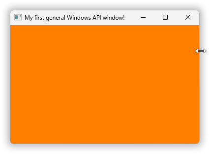
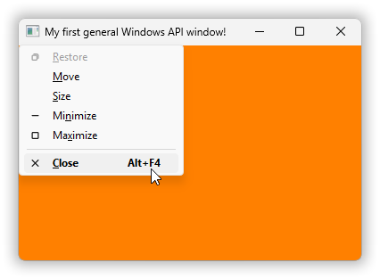
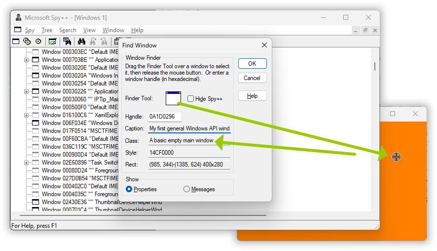
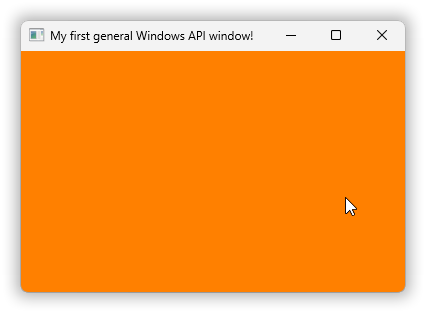
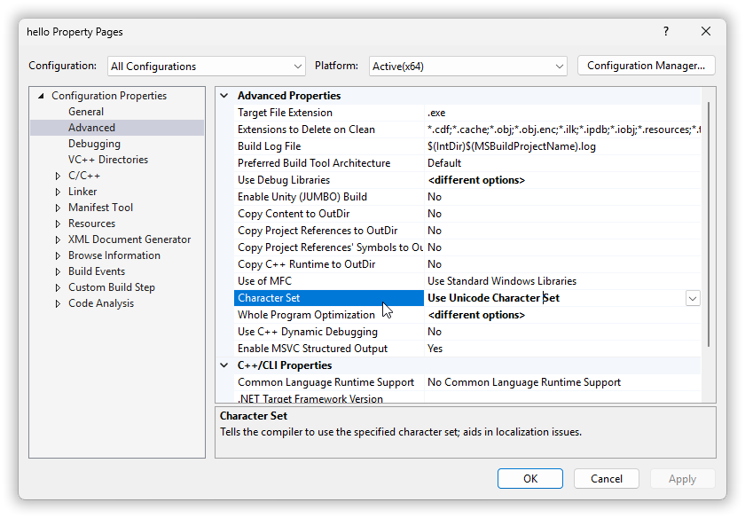
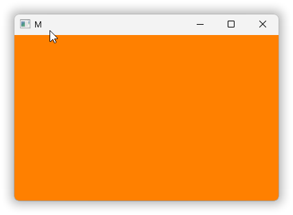
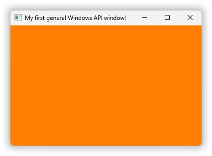

Winapi GUI in C++17 Chapter 3 – General window creation & message handling.

> ❞ *quote.*

<!-- START doctoc generated TOC please keep comment here to allow auto update -->
<!-- DON'T EDIT THIS SECTION, INSTEAD RE-RUN doctoc TO UPDATE -->
**Table of Contents**  *generated with [DocToc](https://github.com/thlorenz/doctoc)*

- [Chapter 3. General window creation & message handling.](#chapter-3-general-window-creation--message-handling)
  - [3.1. Window parts.](#31-window-parts)
  - [3.2. Window creation.](#32-window-creation)
    - [3.2.1. Creating the Windows API “window class”.](#321-creating-the-windows-api-window-class)
    - [3.2.2. Creating the window object.](#322-creating-the-window-object)
    - [3.2.3. Displaying the window.](#323-displaying-the-window)
  - [3.3. Window events, a.k.a. messages.](#33-window-events-aka-messages)
    - [3.3.1. The message loop.](#331-the-message-loop)
    - [3.3.2. The window procedure.](#332-the-window-procedure)
    - [3.3.3. Default handling of messages.](#333-default-handling-of-messages)
  - [3.4. The complete program, version 0.](#34-the-complete-program-version-0)
  - [asdasd](#asdasd)

<!-- END doctoc generated TOC please keep comment here to allow auto update -->

## Chapter 3. General window creation & message handling.

Our first **general window** will look like this:

$\quad$ 

### 3.1. Window parts.

The orange area is made orange by our C++ code. I.e. it’s not the Windows default. This area is called the **client area** because it’s the area where your code, the Windows API’s client code, presents stuff.

Above the client area is the window **title bar** with some control elements — when you click the **window icon** at the left you get a system menu (it can also be invoked via the **`Alt`+`space`** shortcut), and the `–`, `□` and `×` to the right are respectively minimize, maximize and close **buttons**.

Around the client area and title bar is a **window frame**. In modern Windows it’s unfortunately difficult to see that this is a **thick frame** that can be used to resize the window. Conversely, a window with a **thin frame** (it looks just about the same in modern Windows) can’t be resized by the user. To show the resizability in the screenshot I placed the mouse cursor over the thick frame, whence it changes shape to `⇔` resizing. In the code the frame thickness and hence resizability is a “window style” flag passed to `CreateWindow`, where this code uses `WS_OVERLAPPEDWINDOW` which includes `WS_THICKFRAME`.

Here’s a screenshot showing the **system menu** in action:

$\quad$ 

As that menu informs you you can use keyboard shortcut **`Alt`+`F4`** to close the window. This was originally, in the 1980’s, part of the [IBM *Common User Access*](https://en.wikipedia.org/wiki/IBM_Common_User_Access#Influence) standard for keyboard shortcuts. When you click the desktop background and press `Alt`+`F4` you’re closing the desktop window which then gives you the Windows shutdown dialog.

Alternatively you can double-click the window icon to close the window. But some windows like the modern Windows Calc window don’t use that default functionality — the common conventions are just that, conventions, not absolute law. With Calc the apparent window icon is just a graphic presented by Calc and double-clicking that graphic unreasonably maximises the calculator instead of closing the window, but even in Calc you can still access the system menu via `Alt`+`space`.


### 3.2. Window creation.

#### 3.2.1. Creating the Windows API “window class”.

Some of the visible aspects of this window are specified by its **window class**, which is a kind of template for window instances. We need to use that general mechanism even though this program only creates one window. There’s no predefined window class for a general main window so our code has to create one, and the parameters used for that creation are

[In *03\code\empty-basic-window.v0.cpp*](03/code/empty-basic-window.v0.cpp):

```cpp
const auto& window_class_name = L"A basic empty main window";

auto make_window_class_params()
    -> WNDCLASSW
{
    WNDCLASSW params = {};
    params.lpfnWndProc      = &window_proc;
    params.hInstance        = GetModuleHandleW( 0 );        // Not very useful in modern code.
    params.hIcon            = LoadIcon( 0, IDI_APPLICATION );   // ANSI or Wide, either is OK.
    params.hCursor          = LoadCursor( 0, IDC_ARROW );       // ANSI or Wide, either is OK.
    params.hbrBackground    = CreateSolidBrush( RGB( 0xFF, 0x80, 0x00 ) );          // Orange.
    params.lpszClassName    = window_class_name;
    return params;
};
```

The first parameter, the **window proc**, is a single callback function that handles events for the window. It defines the window’s looks and functionality by how it handles the events. In this program it uses default handling of all events except that it needs to terminate the program when the window is closed, which it does via its handling of the `WM_DESTROY` event.

The `LoadIcon` and `LoadCursor` calls use \<windows.h\> **name macros**. By default these names are mapped to respectively `LoadIconA` and `LoadCursorA`, which work fine with the default definitions of `IDI_APPLICATION` and `IDC_ARROW`. But if the symbol **`UNICODE`** is defined when \<windows.h\> is included then the name macros map to respectively `LoadIconW` and `LoadCursorW`, which work fine with the `UNICODE`-dependent definitions of `IDI_APPLICATION` and `IDC_ARROW`.

Since the result for these two functions is the same regardless of ANSI or wide function I just wrote it this way, using the macros. Otherwise the code would have had to require or ensure that `UNICODE` is defined, unlike our code examples so far. But we’ll do that in version 1 because as you’ll see that can avoid some nasty bugs.

To create the window class the program passes these parameters to **`RegisterClass`**, which returns a 16-bit `ATOM` id for the new window class object. However to use that id with e.g. `CreateWindow` it needs to be reinterpreted as a pointer, so that’s both risky and cumbersome. And so instead it’s common to use the window class name, here “A basic empty main window”.

And you can see that name e.g. via Microsoft’s Spy++, command `spyxx` in an environment with the Microsoft tools available, e.g. after [running `vcvars64`](02.md#231-the-vcvars-batch-files):

$\quad$ 

The window class creation:

[In *03\code\empty-basic-window.v0.cpp*](03/code/empty-basic-window.v0.cpp):

```cpp
enum Process_exit_code: int { success = 0, failure = EXIT_FAILURE };

auto run()
    -> Process_exit_code
{
    const WNDCLASSW window_class_params = make_window_class_params();
    RegisterClassW( &window_class_params );
    ⋮
```

This does not check whether the `RegisterClass` call succeeded because if it failed then `CreateWindow` will fail, and that’s checked.

#### 3.2.2. Creating the window object.

The result of **`CreateWindow`** is a **handle** value that represents the new object.

In C and C++ a handle is typewise a pointer. By default some such as `HBRUSH` and **`HWND`** are distinct `struct` pointer types, and some such as `HGDIOBJ` are just `void*`. These types provide *some* safety for natural code, and they generally permit naturally meaningful implicit conversions, but it’s a very imperfect system so one still one needs to be careful!

Usually handle value `0` (a nullpointer) denotes error, but [there are some exceptions](https://devblogs.microsoft.com/oldnewthing/20040302-00/?p=40443). For example, `CreateFile` instead reports error by returning **`INVALID_HANDLE_VALUE`** which is `-1` cast to `HANDLE`. But most functions including `CreateWindow` just use the nullvalue as error indication:

[In *03\code\empty-basic-window.v0.cpp*](03/code/empty-basic-window.v0.cpp):

```cpp
    const HWND window = CreateWindowW(
        window_class_name,
        L"My first general Windows API window!",
        WS_OVERLAPPEDWINDOW,                        // Resizable and has a title bar.
        CW_USEDEFAULT, CW_USEDEFAULT, 400, 280,     // x y w h
        HWND(),                                     // Owner window; none.
        HMENU(),                                    // Menu handle or child window id.
        GetModuleHandleW( 0 ),                      // Not very useful in modern code.
        nullptr                                     // Custom parameter for app’s use.
        );
    if( not window ) {
        return Process_exit_code::failure;          // Avoid hanging in the event loop.
    }
```

The prefix `WS_` for the “style” flags is short for **window style**.

You can inspect or change the window style flags later. For example, most generally they can be changed via a call to `SetWindowLongPtr` with index `GWL_STYLE`. But the style `WS_VISIBLE` should better be inspected via the dedicated function `IsWindowVisible` or changed via the dedicated function `ShowWindow` used below.

The `CW_USEDEFAULT` values for the window position cause the window to be placed automatically. By default Windows places windows in a diagonal down the screen and starts a new diagonal when it runs out of room. You can technically also use `CW_USEDEFAULT` for the width and height.

If window creation fails then a loop until the window closes would just hang, and so, considering the possibility of typos or resource depletion or whatever, this code checks if the window creation succeeded, and if not then it bails out.


#### 3.2.3. Displaying the window.

A top level window is by default created **hidden**, meaning that it has no on-screen presentation. In this state you can populate the window with the contents that you want, without the user seeing that process. Then when all is ready you can call **ShowWindow** to make the window **visible**:

[In *03\code\empty-basic-window.v0.cpp*](03/code/empty-basic-window.v0.cpp):

```cpp
    ShowWindow( window, SW_SHOWDEFAULT );           // Displays the window.
```

The `SW_SHOWDEFAULT` says to present the window as minimized, normal or maximized according to the parent process’ wishes.

However, for the first call to `ShowWindow` the `SHOW_`… specification is *ignored*. In the first call you get `SW_SHOWDEFAULT` no matter what you specify. And this is intentional [documented behavior](https://learn.microsoft.com/en-us/windows/win32/api/winuser/nf-winuser-showwindow#remarks) except that that documentation also includes some nonsense.


### 3.3. Window events, a.k.a. messages.

After creation the window’s life consists of handling events, in a very low level C style way.

The terminology here reflects the history of Windows’ creation. In the late 1970’s the Xerox corporation did a lot of groundbreaking research at their research center in Palo Alto, California, the Xerox PARC center. They invented local area networks, workstations with bitmapped displays, and not the least, in the **Smalltalk** project, object oriented techniques and user interfaces based on windows and mousing — at the time called [WIMP](https://en.wikipedia.org/wiki/Wimp): window, icon, menu, pointer.

Smalltalk is a dynamic object oriented language where method calls are called **messages**. This probably trickled down to Microsoft via Apple’s participation in a Xerox technology transfer program (look up the [Apple Lisa](https://en.wikipedia.org/wiki/Apple_Lisa)). And so the window events in Windows are called “messages”, though they’re represented in C level type unsafe style with just an integer message identifier value such as `WM_SIZE` accompanied by two general integer values with message-dependent meanings.

The `WM_` prefix is short for *window message*. There are a lot of them but for this program we’ll only be checking for `WM_DESTROY` which is a notification that the window’s being destroyed, and `WM_QUIT` which requests that the application terminates. `WM_DESTROY` is a message to a window while `WM_QUIT`, in spite of the `WM_` prefix , is a message to the thread.

The main code’s responsibility after creating a window is to fetch messages from the thread’s **message queue**, and dispatch each to the relevant window’s handler. That handler is called a **window proc**. Which terminology again probably comes from Apple: after Smalltalk they used Pascal for their early work, and in Pascal a `void` function is called a “procedure”.


#### 3.3.1. The message loop.

The message fetching and dispatching is called a **message loop**, here

[In *03\code\empty-basic-window.v0.cpp*](03/code/empty-basic-window.v0.cpp):

```cpp
    // Event loop a.k.a. message loop:
    MSG msg;
    while( GetMessageW( &msg, 0, 0, 0 ) ) {         // We’re ignoring that it can fail.
        TranslateMessage( &msg );           // Provides e.g. Alt+Space sysmenu shortcut.
        DispatchMessageW( &msg );           // Calls the window proc of relevant window.
    }
    assert( msg.message == WM_QUIT );
    return Process_exit_code( msg.wParam );
}
```

`GetMessage` returns 0 when it retrieves a `WM_QUIT` message, and otherwise non-zero. For successful calls the non-zero return value is positive, for errors it’s negative. But an error for `GetMessage` is an extremely rare occurrence so, while we’re going to address that in version 1 that possibility is commonly just ignored to get simpler code like this.

The `TranslateMessage` call is not strictly necessary but it provides e.g. the `Alt`+`space` shortcut for the system menu, by identifying certain keypress combinations and adding messages to the queue, called **posting** of messages.

Some messages instead bypass the queue and the above loop; more or less direct invocations of a window proc. This is called **sending** a message. Windows provides `PostMessage` and `SendMessage` to do this yourself when you might need it.

`DispatchMessage` does more than just identifying the receiver window and calling its window proc. It also supports hooks for inspecting the message stream, as used by e.g. Spy++, although that might (I don’t know) be accomplished by an internal call of `SendMessage`. Plus that it has special handling of `WM_TIMER` messages.


#### 3.3.2. The window procedure.

The `MSG` structure includes a time stamp for the message, and in the Smalltalk project such time stamps were identified as crucial e.g. to be able to handle double-clicking (they also identified undecoded keyboards and bit blitting as crucial fundamentals). However in Windows the time stamp is not passed on to the handler, the window proc. Instead the window proc, if it needs it, may use `GetMessageTime` to get the time stamp of the message last fetched from the queue.

Anyway, that’s the — somewhat circular — reason why the window proc doesn’t have a time stamp parameter:

[In *03\code\empty-basic-window.v0.cpp*](03/code/empty-basic-window.v0.cpp):

```cpp
auto CALLBACK window_proc(
    const HWND          window,
    const UINT          msg_id,         // Can be e.g. `WM_COMMAND`, `WM_SIZE`, ...
    const WPARAM        w_param,        // Meaning depends on the `msg_id`.
    const LPARAM        ell_param       // Meaning depends on the `msg_id`.
    ) -> LRESULT
{
    if( msg_id == WM_DESTROY ) {
        // The window is being destroyed. Terminate the message loop to avoid a hang:
        PostQuitMessage( Process_exit_code::success );
        return 0;
    }
    return DefWindowProcW( window, msg_id, w_param, ell_param );    // Default handling.
}
```

The names `w_param` and `ell_param`, or in Microsoft-speak `wParam` and `lParam`, are short for *word parameter* and *long parameter*, reflecting original 16 and 32 bit sizes.

In modern 64-bit Windows both are 64-bit unsigned integers, but still only `ell_param` is used to represent actual pointers.

#### 3.3.3. Default handling of messages.

**`DefWindowProc`** provides general default handling of a message. A different design is used for “dialog windows” where the higher level event handler returns 0 to request default handling. Regardless of mechanism, usually one *either* fully handles a message, *or* requests default handling, but not both.


### 3.4. The complete program, version 0.

Except for a trivial `main` the above discussed code is all, and here’s the single file:

[*03\code\empty-basic-window.v0.cpp*](03/code/empty-basic-window.v0.cpp):

```cpp
#include <windows.h>

#include <cassert>          // assert
#include <cstdlib>          // EXIT_FAILURE

enum Process_exit_code: int { success = 0, failure = EXIT_FAILURE };

auto CALLBACK window_proc(
    const HWND          window,
    const UINT          msg_id,         // Can be e.g. `WM_COMMAND`, `WM_SIZE`, ...
    const WPARAM        w_param,        // Meaning depends on the `msg_id`.
    const LPARAM        ell_param       // Meaning depends on the `msg_id`.
    ) -> LRESULT
{
    if( msg_id == WM_DESTROY ) {
        // The window is being destroyed. Terminate the message loop to avoid a hang:
        PostQuitMessage( Process_exit_code::success );
        return 0;
    }
    return DefWindowProcW( window, msg_id, w_param, ell_param );    // Default handling.
}

const auto& window_class_name = L"A basic empty main window";

auto make_window_class_params()
    -> WNDCLASSW
{
    WNDCLASSW params = {};
    params.lpfnWndProc      = &window_proc;
    params.hInstance        = GetModuleHandleW( 0 );        // Not very useful in modern code.
    params.hIcon            = LoadIcon( 0, IDI_APPLICATION );   // ANSI or Wide, either is OK.
    params.hCursor          = LoadCursor( 0, IDC_ARROW );       // ANSI or Wide, either is OK.
    params.hbrBackground    = CreateSolidBrush( RGB( 0xFF, 0x80, 0x00 ) );          // Orange.
    params.lpszClassName    = window_class_name;
    return params;
};

auto run()
    -> Process_exit_code
{
    const WNDCLASSW window_class_params = make_window_class_params();
    RegisterClassW( &window_class_params );

    const HWND window = CreateWindowW(
        window_class_name,
        L"My first general Windows API window!",
        WS_OVERLAPPEDWINDOW,                        // Resizable and has a title bar.
        CW_USEDEFAULT, CW_USEDEFAULT, 400, 280,     // x y w h
        HWND(),                                     // Owner window; none.
        HMENU(),                                    // Menu handle or child window id.
        GetModuleHandleW( 0 ),                      // Not very useful in modern code.
        nullptr                                     // Custom parameter for app’s use.
        );
    if( not window ) {
        return Process_exit_code::failure;          // Avoid hanging in the event loop.
    }

    ShowWindow( window, SW_SHOWDEFAULT );           // Displays the window.

    // Event loop a.k.a. message loop:
    MSG msg;
    while( GetMessageW( &msg, 0, 0, 0 ) ) {         // We’re ignoring that it can fail.
        TranslateMessage( &msg );           // Provides e.g. Alt+Space sysmenu shortcut.
        DispatchMessageW( &msg );           // Calls the window proc of relevant window.
    }
    assert( msg.message == WM_QUIT );
    return Process_exit_code( msg.wParam );
}

auto main() -> int { return run(); }
```

Building with MinGW g++ is almost as simple as before because g++ links by default with Windows’ “kernel32.dll” and “**user32.dll**”. The former is used by every program and provides e.g. `GetModuleHandle`, and the latter is the “user interface” DLL that provides all of the GUI-related functions used here, such as `CreateWindow`. However, this program also uses `CreateSolidBrush` and that function is provided by “**gdi32.dll**”, the original “graphics device interface” DLL:

```text
[R:\03\code]
> g++ empty-basic-window.v0.cpp -lgdi32
```

With Visual C++ only “kernel32.dll” is linked in by default so both the User and the GDI libraries must be specified:

```text
[R:\03\code]
> cl empty-basic-window.v0.cpp user32.lib gdi32.lib /Feb
empty-basic-window.v0.cpp
```

Result with both compilers:

$\quad$ 

Worth noting: the ordinary arrow shaped mouse cursor when the mouse is over the window is the one *specified in the window class*; not coincidentally the same as the common mouse cursor elsewhere. Most every window is in on a conspiracy to maintain a **user illusion** that there is one common mouse cursor. But it’s a case of ~everybody voluntarily doing the same.


### 3.5. Avoid inadvertent use of ANSI functions by requiring `UNICODE`.

You may have noticed an apparent inconsistency and possible bug, that the message loop calls the wide function `DispatchMessageW` but also the apparent name macro `TranslateMessage`, which might resolve to an ANSI function?

However this is easily checked by just trying to append a `W` to the latter, showing that there is no such wide function:

```text
[R:\03\code]
> g++ empty-basic-window.v0.cpp -lgdi32
empty-basic-window.v0.cpp: In function 'Process_exit_code run()':
empty-basic-window.v0.cpp:63:9: error: 'TranslateMessageW' was not declared in this scope; did you mean 'TranslateMessage'?
   63 |         TranslateMessageW( &msg );           // Provides e.g. Alt+Space sysmenu shortcut.
      |         ^~~~~~~~~~~~~~~~~
      |         TranslateMessage
```

Another way is to check which ANSI functions the program actually uses by listing the **DLL imports** with names that end with `A`. In order to limit this list to functions I use `findstr` with a pattern that specifies digit `\d` followed by any number of characters `.*` followed by an `A` at the end of the line, option `/e`. As before with the MinGW tools you can use `objdump` for the inspection of the executable’s innards (with MS tools use `dumpbin`):

```[R:\03\code]
> objdump -p a.exe | findstr /e "\d.*A"
        000084d8  <none>  0247  LoadCursorA
        000084e0  <none>  024b  LoadIconA
```

The executable produced by Visual C++ additionally imports `GetCommandLineA` which the runtime uses to produce the arguments of `main`. With g++ that is apparently optimized away. Anyway the only ANSI functions explicitly used by the code are `LoadCursorA` and `LoadIconA`, and these are benign: ANSI or wide doesn’t matter for the cursor and icon they produce handles to.

However, consider the function `DefWindowProc`. Unlike the two functions above its parameters do not distinguish between ANSI `const char*` and wide `const wchar_t*`; the parameters are all integers… And so it’s easy to inadvertently write literally “`DefWindowProc`” instead of “`DefWindowProcW`”, and when or if you do you’re using the name macro and the result will then depend on whether `UNICODE` is defined in the build.

In Visual Studio `UNICODE` is defined by default, hidden behind an innocuously looking setting named *Character Set*:



But the Visual C++ *compiler* that Visual Studio invokes does not itself provide that very Windows specific and year-of-usage specific default. And neither does the MinGW g++ compiler. So when you work in the command line you do not have `UNICODE` defined by default, and then a `DefWindowProc` in the source maps to `DefWindowProcA`:

```text
[R:\03\code]
> objdump -p a.exe | findstr /e "\d.*A"
        000084c0  <none>  00a4  DefWindowProcA
        000084d8  <none>  0247  LoadCursorA
        000084e0  <none>  024b  LoadIconA
```

And the effect of that can be disastrous.

For our almost minimal program it just affects the window title. The code’s UTF-16 encoded wide text title gets set in the window via a `WM_SETTEXT` message, default-handled by `DefWindowProcA`. And that default handling assumes Windows ANSI encoding where the second byte of 16-bit `L'M'` (the first letter in the title) is a zero termination of the string:

$\quad$ 

---

A good way to prevent such bugs is to ***require*** either `UNICODE` defined and use wide functions for everything, or `UNICODE` not defined and use ANSI functions for everything, preferably with UTF-8 encoding. With such requirement one can as well drop the `A` and `W` suffixes except where one very intentionally calls a function of the opposite set. Which, together with checking of possible `GetMessage` failure, constitutes a version 1 of this program, a *no direct ungoodness* starter version:

[03\code\empty-basic-window.v1.cpp](03/code/empty-basic-window.v1.cpp)

```cpp
#ifndef UNICODE
#   error "Please define UNICODE in the build (this is a wide function based program)."
#   include <terminate-compilation>     // Workaround for “must continue anyway!” g++.
#endif
#include <windows.h>

#include <cassert>          // assert
#include <cstdlib>          // EXIT_FAILURE

enum Process_exit_code: int { success = 0, failure = EXIT_FAILURE };

template< class T >
constexpr auto sign_of( const T& v ) noexcept -> int { return (v > 0) - (v < 0); }

auto CALLBACK window_proc(
    const HWND          window,
    const UINT          msg_id,         // Can be e.g. `WM_COMMAND`, `WM_SIZE`, ...
    const WPARAM        w_param,        // Meaning depends on the `msg_id`.
    const LPARAM        ell_param       // Meaning depends on the `msg_id`.
    ) -> LRESULT
{
    if( msg_id == WM_DESTROY ) {
        // The window is being destroyed. Terminate the message loop to avoid a hang:
        PostQuitMessage( Process_exit_code::success );
        return 0;
    }
    return DefWindowProc( window, msg_id, w_param, ell_param );     // Default handling.
}

const auto& window_class_name = L"A basic empty main window";

auto make_window_class_params()
    -> WNDCLASS
{
    WNDCLASS params = {};
    params.lpfnWndProc      = &window_proc;
    params.hInstance        = GetModuleHandle( 0 );         // Not very useful in modern code.
    params.hIcon            = LoadIcon( 0, IDI_APPLICATION );
    params.hCursor          = LoadCursor( 0, IDC_ARROW );
    params.hbrBackground    = CreateSolidBrush( RGB( 0xFF, 0x80, 0x00 ) );          // Orange.
    params.lpszClassName    = window_class_name;
    return params;
};

auto run()
    -> Process_exit_code
{
    const WNDCLASS window_class_params = make_window_class_params();
    RegisterClass( &window_class_params );

    const HWND window = CreateWindowW(
        window_class_name,
        L"My first general Windows API window!",
        WS_OVERLAPPEDWINDOW,                        // Resizable and has a title bar.
        CW_USEDEFAULT, CW_USEDEFAULT, 400, 280,     // x y w h
        HWND(),                                     // Owner window; none.
        HMENU(),                                    // Menu handle or child window id.
        GetModuleHandle( 0 ),                       // Not very useful in modern code.
        nullptr                                     // Custom parameter for app’s use.
        );
    if( not window ) {
        return Process_exit_code::failure;          // Avoid hanging in the event loop.
    }

    ShowWindow( window, SW_SHOWDEFAULT );           // Displays the window.

    // Event loop a.k.a. message loop:
    for( ;; ) {
        MSG msg;
        switch( sign_of( GetMessage( &msg, 0, 0, 0 ) ) ) {
            case +1: {
                TranslateMessage( &msg );           // Provides e.g. Alt+Space sysmenu shortcut.
                DispatchMessage( &msg );            // Calls the window proc of relevant window.
                continue;
            }
            case 0: {
                assert( msg.message == WM_QUIT );
                return Process_exit_code( msg.wParam );
            }
            case -1: {
                return Process_exit_code::failure;
            }
        }
    }
}

auto main() -> int { return run(); }
```

Ah, it’s much cleaner without those pesky suffixes!

In passing, the definition of `sign_of` is idiomatic. I chose pass-by-reference to show how it should be for a reusable definition placed in some header. Think about e.g. arbitrary precision arithmetic with a zillion digits per number.

---

Compilation showing that the check for `UNICODE` works in an almost practical way also with g++:

```text
[R:\03\code]
> g++ empty-basic-window.v1.cpp
empty-basic-window.v1.cpp:2:5: error: #error "Please define UNICODE in the build (this is a wide function based program)."
    2 | #   error "Please define UNICODE in the build (this is a wide function based program)."
      |     ^~~~~
empty-basic-window.v1.cpp:3:13: fatal error: terminate-compilation: No such file or directory
    3 | #   include <terminate-compilation>     // Workaround for “must continue anyway!” g++.
      |             ^~~~~~~~~~~~~~~~~~~~~~~
compilation terminated.
````

Compilation showing how to do all correctly:

```text
[R:\03\code]
> g++ empty-basic-window.v1.cpp -D UNICODE -lgdi32
```

Or with Visual C++:

```text
[R:\03\code]
> cl empty-basic-window.v1.cpp user32.lib gdi32.lib /D UNICODE /Feb
empty-basic-window.v1.cpp
```

Result:

$\quad$ 
