<!-- https://www.google.com/search?q=github+_config.yml+math -->
Winapi GUI in C++17 Chapter 4 – Basic GDI graphics.

> ❞ *Quote.*

<!-- START doctoc generated TOC please keep comment here to allow auto update -->
<!-- DON'T EDIT THIS SECTION, INSTEAD RE-RUN doctoc TO UPDATE -->
**Table of Contents**  *generated with [DocToc](https://github.com/thlorenz/doctoc)*

- [Chapter 4. Basic GDI graphics.](#chapter-4-basic-gdi-graphics)
  - [4.1. Just plotting the graph.](#41-just-plotting-the-graph)
    - [4.1.1. How to handle `WM_PAINT`.](#411-how-to-handle-wm_paint)
    - [4.1.2. How to plot a parabola with every 5th *x* unit marked.](#412-how-to-plot-a-parabola-with-every-5th-x-unit-marked)
    - [4.1.3. Invalidating parts that need to be regenerated.](#413-invalidating-parts-that-need-to-be-regenerated)
  - [4.2. Drawing lines.](#42-drawing-lines)
    - [4.2.1. Connecting the dots … with `MoveToEx` and `LineTo`.](#421-connecting-the-dots--with-movetoex-and-lineto)
    - [4.2.2. You can use `Polyline` for simpler and faster drawing.](#422-you-can-use-polyline-for-simpler-and-faster-drawing)
    - [4.2.3. `Polyline` also serves as the “draw a single straight line” function.](#423-polyline-also-serves-as-the-draw-a-single-straight-line-function)
  - [4.3. Factoring out the coordinate transformations.](#43-factoring-out-the-coordinate-transformations)
    - [4.3.1. A `Painter` class.](#431-a-painter-class)
    - [4.3.2. Special case code versus refactored orientation agnostic code.](#432-special-case-code-versus-refactored-orientation-agnostic-code)
    - [4.3.3. Why the GDI coordinate transformation support doesn’t cut it.](#433-why-the-gdi-coordinate-transformation-support-doesnt-cut-it)
    - [4.3.4. 90° rotations are simple but (a gotcha) involve handedness.](#434-90%C2%B0-rotations-are-simple-but-a-gotcha-involve-handedness)
    - [4.3.5. Hybrid coordinates: pixel indices on the math *x* axis.](#435-hybrid-coordinates-pixel-indices-on-the-math-x-axis)

<!-- END doctoc generated TOC please keep comment here to allow auto update -->


## Chapter 4. Basic GDI graphics.

An example of custom graphics is to present a parabola graph in a window, which we’ll do in this chapter:

[image]

Graphics like that is the one thing that you can’t easily do in a text based program, except at extremely or very low resolution. A classic Windows console can only present very crude “[ASCII art](https://en.wikipedia.org/wiki/ASCII_art)” graphics made of characters. At best — but that involves some effort — it can utilize [block graphics characters](https://en.wikipedia.org/wiki/Block_Elements) like `▀` and `▄` to increase vertical resolution and improve the horrendous aspect ratio.

Unix-land terminals and in Windows a Windows Terminal or mintty console view *can* present low res photo like graphics via [Sixel](https://en.wikipedia.org/wiki/Sixel) codes but that’s even more extra effort to do. If we call “made of ordinary characters” level 0, and “block graphics characters” level 1, and “Sixel graphics” level 2, then most novices and professionals alike never get beyond level 0. It can look like this:

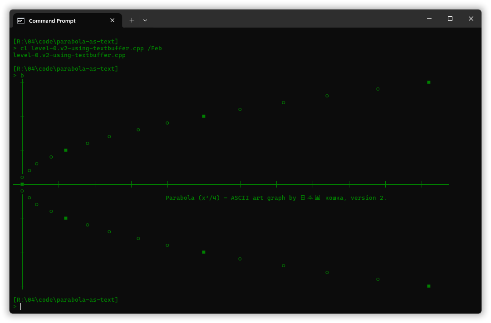

So, learners that start with C++ and want to do graphics generally eschew pure text based standard C++ for 3rd party graphics/GUI libraries or other languages like Python or JavaScript, or tools like spreadsheets. In particular for the special case of graphing a mathematical function a Python program using e.g. Matplotlib or one of the newer Matplotlib-like alternatives, or a spreadhsheet graph of data from a generated CSV file, are easy low effort ways to do it and generally with much higher quality results than one could expect from a DIY C++ program. Or one can simply use a graphing calculator such as Windows’ Calc or online [Desmos](https://www.desmos.com/calculator).

But math functions are not all that graphics is used for. For a novice they are simply natural easy first steps into the world of graphics. And since the Windows GUI API primarily is designed for C and C++, one can do graphics via native Windows functionality such as the original [**GDI** library](https://en.wikipedia.org/wiki/Graphics_Device_Interface), the *graphics device interface*. Additionally Windows offers the GDI successor [**GDI+**](https://en.wikipedia.org/wiki/Graphics_Device_Interface#Windows_XP) introducing (gasp!) *color names*, the GDI+ successor [**Direct2D**](https://en.wikipedia.org/wiki/Direct2D), the [**Direct3D**](https://en.wikipedia.org/wiki/Direct3D) framework for games, and the [**Windows Imaging Component**](https://en.wikipedia.org/wiki/Windows_Imaging_Component) framework for handling pixel based images. And yes, not to forget, Windows also offers an [**OpenGL** implementation](https://learn.microsoft.com/en-us/windows/win32/opengl/opengl); as with the others it’s ready to use functionality with no installation.

We saw in the previous chapter that `RegisterClass`  from the pure windowing functionality in the User library, took a parameter of GDI type, namely a handle to a “brush” used for clearing the background, which we created with the GDI function `CreateSolidBrush`. And generally these two APIs/libraries, User and GDI, are very tightly coupled; to wit, the GDI-specific message `WM_PAINT` is included in the general set and its associated helper functions `BeginPaint` and `EndPaint` are provided by User. So pedagogically it’s necessary to start with the GDI, it’s involved anyway, and in this chapter we’ll only use the GDI.

The problems that we’ll encounter and solve here are mainly general ones that are not GDI specific problems, except the last one:

* The graph is not properly fully redrawn when the window is resized.  
  Solution: *invalidate* the client area when the window is resized (this can be automated).

* For pixel based graphics single computed points on a graph look disconnected.  
  Solution: connect them with lines.

* Text is by default presented using an archaic bitmapped font that’s ugly and lacks certain characters.  
  Solution: check which font `MessageBox` uses for its button, and use that.

* By default the program doesn’t have available the real screen resolution, it looks very low res.  
  Solution: the program needs to declare DPI awareness; real screen resolution is an opt-in feature.

* Even with full screen resolution the graph has visible staircase effect.  
  Solution: use e.g. GDI+ anti-aliasing or, with only GDI, reduce the impression via thicker lines.

So this chapter is to some degree a journey through an obstacle course. But an enlightening journey. Enjoy.


### 4.1. Just plotting the graph.

Our goal for now is to plot the graph of the parabola *y* = ¼⋅*x*² given by

```cpp
auto f( const double x ) -> double { return x*x/4; }
```

… with the the multiples of 5 for *x* marked specially to make it easy to see the scale. The screenshots at the start showed our final goal. But for now, in this section, the goal is just seeing that graph: no axes, no explanatory text or anything.

We’ll use Windows’ User library, “user32.dll”, for the window creation and message handling, just adding to the chapter 3 code, and we’ll use the GDI library, “gdi32.dll”, for the graphics generation, in User/GDI-speak also known as **painting**.

The easiest for the programmer would be to generate/draw/paint the graphics once “in the window” and be done with it, with the graphics actually stored in an image that the system would use to refresh the screen display as necessary. But the User library is instead designed to (only) let *your* code deal with the screen updates — possibly and usually avoiding the costly per window image storage. To understand this design consider that the User library originated with the birth of Windows circa 1983 to 1985, when a PC’s hardware was very limited both in speed and memory capacity. So it’s designed for **cooperative** as light as possible use of that hardware. And so whenever some part of the client area needs to have its screen presentation updated, e.g. because the window has been resized or (in earlier times) a covering window has been moved, you get a **`WM_PAINT`** message.


#### 4.1.1. How to handle `WM_PAINT`.

Handling `WM_PAINT` is usually more than a couple of lines of code, so it’s best delegated to a dedicated function that I systematically name **`on_wm_paint`**, called by the window proc:

[In *04\code\parabola-gdi.v0.cpp*](04/code/parabola-gdi.v0.cpp):

```cpp
    auto CALLBACK window_proc(
        const HWND          window,
        const UINT          msg_id,         // Can be e.g. `WM_COMMAND`, `WM_SIZE`, ...
        const WPARAM        w_param,        // Meaning depends on the `msg_id`.
        const LPARAM        ell_param       // Meaning depends on the `msg_id`.
        ) -> LRESULT
    {
        switch( msg_id ) {
            case WM_DESTROY:    {
                // The window is being destroyed. Terminate the message loop to avoid a hang:
                PostQuitMessage( Process_exit_code::success );
                return 0;
            }
            case WM_PAINT:      { on_wm_paint( window );  return 0; }
        }
        return DefWindowProc( window, msg_id, w_param, ell_param );     // Default handling.
    }
```

This is just a slight elaboration of [the window proc from chapter 3](03.md#332-the-window-procedure).

And to keep the similarity with that earlier version I chose to for now not putting the `WM_DESTROY` handling in its own `on_wm_destroy` function, but that refactoring is of course coming up, because consistency is important.

`on_wm_paint` has to follow a fairly strict protocol of (1) calling **`BeginPaint`**, (2) doing the graphics if `BeginPaint` succeeded, and (3) at least according to the documentation, regardless of success or not calling **`EndPaint`**:

[In *04\code\parabola-gdi.v0.cpp*](04/code/parabola-gdi.v0.cpp):

```cpp
    void on_wm_paint( const HWND window )
    {
        PAINTSTRUCT     info = {};          // Primarily a dc and an update rectangle.

        const HDC dc = BeginPaint( window, &info );
        if( dc ) { paint( window, dc ); }
        EndPaint( window, &info );
    }
```

For now we’ll just ignore the possibility that higher level code may need to know about a `BeginPaint` failure.

A successful `BeginPaint` call produces a handle to a **device context**, which is like a canvas to paint on; the painting result ends up in the window’s client area.

The device context provides automatic pixel level **clipping** of your graphics output. This ensures that no matter what your `paint` code does it won’t affect anything outside the window’s client area. More precisely it won’t affect anything outside the area that needs to be regenerated, the **update region** for the current `BeginPaint` call, so except for efficiency considerations you can let your graphics operations do just about anything anywhere with excess (as we’ll do!).

It’s `BeginPaint` that sets the device context’s **clipping region**, the “ignore all pixel setting outside of this” region, namely to the same as the update region, which after `BeginPaint` [is rectangular](https://learn.microsoft.com/en-us/windows/win32/gdi/clipping-regions). `BeginPaint` is also responsible for sending the window a `WM_ERASEBKGND` message if necessary. This scheme is part of the effort to minimize use of memory and processing capacity.

The update region rectangle is available in the `PAINTSTRUCT` and can in principle be used to limit the graphics regeneration. However I’ve never needed that optimization, even with 1990’s PC’s. And so only the `dc` is passed to `paint`.


#### 4.1.2. How to plot a parabola with every 5th *x* unit marked.

The console text based way of plotting a graph can be used almost unchanged for pixel based graphics, just that instead of rows of characters one has rows of pixels.

For simple text based plotting in a console the output progresses left to right → on each line, and on a higher level it progresses top to bottom ↓ for the lines. With a reasonable function such as *y* = ¼⋅*x*² one can then ensure, for simplicity, that there is only *one plot point per line* by orienting the math *y* axis horizontally. This naturally gives a *coordinate system*, sort of chosen by default, no hard thinking necessary or involved, where math *x* increases downwards, ↓, and math *y* increases to the right, →.

Code:

[In *04\code\parabola-as-text\level-0.v0-minimal-direct-output.cpp*](04/code/parabola-as-text/level-0.v0-minimal-direct-output.cpp):
```cpp
    void plot()
    {
        const double    horizontal_scaling  = 2;    // A char is ~half as wide as high.
        for( int i_line = -15; i_line <= +15; ++i_line ) {
            const double x = i_line;
            const double y = f( x );

            const int       i_column        = static_cast<int>( y*horizontal_scaling );
            const bool      is_marked       = (i_line % 5 == 0);
            const C_str     plot_char       = (is_marked? "■" : "○");

            if( i_column < 0 or i_column >= 120 ) {
                cout << '\n';
            } else {
                cout << spaces( i_column ) << plot_char << '\n';
            }
        }
    }
```

The `if( i_column < 0 or i_column >= 120 )` is a DIY character level clipping.

Result:

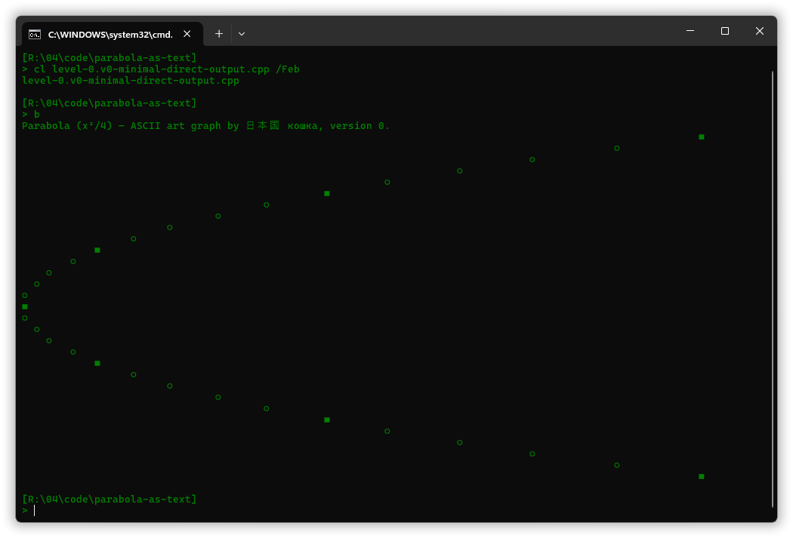

With GDI graphics one can assume that, unlike a character cell, a pixel is square. I.e. an ***aspect ratio of 1***. So there is no `horizontal_scaling`, but since pixels are small the math view coordinates need to be scaled up in order to see a reasonable size graph, e.g. a general `scaling` of 10 or so (this maps math *x* = -15 to pixel offset `-150` from the graph’s middle),

In passing: in the following code **`Nat`** is a type defined earlier in the file, i.e. it’s not a Windows API type. It’s an alias for `int`, simply defined as

```cpp
using Nat = int;
```

… but implying and communicating “no negative values”, i.e. it’s [a signed type for natural numbers](https://isocpp.github.io/CppCoreGuidelines/CppCoreGuidelines#es106-dont-try-to-avoid-negative-values-by-using-unsigned). The link is to the C++ Core Guidelines, which provide some explanation and justification.

[In *04\code\parabola-gdi.v0\with.single-loop.using-precomputed-bound.cpp*](04/code/parabola-gdi.v0/with.single-loop.using-precomputed-bound.cpp):

```cpp
    void paint( const HWND window, const HDC dc )
    {
        static constexpr COLORREF black = RGB( 0, 0, 0 );
        static const auto black_brush = static_cast<HBRUSH>( GetStockObject( BLACK_BRUSH ) );

        const RECT  r   = winapi::client_rect_of( window );
        const Nat   h   = r.bottom - r.top;     // r.top is always 0 for a client rect, but.
        assert( h >= 0 );

        const double scaling = 10;              // So e.g. math x = -15 maps to pixel row -150.
        
        const Nat   i_pixel_row_middle = h/2;

        // Plot the parabola.
        for( Nat i_pixel_row = 0; i_pixel_row < h; ++i_pixel_row ) {
            const int       relative_row_index = i_pixel_row - i_pixel_row_middle;
            const double    x                   = 1.0*relative_row_index/scaling;
            const double    y                   = f( x );
            const int       i_pixel_col         = int( scaling*y );

            SetPixel( dc, i_pixel_col, i_pixel_row, black );    // x hor y ver pixel coordinate.
        }

        // Add markers for every 5 math units of math x axis.
        const Nat       max_int_x_magnitude         = Nat( i_pixel_row_middle/scaling );
        const double    max_marker_x_magnitude      = 5*(max_int_x_magnitude/5);    // Symmetrical.
        for( double x = -max_marker_x_magnitude; x <= max_marker_x_magnitude; x += 5 ) {
            const double    y               = f( x );
            const int       i_pixel_row     = i_pixel_row_middle + int( scaling*x );
            const int       i_pixel_col     = int( scaling*y );

            const auto square_marker_rect = RECT{
                i_pixel_col - 2, i_pixel_row - 2, i_pixel_col + 3, i_pixel_row + 3
                };
            FillRect( dc, &square_marker_rect, black_brush );
        }
    }
```

The color value `black` — it’s just a 32-bit value, not a dynamic object — is used in the `SetPixel` call for the graph plotting, and the brush object `black_brush` is used in the `FillRect` call to set a square marker on the graph. Ordinarily **GDI objects** like brushes are dynamically created via calls such as `CreateSolidBrush` that we used in chapter 3, and unless ownership is transferred the object should better also be **destroyed** via a call to GDI’s **`DeleteObject`**. However a **stock object**, obtained from `GetStockObject`, is provided by the system and neither needs to nor should be destroyed; it lives forever.

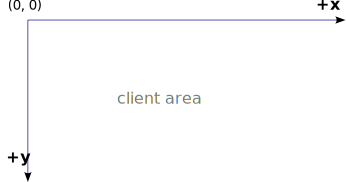

The [`SetPixel` function declaration](https://learn.microsoft.com/en-us/windows/win32/api/wingdi/nf-wingdi-setpixel) names the two position values `x` and `y`. Our code’s corresponding arguments are `i_pixel_col` and `i_pixel_row`. So with GDI by default the ***x* axis** is left to right horizontal, →, and the ***y* axis** is top to bottom vertical, ↓.

This view of the coordinates is necessary to understand e.g. the field names in a `RECT`.

The **`RECT`** used for the square marker holds 4 values, `top`, `left`, `bottom` and `right`, where the latter two are the coordinates of the pixel *beyond* the rectangle, diagonally down right from the down right corner. I.e. *width* = `right` - `left` and *height* = `bottom` - `top`. The API provides some [`RECT` support functions](https://learn.microsoft.com/en-us/windows/win32/gdi/rectangle-functions) but curiously not width and height functions…

For completeness, `winapi::client_rect_of` is defined by this program’s code as

[In *04\code\parabola-gdi.v0\with.single-loop.using-precomputed-bound.cpp*](04/code/parabola-gdi.v0/with.single-loop.using-precomputed-bound.cpp):

```cpp
namespace winapi {
    auto client_rect_of( const HWND window )
        -> RECT
    {
        RECT r;
        GetClientRect( window, &r );
        return r;
    }
}  // winapi
```

Result:

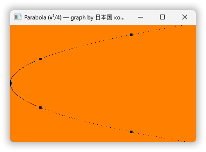


#### 4.1.3. Invalidating parts that need to be regenerated.

The screenshot shows that the window is created too small to display the full window title. That’s worth remembering for a version 1 (following this version 0). For now, since the window is resizable to see the full glorious title you can just grab the lower right corner and drag it a bit generally to the right:

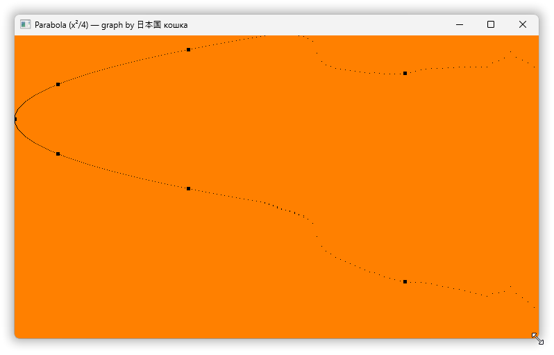

Okay, the title’s OK. But the graph… Wtf?

The strange graphics result is caused by the GDI helpfully *not updating* parts that as far as it knows don’t need updating. Our graph is centered vertically so whenever the window changes vertical size that graph presentation changes (it moves) and hence needs to be fully redrawn, or at least fully re-presented in the window, and the GDI doesn’t know! But purely horizontal resizing of the window doesn’t change any of the already presented graphics, so for our window purely horizontal resizing is fine:

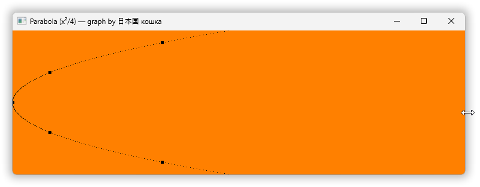

One possible fix is therefore to include the [**class style**](https://learn.microsoft.com/en-us/windows/win32/winmsg/window-class-styles) flag `CS_VREDRAW` in the window class, because for any window based on that class it “redraws the entire window if a movement or size adjustment changes the height of the client area”. If *window class* is not a familiar term then see the previous chapter’s discussion of [creating an API level window class object](03.md#321-creating-the-windows-api-window-class). Anyway, correspondingly, if horizontal size changes had been a problem then one could also or alternatively include `CS_HREDRAW`.

<sup></sub>Regarding the perhaps baffling word “movement” in the MS documentation quote: moving a window from one screen to another of very different dots per inch can change the client area height seen by the code.</sub></sup>

But: while it’s easy to instead add such redrawing in one’s message handling code, it’s difficult to avoid redrawing imposed by the window class. And different windows based on the same window class may have different requirements. In principle even the same window might have different requirements at different times, so this should not be the window class’ responsibility.

We can instead, in our ordinary message handling code, **invalidate** the client area contents whenever the window size changes, telling the GDI that this needs repainting. And there is no need to limit that to just vertical size changes. On a modern PC, and even back in the late 1980’s, *a user won’t see the repainting*: for our parabola it looks as static graphics moving vertically.

The window is informed about size changes via **`WM_SIZE`** messages, and the API offers `InvalidateRect` for the invalidation:

[In *04\code\parabola-gdi.v1.cpp*](04/code/parabola-gdi.v1.cpp):

```cpp
    void on_wm_destroy( const HWND window )
    {
        // The window is being destroyed. Terminate the message loop to avoid a hang:
        (void) window;      // Unused.
        PostQuitMessage( Process_exit_code::success );
    }

    void on_wm_paint( const HWND window )
    {
        PAINTSTRUCT     info = {};          // Primarily a dc and an update rectangle.

        const HDC dc = BeginPaint( window, &info );
        if( dc ) { paint( window, dc ); }
        EndPaint( window, &info );
    }

    void on_wm_size( const HWND window )
    {
        InvalidateRect( window, nullptr, true );    // `true` ⇨ let `BeginPaint` erase background.
    }

    auto CALLBACK window_proc(
        const HWND          window,
        const UINT          msg_id,         // Can be e.g. `WM_COMMAND`, `WM_SIZE`, ...
        const WPARAM        w_param,        // Meaning depends on the `msg_id`.
        const LPARAM        ell_param       // Meaning depends on the `msg_id`.
        ) -> LRESULT
    {
        switch( msg_id ) {
            case WM_DESTROY:    { on_wm_destroy( window );  return 0; }
            case WM_PAINT:      { on_wm_paint( window );  return 0; }
            case WM_SIZE:       { on_wm_size( window );  return 0; }
        }
        return DefWindowProc( window, msg_id, w_param, ell_param );     // Default handling.
    }
```

And with this version 1 resizing works fine:

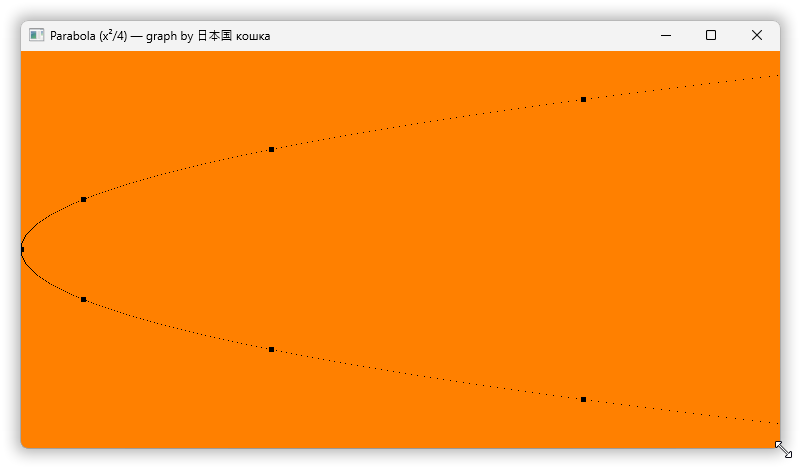

`WM_SIZE` is a message that has parameters, values encoded in `w_param` and `ell_param`. They’re just ignored here, so by happenchance all the `on_wm...` functions so far have the same simple form. But when we start using \<windowsx.h\> message cracker macros the message handler functions need to have the appropriate parameters that the macros generate arguments for.


### 4.2. Drawing lines.

Especially with a large size window the graph-made-of-separate-dots looks the opposite of solid and clear.

A simple remedy is to draw a line between each pair of plotted dots.

To the user this will look like a contiguous graph. And our goal for this section is to do that for the graph, and while we’re doing line drawing also add mathematical *x* and *y* axes and tick marks on the axes. We’ll not add a grid yet because that req


#### 4.2.1. Connecting the dots … with `MoveToEx` and `LineTo`.

The most direct way to draw the lines is to use **`MoveToEx`**, which specifies a device context **current position** that serves as line starting position, and **`LineTo`**, which draws a line including the starting point to but not including the specified end point. `LineTo` also moves the current position to the end point so that the next line can just continue from there. Using `LineTo` repeatedly can be viewed as *drawing* by moving a *pen*.

This approach means that the first point on the graph must be treated specially, resulting in a call to `MoveToEx` instead of `LineTo`. And also in general the last point must be treated specially, since `LineTo` doesn’t set a pixel there. That can be done in various ways, including for simplicity just a `SetPixel` call.

However, in order to pedantically ensure that something is drawn also in a 1 pixel high client area, and to even more pedantically ensure that the visible ends of the graph do not appear to be cut short, the code now draws the graph starting one line width above the client area, at GDI *y* = -1, and ending one line width below the client area, at GDI *y* = *h* — the parts of the lines that land outside the client area are clipped away by GDI:

[In `paint` in *04\code\parabola-gdi.v2.cpp*](04/code/parabola-gdi.v2.cpp):

```cpp
        // Plot the parabola.
        // The graph is plotted to vertically just outside the client area, to avoid cutting it.
        for( int i_pixel_row = -1; i_pixel_row <= h; ++i_pixel_row ) {
            const int       relative_row_index = i_pixel_row - i_pixel_row_middle;
            const double    x                   = 1.0*relative_row_index/scaling;
            const double    y                   = f( x );
            const int       i_pixel_col         = int( scaling*y );

            if( i_pixel_row == -1 ) {
                MoveToEx( dc, i_pixel_col, i_pixel_row, nullptr );
            } else {
                LineTo( dc, i_pixel_col, i_pixel_row );         // Draws black by default.
            }
        }
```

There’s no need to call `SetPixel` here (the last line ends outside the client area, a not visible part), and hence the named color value `black` is not needed anymore here in version 2 and has been removed.

Result:


There [once was a `MoveTo`](https://ecma-international.org/publications-and-standards/standards/ecma-234/) which current `MoveToEx` was an extension of. Alas, Microsoft decided to ditch it instead of having it as a convenient most used form. They may have thought that programmers would be confused if they changed the archaic limited return type to `void`, as if we’re not able to e.g. deal with “system32” for 64-bit executables, and other such changes.


#### 4.2.2. You can use `Polyline` for simpler and faster drawing.

At least on the PC I’m using to write this there’s no flicker when I resize the window. So drawing individual lines with `LineTo` is Fast Enough™. Still, one function that can draw these lines a bit faster, **`Polyline`**, also makes the drawing logic simpler, dispensing with the user code `if` statements to handle the first and last points specially.

So let’s do it, let’s replace `MoveToEx` + *n*×`LineTo` with a single call to `Polyline`.

Happily C++ has `std::vector` for storing the <b>`POINT`</b>­s in an array, as `Polyline` requires:

[In `paint` in *04\code\parabola-gdi.v3.cpp*](04/code/parabola-gdi.v3.cpp):

```cpp
        // Plot the parabola.
        // The graph is plotted to vertically just outside the client area, to avoid cutting it.
        auto points = vector<POINT>( h + 2 );       // 2 extra pixel rows for plotting to outside.
        for( int i_pixel_row = -1; i_pixel_row <= h; ++i_pixel_row ) {
            const int       relative_row_index  = i_pixel_row - i_pixel_row_middle;
            const double    x                   = 1.0*relative_row_index/scaling;
            const double    y                   = f( x );
            const int       i_pixel_col         = int( scaling*y );

            points[i_pixel_row + 1] = POINT{ i_pixel_col, i_pixel_row };
        }
        Polyline( dc, points.data(), int( points.size() ) );
```

Result:

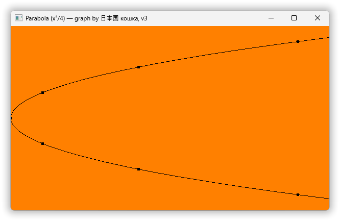

This is intentionally *identical* to the result before the change to `Polyline`, for identical result increases confidence that the rewrite was correct.


#### 4.2.3. `Polyline` also serves as the “draw a single straight line” function.

To now add math axes to the plot it would be natural to use a single line segment function, e.g. named `DrawLine`. Alas, while GDI+ does offer a `DrawLine`, the original and older GDI does not. One must make do with `LineTo` and `Polyline`, and perhaps `SetPixel`.

Just for reference I repeat verbatim the [documentation’s list of GDI drawing functions](https://learn.microsoft.com/en-us/windows/win32/gdi/line-and-curve-functions):

| Function | Description |
|----------|-------------|
| `AngleArc` | Draws a line segment and an arc. |
| `Arc` | Draws an elliptical arc. |
| `ArcTo` | Draws an elliptical arc. |
| `GetArcDirection` | Retrieves the current arc direction for the specified device context. |
| `LineDDA` | Determines which pixels should be highlighted for a line defined by the specified starting and ending points. |
| `LineDDAProc` | An application-defined callback function used with the LineDDA function. |
| `LineTo` | Draws a line from the current position up to, but not including, the specified point. |
| `MoveToEx` | Updates the current position to the specified point and optionally returns the previous position. |
| `PolyBezier` | Draws one or more Bézier curves. |
| `PolyBezierTo` | Draws one or more Bézier curves. |
| `PolyDraw` | Draws a set of line segments and Bézier curves. |
| `Polyline` | Draws a series of line segments by connecting the points in the specified array. |
| `PolylineTo` | Draws one or more straight lines. |
| `PolyPolyline` | Draws multiple series of connected line segments. |
| `SetArcDirection` | Sets the drawing direction to be used for arc and rectangle functions. |

Absent in that list: `SetPixel`, which we’ve used. It’s instead listed as [a bitmap-related function](https://learn.microsoft.com/en-us/windows/win32/gdi/bitmap-functions); to find it it helps to know that it exists. Microsoft’s ways are as ever mysterious & baffling.

And there is no `SetPixel` variant that uses the color that the line functions use. It’s possible to check what that color would be, but it would be a little cumbersome and inefficient. And so a practical way to set a pixel to that color is to instead simply draw a one pixel long line, e.g. using `Polyline`.

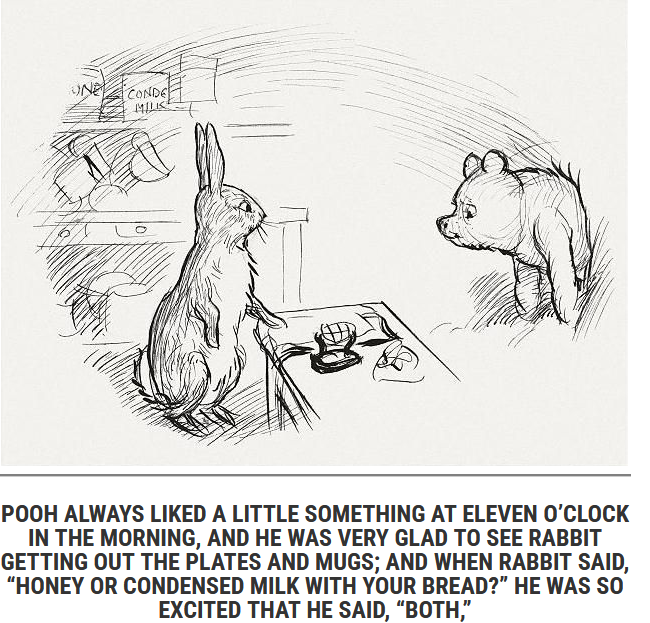

I.e. `Polyline` is the GDI workhorse for multiline, single line and single pixel drawing.

However since `Polyline` needs an array argument it seems unreasonable to use it *directly* to draw single line segments and pixels. So let’s define wrappers. E.g. one named `winapi::draw_line`, in the same namespace as our existing wrapper `client_rect_of`.

A fine point: the documentation is silent on whether `Polyline` draws the last point. One would reasonably expect that it does. But in my experimentation, with my Windows 11 version and default device context, it did *not* draw the last point.

We’ll need to deal with that incomplete result for drawing ticks on the math axes because one pixel versus two pixel length is visually significant for the two ends of a tick line crossing an axis. And so `winapi::draw_line` should fill in that pixel, a default **no surprise** behavior. However, since to a C++ programmer it just feels wrong to let code do things that can be unnecessary, let’s also define a function `winapi::draw_line_sans_endpoint` that doesn’t do this extra thing:

[In *04\code\parabola-gdi.v4.cpp*](04/code/parabola-gdi.v4.cpp):

```cpp
namespace winapi {
    using   cppm::in_;

    auto client_rect_of( const HWND window )
        -> RECT
    {
        RECT r;
        GetClientRect( window, &r );
        return r;
    }

    void draw_line_sans_endpoint( const HDC dc, in_<POINT> from, in_<POINT> to )
    {
        const POINT points[] = {from, to};
        Polyline( dc, points, 2 );
    }

    void set_pixel( const HDC dc, in_<POINT> where )
    {
        // With a fancy pen this can conceivably be imperfect.
        draw_line_sans_endpoint( dc, where, {where.x + 1, where.y} );
    }

    void draw_line( const HDC dc, in_<POINT> from, in_<POINT> to )
    {
        draw_line_sans_endpoint( dc, from, to );
        set_pixel( dc, to );
    }
}  // winapi
```

Here `cppm::in_` is a one-liner template alias defined earlier in the code, where `in_<T>` expands to `const T&`, a suitable type for an in-parameter:

```cpp
    template< class T > using in_ = const T&;       // Type of in-parameters.
```

But even with the above helpers to produce more succinct code, the `paint` function with axes drawing included is now borderline too large for a single function — even with Really Small Font™ (after two times `Ctrl`+`-`) I can’t see the complete function body all at once in my editor:

[In *04\code\parabola-gdi.v4.cpp*](04/code/parabola-gdi.v4.cpp):

```cpp
    void paint( const HWND window, const HDC dc )
    {
        static const auto black_brush = static_cast<HBRUSH>( GetStockObject( BLACK_BRUSH ) );

        const RECT  r   = winapi::client_rect_of( window );
        const Nat   w   = r.right - r.left;     // r.left is always 0 for a client rect, but.
        const Nat   h   = r.bottom - r.top;     // r.top is always 0 for a client rect, but.
        assert( h >= 0 );

        const double    scaling     = 10;           // So e.g. math x = -15 maps to pixel row -150.
        const double    minimum_y   = -2.0;         // In the display’s left edge.
        
        const Nat       i_pixel_row_middle      = h/2;
        const Nat       i_pixel_col_y_zero      = int( scaling*( 0.0 - minimum_y ) );

        const Nat       max_int_x_magnitude         = Nat( i_pixel_row_middle/scaling );
        const double    max_marker_x_magnitude      = 5*(max_int_x_magnitude/5);    // Symmetrical.

        const int       min_int_y                   = int( minimum_y );
        const double    min_marker_y                = 5*(min_int_y/5);
        const int       max_int_y                   = int( minimum_y + w/scaling );
        const double    max_marker_y                = 5*(max_int_y/5);

        // Display the math x and y axes first to make the graph appear to be “above”.
    
        // Math y-axis:
        winapi::draw_line( dc, {i_pixel_col_y_zero, 0}, {i_pixel_col_y_zero, h} );

        // Add ticks on the math y-axis for every 5 math units.
        for( double y = min_marker_y; y <= max_marker_y; y += 5 ) {
            const int   row     = i_pixel_row_middle;
            const int   col     = i_pixel_col_y_zero + int( scaling*y );

            winapi::draw_line( dc, {col, row - 2}, {col, row + 2} );
        }

        // Math x-axis:
        winapi::draw_line( dc, {0, i_pixel_row_middle}, {w, i_pixel_row_middle} );

        // Add ticks on the math x-axis for every 5 math units.
        for( double x = -max_marker_x_magnitude; x <= max_marker_x_magnitude; x += 5 ) {
            const int   row     = i_pixel_row_middle + int( scaling*x );
            const int   col     = i_pixel_col_y_zero;

            winapi::draw_line( dc, {col - 2, row}, {col + 2, row} );
        }

        // Plot the parabola.
        // The graph is plotted to vertically just outside the client area, to avoid cutting it.
        auto points = vector<POINT>( h + 2 );       // 2 extra pixel rows for plotting to outside.
        for( int i_pixel_row = -1; i_pixel_row <= h; ++i_pixel_row ) {
            const int       relative_row_index  = i_pixel_row - i_pixel_row_middle;
            const double    x                   = 1.0*relative_row_index/scaling;
            const double    y                   = f( x );
            const int       i_pixel_col         = i_pixel_col_y_zero + int( scaling*y );

            points[i_pixel_row + 1] = POINT{ i_pixel_col, i_pixel_row };
        }
        Polyline( dc, points.data(), int( points.size() ) );

        // Add markers on the graph for every 5 math units of math x axis.
        for( double x = -max_marker_x_magnitude; x <= max_marker_x_magnitude; x += 5 ) {
            const double    y               = f( x );
            const int       i_pixel_row     = i_pixel_row_middle + int( scaling*x );
            const int       i_pixel_col     = i_pixel_col_y_zero + int( scaling*y );

            const auto square_marker_rect = RECT{
                i_pixel_col - 2, i_pixel_row - 2, i_pixel_col + 3, i_pixel_row + 3
                };
            FillRect( dc, &square_marker_rect, black_brush );
        }
    }
```

So there is some refactoring on the horizon, but for now, result:

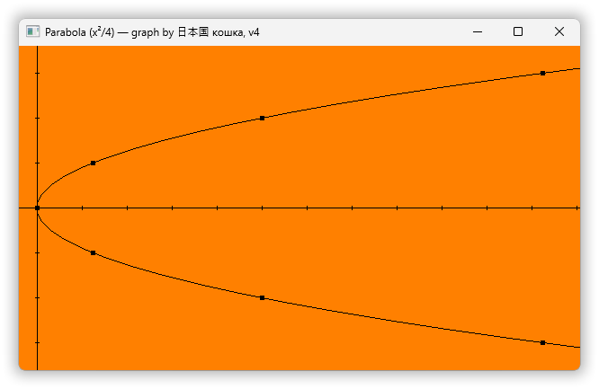

A general coordinate grid is not drawn because the grid lines would need to be de-emphasized via color and/or pattern, and we’re not there yet.

Besides, this function is large enough…


### 4.3. Factoring out the coordinate transformations.

The code snippet comments in the `paint` function indicate that it can be naturally split into smaller functions, one for each snippet:

  1. `// Math y-axis:`
  2. `// Add ticks on the math y-axis for every 5 math units.`
  3. `// Math x-axis:`
  4. `// Add ticks on the math x-axis for every 5 math units.`
  5. `// Plot the parabola.`
  6. `// Add markers on the graph for every 5 math units of math x axis.`

Splitting the code into individual functions will presumably reduce the local code complexity.

Another (orthogonal) possible way to reduce local complexity is to factor out the transformations from math coordinates to pixel coordinates and vice versa. Instead of having these transformations hardcoded inline each place they’re needed they can be managed by a common coordinate transformation object. The ideal then is that the refactored code is even unaware of the orientation of the graph: that the code will work equally well with the common in math convention of the *y* axis pointing up, i.e. having the parabola’s bottom curve at the bottom.

So, we will split the drawing code into functions and centralize the coordinate transformations.

And since all the drawing functions will need access to a device context and the coordinate transformation object, instead of passing these as parameters to every function we will just make the functions member functions of a class, here one called `Painter`.


#### 4.3.1. A `Painter` class.

With the helper definition

[In *04\code\parabola-gdi.v5.cpp*](04/code/parabola-gdi.v5.cpp):

```cpp
namespace winapi {
    auto extent_of( in_<RECT> r ) -> SIZE { return {r.right - r.left, r.bottom - r.top}; }
}  // winapi
```

… the `paint` function code is now reduced to

[In *04\code\parabola-gdi.v5.cpp*](04/code/parabola-gdi.v5.cpp):

```cpp
    void paint( const HWND window, const HDC dc )
    {
        const SIZE client_area_size = winapi::extent_of( winapi::client_rect_of( window ) );
        Painter( dc, client_area_size ).paint();
    }
```

… where **`Painter`** is the class that contains the drawing functions.

The client area size is really all that’s needed to compute all the local variables of the former v4 `paint`. The `Painter` constructor could alternatively itself have obtained that information from the device context by assuming that it’s a device context for a window and using the **`WindowFromDC`** function to get a handle to the window, and then `GetClientRect`. However, then it couldn’t be used to paint into a bitmap image, via a device context that represents an image, whereas a `Painter` that doesn’t assume a window — and therefore gets a separate `SIZE` — can be used also to paint to a bitmap image.

It turns out that with graph-orientation agnostic code there is no need to have separate functions for drawing the *x*-axis and the *y*-axis. And ditto for placing ticks on the axes. So instead of the decidedly un-[DRY](https://en.wikipedia.org/wiki/Don%27t_repeat_yourself) four original code snippets we end up with just two member functions `draw_math_axis` and `add_math_axis_ticks`, like this:

[In *04\code\parabola-gdi.v5.cpp*](04/code/parabola-gdi.v5.cpp):

```cpp
    class Painter
    {
        using Ct = ...; // The Coordinate Transformation class; we’ll discover what’s required.

        const HDC   m_dc;
        const Ct    m_xform;

        inline void draw_math_axis( const Ct::Math_axis::Enum axis ) const;

        inline void add_math_axis_ticks( const Ct::Math_axis::Enum axis, const Nat tick_distance ) const;

        inline void plot_the_parabola() const;
        
        inline void add_markers_on_the_graph() const;
        
        void draw_axes_with_ticks() const
        {
            for( const auto axis: Ct::math_axes ) { draw_math_axis( axis ); }
            for( const auto axis: Ct::math_axes ) { add_math_axis_ticks( axis, 5 ); }
        }

    public:
        Painter( const HDC dc, in_<SIZE> client_area_size ):
            m_dc( dc ),
            m_xform( client_area_size )
        {}

        void paint() const
        {
            // Display the math x and y axes first to make the graph appear to be “above”.
            draw_axes_with_ticks();
            plot_the_parabola();
            add_markers_on_the_graph();
        }
    };
```

As shown this code assumes an **axis enumeration** type `Ct::Math_axis::Enum`, which is defined simply as

```cpp
        struct Math_axis{ enum Enum: int { x, y }; };
        static constexpr Math_axis::Enum math_axes[] = { Math_axis::x, Math_axis::y };
```

The array constant supports use of range based `for` loops, as shown in `draw_axes_with_ticks`, without introducing more elaborate machinery.


#### 4.3.2. Special case code versus refactored orientation agnostic code.

The original v4 axes drawing, hardcoding the horizontal graph orientation, went like this:

[In *04\code\parabola-gdi.v4.cpp*](04/code/parabola-gdi.v4.cpp):

```cpp
        const RECT  r   = winapi::client_rect_of( window );
        const Nat   h   = r.bottom - r.top;     // r.top is always 0 for a client rect, but.

        const double    scaling     = 10;           // So e.g. math x = -15 maps to pixel row -150.
        const double    minimum_y   = -2.0;         // In the display’s left edge.

        const Nat       i_pixel_row_middle      = h/2;
        const Nat       i_pixel_col_y_zero      = int( scaling*( 0.0 - minimum_y ) );

        // Math x-axis:
        winapi::draw_line( dc, {i_pixel_col_y_zero, 0}, {i_pixel_col_y_zero, h} );

        // Math y-axis:
        winapi::draw_line( dc, {0, i_pixel_row_middle}, {w, i_pixel_row_middle} );
```

Instead of the above variables and knowledge of the transformations (e.g. that the math *x* axis is displayed as vertical) the refactored axes drawing code uses three coordinate transformation methods that we’ll have to define: `.math_minimum`, `.math_maximum` and `.px_point_from` (short for “pixel point from”). The two first return the minimum and maximum math values, the end point values of a math *x* or *y* axis within the presentation area. The last one transforms from math coordinates to pixel coordinates.

[In *04\code\parabola-gdi.v5.cpp*](04/code/parabola-gdi.v5.cpp):

```cpp
    void Painter::draw_math_axis( const Ct::Math_axis::Enum axis ) const
    {
        const auto& _ = m_xform;
        const double    first_v     = _.math_minimum( axis );
        const double    last_v      = _.math_maximum( axis );
        winapi::draw_line( m_dc, _.px_pt_from( axis, first_v ), _.px_pt_from( axis, last_v ) );
    }

        ⋮
    for( const auto axis: Ct::math_axes ) { draw_math_axis( axis ); }
```

Recall that a C++ reference is an alias for something, an alternative name. I added the **name alias** `_` to reduce visual noise from “`m_xform`” peppered everywhere. An alternative could have been to use private inheritance of the coordinate transformation class, and that would totally get rid of the qualification noise, but at the cost of possibly making the purpose and responsibility of `Painter` less clear.

And in passing, the `draw_line` call implies that `.px_pt_from` returns a type at least convertible to GDI `POINT`.

In fact it just returns `POINT` but using a name alias `Px_point` because I don’t like all that uppercase everywhere, and to tie a connection to `Px_point_vector` (discussed later). So this code uses name aliases both to reduce noisy verbosity, to get rid of all uppercase shouting, and to hint about connections. That is perhaps borderline, it’s maybe even crossing the line, but.


#### 4.3.3. Why the GDI coordinate transformation support doesn’t cut it.

After scaling the transformation maps the mathematical rightward *x* axis to the GDI downwards *y* axis, with an offset for centering, and it maps the mathematical upward *y* axis to the GDI right direction *x* axis, also with an offset (to move the math origin inside the presentation area). Essentially the axes are switched so it’s a kind of mirroring, a **reflection** around a diagonal. With no coordinate transformation the parabola would have had its bottom curve upwards, since increasing GDI *y* is down; switching the axes you get the bottom to the left.

&nbsp;&nbsp;&nbsp;&nbsp; 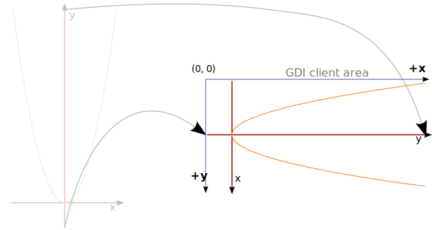

The basic old GDI that we’re using offers two levels of automatic coordinate transformation. If one of these schemes was applicable it would obviate the need for calling some explicit coordinate transformation like `.px_pt_from`. It would all happen automagically.

Unfortunately, for the most basic scheme, involving `SetMapMode`, `SetWindowExtEx` and `SetViewportExtEx`, the [documentation](https://learn.microsoft.com/en-us/windows/win32/gdi/mapping-modes-and-translations) specifies the transformation to pixel (display) *x* as

> ❞ Dx = ((Lx - WOx) * VEx / WEx) + VOx

This involves only the *x* values so it can’t do the requisite diagonal reflection.

The higher level GDI coordinate transformation involves first setting the “graphics mode” to “advanced” via `SetGraphicsMode`, and then calling `SetWorldTranform` to specify the transformation. The specification is six `float` values that form the upper ⅔ of a 3×3 transformation matrix, and it can do any [**affine transformation**](https://en.wikipedia.org/wiki/Affine_transformation) including diagonal mirroring. But the nice floating point calculations operate on very course grained integer source coordinates, integer `POINT` values in calls to GDI drawing functions, and e.g. having all math values in the range 0 through 1 mapped to *either* 0 or 1 and then scaled would yield a just too extremely low quality result…

So the higher level GDI coordinate transformation can’t do the full transformation. It could conceivably be employed to do just the transformation after scaling. But with such automagic transformation turned on it could be more difficult to e.g. obtain the end points of the math axes within the presentation area, as with `.math_minimum` and `.math_maximum` above.


#### 4.3.4. 90° rotations are simple but (a gotcha) involve handedness.

The v4 code to draw the axis ticks directly used knowledge of the orientation of the ticks: horizontal, or vertical.

But with the orientation agnostic refactoring one must *pretend that one doesn’t know*. It’s a [separation of concerns](https://en.wikipedia.org/wiki/Separation_of_concerns) where that knowledge resides exclusively with the coordinate transformation object. So the drawing code must obtain the axis orientation from `m_xform`, e.g. in the form of a **unit vector**, and then rotate that direction 90° to get the direction of the axis ticks.

In this code the vector type is named `Px_point_vector`; the function to get a direction for an axis is `.px_unit_vector_for`; and the 90° rotation function is `rotl`, short for “rotate left”, the same as in e.g. `std::rotl`:


[In *04\code\parabola-gdi.v5.cpp*](04/code/parabola-gdi.v5.cpp):

```cpp
    void Painter::add_math_axis_ticks( const Ct::Math_axis::Enum axis, const Nat tick_distance ) const
    {
        const auto& _ = m_xform;
        const Px_point_vector   tick_extent     = 2*rotl( _.px_unit_vector_for( axis ) );
        const Nat               td              = tick_distance;

        const double    min_marker_value    = td*trunc( _.math_minimum( axis )/td );
        const double    max_marker_value    = td*trunc( _.math_maximum( axis )/td );

        // Add ticks on the math y-axis for every td math units. Note: looping over integer values.
        for( double value = min_marker_value; value <= max_marker_value; value += td ) {
            const Px_point pt = _.px_pt_from( axis, value );
            winapi::draw_line( m_dc, pt - tick_extent, pt + tick_extent );
        }
    }
```

The expressions `pt - tick_extent` and `pt + tick_extent` show the `Px_point_vector` type interacting with the `Px_point` type, which is defined as GDI `POINT`.

But since a type like `Px_point_vector` can be very portable my first instinct was to define it in a platform-independent, portable way, and I did that by expressing the GDI specific `Px_point_vector` in terms of a portable template `Px_point_vector_`:

[In *04\code\parabola-gdi.v5.cpp*](04/code/parabola-gdi.v5.cpp):

```cpp
    using   geometry::Handedness, geometry::Point_vector_;

    static_assert( sizeof( long ) == sizeof( int ) );   // Holds in Windows.
    using Px_point          = POINT;                    // Pixel location.
    using Px_point_vector   = Point_vector_<Px_point, Handedness::opposite_math>;
```

The chances of actual reuse are slim to non-existent for this particular class, but decoupling from the Windows API generally clarifies things. One can avoid some Microsoft complications, and some other complications can become more visible, explicitly dealt with, which generally is a Good Thing™. Here there were two complications of the latter category:

* The **handedness** of the GDI coordinate system, which is opposite of the usual math coordinate system.  
  That is, code that rotates left in the math coordinate system will rotate right in the GDI system, and vice versa.

* The item value type of GDI `POINT` is `long`.  
  In both 32-bit and 64-bit Windows a `long` is 32 bits, the same as `int` and our alias `Nat` for non-negative `int`.

One way to address the item value type issues is to just use that type and family types. Instead I chose to simply express that the `int` type used in `px_point_vector_` covers the `POINT` value range, via a `static_assert`ion. This way it is (in my opinion) more clear at a glance what kinds of values the code deals with or can be used with, and that there is no meaningful distinction.

In the math coordinate system rotation 90° right on the circle, a **clockwise rotation**, maps positive *y* to positive *x*, while an original positive *x* becomes a negative *y*:

&nbsp;&nbsp;&nbsp;&nbsp; 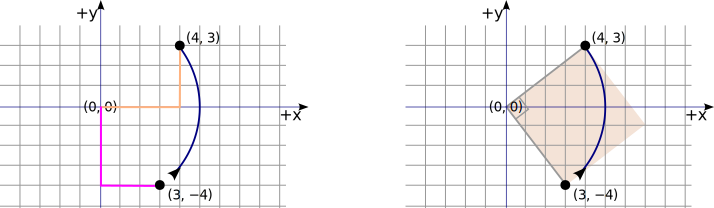

```cpp
auto math_rotr( in_<Point_vector_> vec ) -> Point_vector_ { return {vec.y(), -vec.x()}; }
```

And this simple switch-and-change-sign scheme works also for points in other quadrants, so:

[In *04\code\parabola-gdi.v5.cpp*](04/code/parabola-gdi.v5.cpp):

```cpp
namespace geometry{
    using   cppm::in_;

    struct Handedness{ enum Enum: int { like_math, opposite_math }; };

    // Template parameter `Point` should be like `struct Point{ int x; int y; }`.
    template< class Point, Handedness::Enum handedness = Handedness::like_math >
    class Point_vector_
    {
        Point   m_pt;

        friend auto math_rotl( in_<Point_vector_> vec )
            -> Point_vector_
        { return {-vec.y(), vec.x()}; }

        friend auto math_rotr( in_<Point_vector_> vec )
            -> Point_vector_
        { return {vec.y(), -vec.x()}; }

    public:
        Point_vector_(): m_pt() {}
        Point_vector_( in_<Point> pt ): m_pt( pt ) {}
        Point_vector_( const int x, const int y ): m_pt{ x, y } {}

        auto x() const -> int { return m_pt.x; }
        auto y() const -> int { return m_pt.y; }

        operator Point () const { return m_pt; }

        friend auto operator*( const int n, in_<Point_vector_> vec )
            -> Point_vector_
        { return {n*vec.x(), n*vec.y()}; }

        friend auto operator+( in_<Point> pt, in_<Point_vector_> vec )
            -> Point
        { return {pt.x + vec.x(), pt.y + vec.y()}; }

        friend auto operator-( in_<Point> pt, in_<Point_vector_> vec )
            -> Point
        { return {pt.x - vec.x(), pt.y - vec.y()}; }

        friend auto rotl( in_<Point_vector_> vec )
            -> Point_vector_
        { return (handedness == Handedness::like_math? math_rotl( vec ) : math_rotr( vec )); }

        friend auto rotr( in_<Point_vector_> vec )
            -> Point_vector_
        { return (handedness == Handedness::like_math? math_rotr( vec ) : math_rotl( vec )); }
    };
}  // geometry
```

In passing, the `friend` keyword is here not used to gain access to implementation details: it’s used only for placing the function definitions inline in the class, to avoid the extreme verbosity of the alternative. Arguably that aspect of `friend` should have been a separate language feature. Maybe a source comment about it would be appropriate … or not.

Also, for completeness: the handedness considerations do not matter for the program we have, the code that I have presented, because its axis ticks are symmetrical. It doesn’t matter which way they’re rotated. But if one changes the code to e.g. only draw ticks to one side of an axis, then the handedness matters, and that was how I tested the above code.


#### 4.3.5. Hybrid coordinates: pixel indices on the math *x* axis.

asdasd

[In *04\code\parabola-gdi.v5.cpp*](04/code/parabola-gdi.v5.cpp):

```cpp
    void Painter::plot_the_parabola() const
    {
        // The graph is plotted to just outside the client area.
        const auto& _ = m_xform;
        constexpr auto x_axis = Ct::Math_axis::x;

        const Px_index      i_px_first      = _.px_i_first( x_axis );
        const Px_index      i_px_beyond     = _.px_i_beyond( x_axis );
        const auto          n_px_indices    = int( i_px_beyond );

        assert( int( i_px_first ) == 0 );
        assert( int( i_px_beyond ) > 0 );

        auto points = vector<POINT>( n_px_indices + 2 );    // 2 extra indices for plotting to outside.
        for(    Px_index    i_px_for_x      = value_before( i_px_first );
                i_px_for_x <= i_px_beyond;
                ++i_px_for_x
                ) {
            const double        x           = _.math_x_from( i_px_for_x );
            const double        y           = f( x );
            const Px_index      i_px_for_y  = _.px_index_from_math_y( y );

            points[int( i_px_for_x ) + 1] = _.px_pt_from_indices( i_px_for_x, i_px_for_y );
        }
        Polyline( m_dc, points.data(), int( points.size() ) );
    }
```
